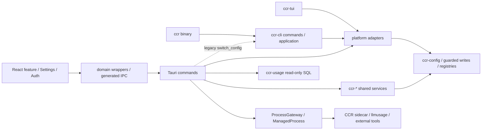
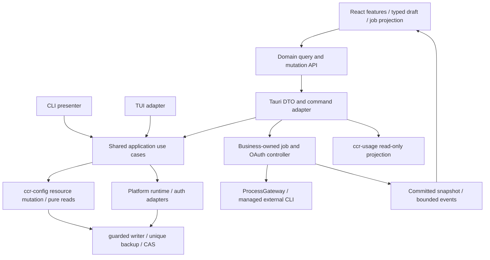

# CCR CLI / Tauri / React 架构审查与优化规划

日期：2026-09-28。仓库：`D:/Documents/Code/Github/ccr`。分支：`dev`。基线 commit：`34d8a85e0e48b793733835e0304c8ed33940fcee`。

## 结论

当前项目已经具有合理的领域 crate、共享 application、typed IPC、命令权限、进程管理、前端分层和自动检查机制。主要问题是同一业务操作存在多个编排入口，持久化与后台任务的完成边界不统一，前端抽象丢失领域信息，以及测试没有覆盖真实用户操作链。

本轮将 29 项原始审查记录合并为 **20 组需处理的问题：9 组 P1、10 组 P2、1 组 P3**。另保留不可达 legacy adapter、环境可达性与性能等未充分验证事项。原始问题编号完整保留，不按 grep 次数、文件长度或开放 JSON 数量重复计分。

重构应优先建立共享业务用例和明确结果，再迁移 CLI/TUI/Tauri 适配器，最后完成前端状态、编辑能力和验收门禁。保留现有外部 `llmusage` CLI 与 `ccr-usage` SQL 投影边界。无需先新增统一业务大 crate，也没有证据支持推翻 React/TanStack Query 或 Tauri 架构。

本轮完成审查、隔离反例与父子任务规划；**没有修改产品源码、执行真实配置操作、启动实施、提交或归档**。

## 方法、证据与限制

- 使用 `trellis-start`、`trellis-brainstorm`、`su-architecture-first` 和 `codebase-design`；依 Trellis research 流程分别审查 CLI、Tauri 和 React，主线程核对跨域发现、门禁与任务追溯。
- 原始报告：[CLI/TUI](cli-audit.md)、[Tauri](tauri-audit.md)、[React](frontend-audit.md)、[治理与检查](governance-audit.md)。这些文件保存触发条件、根因、owner、精确代码位置和反例验收。
- `confirmed/source`：当前源码能建立确定控制流或结构事实。`confirmed/isolated`：本轮隔离测试复现。`inferred`：源码支持的并发交错或故障后果。`untested`：未执行相应环境验证。
- 重点覆盖配置、profile、认证、后台命令、usage、Settings、Auth 与质量门禁。未逐函数审计全部 crates/前端文件；checkin、sync、skills 和数据库内部算法仅核对边界与相关调用。
- 6 项前端反例已隔离复现。Rust 并发、磁盘故障、ACL、进程树、原生桌面、真实 OAuth/SSH/WSL/WebDAV 和视觉表现未运行验证。没有声称存在已被利用的凭据泄露或已测得性能瓶颈。

## 当前架构

根 workspace 有 13 个 crate；Tauri 独立 workspace 包含 command-macros。依赖清单未显示本地 crate 循环。Tauri 同时依赖 facade `ccr`、`ccr-cli` 与多个领域 crate；业务调用和终端 handler 混用导致 A01。规模及依赖边详见 [inventory.json](inventory.json)。

当前 registry 有 340 个基础命令、348 个 Windows 命令；277 个 generated typed 命令均有 exact wire type，另外 71 个 legacy schema。部分 generated 结果为开放 JSON。开放 JSON 对用户配置有合理用途；操作结果缺少固定状态时才需要 named DTO。不能把 typed 命令计数当作业务正确性证明。

### 调用边界的保留与调整

| 功能 | 当前执行方式 | 规划方向 |
| --- | --- | --- |
| profile/config CRUD、切换、off | 共享 Rust 库与多个 adapter 编排并存 | 直接调用共享应用用例，统一资源和提交边界 |
| 通用命令工作台 | 受控 CCR sidecar + ProcessGateway | 保留子进程、allowlist、版本/hash、确认、流量和清理约束 |
| usage 同步 | 已安装 llmusage CLI + NDJSON | 保留外部 CLI；修复 deadline、cancel 和终态 |
| usage 查询 | ccr-usage 只读 SQL 投影 | 保留单一 SQL owner；Tauri adapter 只做映射 |
| OAuth | 共享账号服务 + command 层 listener/pending/HTTP 编排 | 抽出可测试的 login controller，桌面负责事件和呈现 |
| Settings | 共享 Base + 标量 values + 平台 mapper | 保留 Base，扩展无损 snapshot/patch/capability 契约 |

## P1：优先恢复功能与状态完整性

| ID | 触发与已证问题 | 关键证据 | Owner / 子任务 |
| --- | --- | --- | --- |
| A01 | 配置页切换和启用走永久返回 migration error 的旧 handler；该 UI 调用链仍有效。 | `ccr-ui/src/features/configs/hooks/useConfigsPage.ts:55` → `ccr-ui/src-tauri/src/commands/config.rs:200-204` → `crates/ccr-cli/src/commands/profile/switch.rs:24-26` | shared application + Tauri/configs；T03，前置 T01/T02 |
| A02 | 同一 profiles 文件使用 config / ccr_config / platform_profiles 等不同锁；部分读取在加锁前，旧 sections 可覆盖新修改。 | `ccr-ui/src-tauri/src/commands/config.rs:225-233`；`crates/ccr-config/src/services/config_service.rs:91-103`；`crates/ccr-config/src/platforms/base.rs:482-504` | ccr-config repository；T01 |
| A03 | TUI 先独立提交 off 再校验/apply；跨文件切换和 history 失败可发生在 runtime 已改变后。 | `crates/ccr-tui/src/tui/app.rs:960-993`；`crates/ccr-cli/src/application/profile_switch.rs:60-92`；`crates/ccr-cli/src/platforms/claude.rs:317-329` | application + platform；T02，前置 T01/T05 |
| A08 | usage token 在 snapshot 发布后才登记；cancel 直接写终态，随后普通错误分支可把 Cancelled 改成 Failed。 | `ccr-ui/src-tauri/src/commands/usage.rs:446-449`、`:731-740`、`:1539-1546`、`:1570-1585` | usage lifecycle；T06 |
| A09 | llmusage stream 的 spawn 路径没有执行 descriptor deadline，取消/解析错误分支绕过 cleanup error。 | `ccr-ui/src-tauri/src/process/gateway.rs:197-206`、`:271-279`；`ccr-ui/src-tauri/src/llmusage_adapter/cli.rs:139-159` | streaming execution owner；T06 |
| A11 | OAuth pending 含 verifier，普通 writer 写后才尝试权限调整，权限失败被吞没。源码证明契约偏离，实际 ACL/泄露未验证。 | `ccr-ui/src-tauri/src/commands/codex_auth.rs:518-521`；`crates/ccr-codex/src/utils.rs:87-111` | secret storage；T05 |
| A13 | 命令任务状态留在路由局部；回页无法恢复，晚到 start 响应能将终态覆盖为 queued；另有迟到订阅泄漏。前三种反例已隔离复现。 | `ccr-ui/src/features/commands/useCommandsPage.ts:49`、`:99-179`；`ccr-ui/src/shell/eventBridge.ts:150-160` | shell job controller + Commands；T07 |
| A14 | Codex notifications 数组被 flatten 成 false；修改 model 后全量保存会把未编辑通知数组写成 false。映射损失已隔离复现。 | `ccr-ui/src/configs/settings-codex-map.ts:40`、`:96-103`；`ccr-ui/src/configs/settings-codex.ts:66-67` | typed settings mapper；T08 |
| A15 | Settings rawSource/managedLocks 标志无对应数据/回调接口，Grok 锁和策略元数据在 load 时丢失；原始编辑能力在路由不可达。 | `ccr-ui/src/configs/settings-types.ts:35-57`；`ccr-ui/src/configs/settings-grok.ts:101-109`；`ccr-ui/src/features/platform/settings/BaseSettings.tsx:25-41` | Settings capability contract；T08 |

A02/A03/A08/A09 的实际并发及 OS 故障后果仍需 barrier/fault-injection 验收；源码可证的危险顺序不等于已在真实账户上重现。A11 的优先级来自活跃敏感路径对明确安全契约的违反，不代表已证明可利用漏洞。

## P2：业务语义、后台控制与界面恢复

| ID | 问题与根因 | 关键证据 | 子任务 |
| --- | --- | --- | --- |
| A04 | enabled、usage_count、history 由各端独立决定；profile rename 的 save/delete/apply 同样缺少完整结果。 | `crates/ccr-cli/src/application/profile_switch.rs:33-92`；`crates/ccr-tui/src/tui/app.rs:988-993`；`ccr-ui/src-tauri/src/commands/claude_profiles.rs:99-153` | T02 |
| A05 | validate 汇总错误后仍 Ok；读取错误被折成未配置；通用 API-key 校验与 subscription apply 不一致。 | `crates/ccr-cli/src/commands/lifecycle/validate.rs:255-307`；`crates/ccr-cli/src/platforms/claude.rs:339-345` | T04 |
| A06 | 查询会 bootstrap/autofix/修 marker；with_default 取首个 enabled 平台，结果受 registry 顺序影响。 | `crates/ccr-config/src/managers/config/manager.rs:31-46`、`:89-108`；`crates/ccr-cli/src/platforms/claude.rs:138-158` | T01/T04 |
| A07 | 秒级备份名相同，fs::copy 可覆盖同秒较早前镜像。 | `crates/ccr-core/src/core/guarded_write.rs:264-307` | T05 |
| A10 | 静态策略将 `cancel_ccr_command_job`、`llmusage_install_cancel` 放入全局 singleton，将 `cancel_usage_import_job_v2`、`codex_oauth_login_cancel` 放入各自 module-exclusive；相应长 handler 可使取消在到达 owner 前排队。已为 Parallel 的 get/status 不计入当前缺陷，逐 ID 策略与防回归要求见 [control-command-matrix.md](control-command-matrix.md)；实际原生阻塞未运行。 | `ccr-ui/src-tauri/src/commands/handler_registry.rs:229-263`；`ccr-ui/src-tauri/src/commands/runtime_policy.rs:41-81`；`ccr-ui/src/api/generated/command-manifest.json` | T11 |
| A12 | OAuth probe-close-rebind、listener 错误丢弃、已接受 socket 无 deadline、memory/disk 发布顺序不一致。 | `ccr-ui/src-tauri/src/commands/codex_auth.rs:544-551`、`:595-599`、`:671-680`、`:1426-1432` | T05/T11 |
| A16 | Grok BaseAuth 将 load error 显示 signedOut，将 probe error 留在 loading；两项均已隔离复现。 | `ccr-ui/src/features/platform/auth/BaseAuth.tsx:15-67` | T09 |
| A17 | Settings refetch 无条件 reset，dirty 草稿与 server snapshot 缺少独立版本和环境身份。 | `ccr-ui/src/features/platform/settings/BaseSettings.tsx:26-41`；`ccr-ui/src/shell/eventBridge.ts:183-184` | T09，依赖 T08 |
| A18 | Configs 使用裸 t 和空依赖 memo，语言切换不会可靠刷新已挂载标签与摘要。 | `ccr-ui/src/features/configs/ConfigsView.tsx:32-38`；`ccr-ui/src/features/configs/hooks/useConfigsPage.ts:37` | T09 |
| A19 | 本地 just ci 未组合完整 tauri-ci；部分 smoke 只测 store/标题/签名，未经过路由重入与 read-edit-save 链。 | `justfile:570-584`、`:1545-1551`；`ccr-ui/tests/shell/cache-route.smoke.test.ts:41-54`；`ccr-ui/tests/platforms/platform-base-settings.smoke.test.tsx:38-49` | T10，行为测试由各 owner 落地 |

## P3：规范事实漂移

**A20**：registry 规范同时出现 340/348、336，另一规范仍写 315/323；存在旧 Vue 当前路径示例、lint auto-fix 错误提示和 ccr-usage 包规范入口缺口。证据：`.trellis/spec/ccr/backend/tauri-handler-registry.md:59`、`:150`；`.trellis/spec/ccr/backend/dependency-governance.md:361`；`ccr-ui/code_map.md:52`。由 T10 收敛，子任务随各自实现更新所属规范。

## 根因与目标结构

1. **缺少共享操作 owner**：trait 或 file writer 只完成局部动作，客户端拼装验证、清理、激活、计数和历史。共享 application 用例应决定提交点与完整结果。
2. **多个状态记录各自可写**：profiles、registry、runtime 与 UI cache 并存。明确权威记录、投影、冲突和恢复；查询不应暗中修复状态。
3. **进程状态与 UI 状态分离**：job admission、cancel token、snapshot、terminal、history 分属不同生命周期。进程 owner 提交终态，其他层只请求控制和消费投影。
4. **前端统一接口缺少领域信息**：标量 SettingsValues 和布尔 flags 无法表达 union、托管锁、版本、raw source、dirty baseline。接口应携带这些真实义务。
5. **验证集中在局部结构**：import graph、typed count 和组件薄壳规则有价值，但没有覆盖上述语义。增加跨入口、故障、时序和一字段修改的反例测试。

### 关键设计取舍

- 首先在现有 `ccr-cli::application`、领域 services 和现有 desktop service 中形成接口；物理拆包须由真实依赖需求决定。
- profile 使用 prepare/execute/outcome，保留必要 off 清理规则；不能简单删除 TUI off。跨文件操作不宣称操作系统级原子事务，采用序列化、版本保护补偿和明确 recovery 结果。
- 固定操作结果逐域迁入 named DTO；保留自由配置的 OpenJson，保留 public CcrError freeze，不全量推翻 command macro 的 String error 契约。
- control permit 按资源与操作类别定义，cancel/status 可到达 owner；不把所有命令改为 Parallel。
- Settings 的领域中性 editor composite 进入明确共享层再复用，保持 feature import 边界；不增大全域跨 feature 豁免。
- 不设未经测量的延迟或内存性能目标。timeout 测试用可注入时钟和短期限，生产保留既有策略。

## 任务树与依赖

父任务：`09-28-cli-tauri-architecture`，持有问题集、兼容边界、矩阵和最终集成验收；实现以子任务为单位。

| Key | 子任务 | 优先级 | 必要前置 |
| --- | --- | --- | --- |
| T01 | `09-28-config-repository-consistency` 配置仓储与纯查询 | P1 | 无 |
| T02 | `09-28-profile-application-usecases` 三端共享 profile 用例 | P1 | T01、T05 |
| T03 | `09-28-tauri-config-adapter` 配置页与 Tauri adapter | P1 | T01、T02 |
| T04 | `09-28-cli-diagnostics-contract` 诊断与退出码 | P2 | T01、T02 |
| T05 | `09-28-safe-persistence-backups` secret writer 与备份 | P1 | 无 |
| T06 | `09-28-usage-job-lifecycle` usage 取消/清理/deadline | P1 | 无 |
| T07 | `09-28-command-workbench-lifecycle` 命令页恢复/事件 | P1 | T11 |
| T08 | `09-28-settings-lossless-capabilities` 无损设置与能力 | P1 | 无 |
| T09 | `09-28-frontend-query-error-contracts` Auth/草稿/语言 | P2 | T03、T08 |
| T10 | `09-28-architecture-contract-gates` 门禁/规范/集成 | P2 | 其余全部子任务 |
| T11 | `09-28-desktop-control-oauth-lifecycle` 控制并发/OAuth | P2 | T05、T06 |

T01/T05/T06/T08 可先推进独立工作；随后 T02/T11，再推进 T03/T04/T07/T09，T10 最后验收。同一 registry、generated artifact、Settings metadata 的写入必须协调串行。依赖不是父子关系自动保证，已写入各子任务文档和 meta.depends_on。

当前 Insights 前端任务仍为 `in_progress`。新任务不接管首页 redesign；共享 event bridge、query key 或 dashboard 文件需要先对照该任务的实际交付。两个原有 `.tmp-*.mjs` 均保留。

## 验证结果

| 检查 | 本轮结果 | 边界 |
| --- | --- | --- |
| `just version-check` | 通过 | 19 项重复依赖检查，1 项已登记 toml 例外 |
| `just fmt-check` | 通过 | 包含独立 Tauri workspace 格式检查 |
| workflow governance / secret-write guard | 通过 | 结构规则，不证明跨端业务语义 |
| `bun run type-check` | 通过 | TypeScript |
| `bun run check:cycles` | 通过，722 文件 | 实际脚本的扫描口径 |
| `bun run check:arch-boundaries` | 通过 | 已知违规 import fixture 自检 |
| 正式 `bun run lint:ci` | **失败** | 原有两个临时脚本共 5 条 no-console；未清理、未改忽略规则 |
| 排除上述两个文件的 ESLint 诊断 | 通过 | 不能替代正式 lint 结果 |
| stylelint / style-lines | 通过 | style-lines 当前匹配 0 个 module.css，其通过范围有限 |
| 9 个现有相关 smoke 文件 | 29 项通过 | 隔离研究配置沿用原项目语义 |
| 新增研究反例 | 6 项复现成功 | 测试通过表示缺陷存在，不表示已修复 |

日志：同目录 `baseline-*.log` / `baseline-*.json`。前端命令、配置和反例见 [frontend-audit.md](frontend-audit.md)、[frontend-audit.evidence.test.tsx](frontend-audit.evidence.test.tsx)。研究 harness 的初始配置问题已修正，不列为产品缺陷。

本轮未运行 `just ci`；其包含 version-sync/fmt 等改写步骤。未运行完整 Rust/Tauri 测试、发布构建、native/visual、真实性能、真实账号操作或安全漏洞扫描。最终实现验收必须包含完整根/Tauri 门禁及相应原生验证。

## 规划交付复核

- 独立复核首轮发现 6 项规划问题；修订后的 PV-01–PV-06 全部闭合，剩余规划问题 0 项。保留首轮发现与逐项闭合证据：[planning-validation.md](planning-validation.md)。
- T11 [控制矩阵](control-command-matrix.md) 覆盖 23 个真实命令 ID；69 个当前策略字段与 manifest 一致。C01–C06 分别约束四个命令族、owner admission 生命周期和权限保留。
- 父任务与 11 个子任务的机械 precheck、context validate 全部通过，依赖无环；11 个父 AC 与 39 个子 AC 均有机制和测试映射。详见 plan-precheck.json、context-validation.json 和 planning-checks.json。
- 所有新任务保持 planning；没有产品实现授权或任务启动。规划验收通过不表示产品缺陷修复。
- 自动审批审查拒绝清理本轮生成的 `.frontend-audit-cache`，仅返回 `blocked by policy`；缓存保留，未改用其他工具删除。

## 已分析但不作已证产品缺陷的项目

- **D01：Gemini/Droid legacy writer**：存在直接写与未知字段风险，但当前主 auth/profile 支持矩阵只含 Claude/Codex/Grok。T04 盘点和明确能力边界，不无证扩大为当前主流程数据丢失，也不擅自启用或删除公共兼容 API。对应 CLI-09。
- **D02：性能候选**：usage 历史 snapshot 的保留、collect 总事件量、广域 invalidation 和大模块需要测量；没有 OOM、卡顿或时延结论。T06 可记录现有容量/保留行为，新的调优另以测量决定。
- **D03：环境可达性**：部分 handler 无 environment 输入，raw/off 有 Local-only 检查；尚未穷尽远程界面可达性。T10 建立 Local/WSL/SSH 操作矩阵，不宣称已发生跨环境误写。
- **D04：OpenCode notify**：前端映射压缩可见，完整后端写链未验证；T08 要求未编辑字段不进入 patch，并补充支持链验证。
- **D05：全面视觉和可访问性**：发现源码中的旧 violet/gradient、圆角风格偏差；本轮没有截图、对比度或键盘验收。相关任务仅修触及表面的已定规范，不开展全站美化。

## 原始记录到任务的完整追溯

| 原始记录 | 合并组 / 处理 | 任务 |
| --- | --- | --- |
| CLI-01 / TA-02 | A02 | T01/T03 |
| CLI-02 / CLI-03 | A03 | T02 |
| CLI-04 / TA-08 profile | A04 | T02 |
| CLI-05 | A05 | T04 |
| CLI-06 | A06 | T01/T04 |
| CLI-07 / TA-01 | A01 和应用呈现边界 | T02/T03 |
| CLI-08 | A07 | T05 |
| CLI-09 | D01，能力盘点与受控延后 | T04 |
| CLI-10 | A19/A20 | T04/T10 |
| TA-03 / TA-04 | A08/A09 | T06 |
| TA-05 | A10 | T11 |
| TA-06 / TA-07 | A11/A12 | T05/T11 |
| TA-08 wire/error | 逐域契约机制，不单独按数量评分 | T02/T03/T06/T11 |
| F01 / F02 / F03 | A13 | T07 |
| F04 / F05 | A14/A15 | T08 |
| F06 / F07 / F08 | A16/A17/A18 | T09 |
| G-01 / G-03 | A19 | T10 与各行为 owner |
| G-02 | A20 | T10 |

全部父子任务保持 planning。后续实施以获批文档和各子任务验收为准，不能把本审查状态当作产品修复完成。
