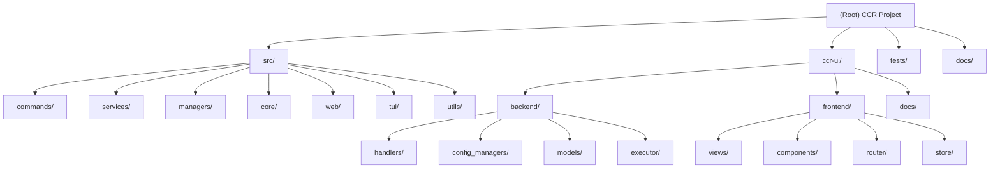

<!-- OPENSPEC:START -->
# OpenSpec Instructions

These instructions are for AI assistants working in this project.

Always open `@/openspec/AGENTS.md` when the request:
- Mentions planning or proposals (words like proposal, spec, change, plan)
- Introduces new capabilities, breaking changes, architecture shifts, or big performance/security work
- Sounds ambiguous and you need the authoritative spec before coding

Use `@/openspec/AGENTS.md` to learn:
- How to create and apply change proposals
- Spec format and conventions
- Project structure and guidelines

Keep this managed block so 'openspec update' can refresh the instructions.

<!-- OPENSPEC:END -->

# CCR - Claude Code Configuration Switcher

## Change Log (Changelog)
- **2025-10-25 [Current]**: Added comprehensive multi-platform configuration documentation
- **2025-10-22 10:39:28 CST**: Documentation refresh - corrected frontend path after Vue.js migration
- **2025-10-22 00:04:36 CST**: Initial AI context documentation created

## Project Vision

CCR (Claude Code Configuration Switcher) is a Rust-powered configuration management tool that provides direct, safe, and auditable control over Claude Code's settings. The project delivers a complete ecosystem including:

- A robust CLI tool with 13+ commands for config management
- A full-featured TUI (Terminal User Interface) for visual management
- A lightweight web API server for programmatic access
- A comprehensive full-stack web application (ccr-ui) with Vue.js 3 frontend and Axum backend
- Support for multiple AI platforms: Claude Code, Codex, Gemini, Qwen, and iFlow

The core philosophy emphasizes **reliability** (atomic operations, file locking), **auditability** (complete history tracking), and **safety** (automatic backups, validation).

## Architecture Overview

CCR follows a strict layered architecture pattern:

```
CLI/Web Layer → Services → Managers → Core/Utils
```

### Key Architectural Principles

1. **Separation of Concerns**: Each layer has well-defined responsibilities
2. **Atomic Operations**: All file modifications use temporary files + atomic rename
3. **Concurrency Safety**: File locking prevents corruption across multiple processes
4. **Complete Audit Trail**: Every operation logged with UUID, timestamp, and actor
5. **Fail-Safe Design**: Automatic backups before destructive operations

### Technology Stack

- **Core**: Rust (Edition 2024, v1.4.4)
- **CLI Framework**: Clap 4.5
- **Web Server**: Axum 0.8 + Tokio async runtime
- **TUI**: Ratatui 0.29 + Crossterm
- **Frontend**: Vue.js 3.5 + TypeScript + Tailwind CSS + Vite
- **Serialization**: Serde + TOML + JSON
- **Testing**: 95%+ coverage with integration tests

## Multi-Platform Configuration Support

CCR supports managing configurations for multiple AI CLI platforms from a unified interface. This allows you to:

- **Switch between platforms** seamlessly (Claude, Codex, Gemini)
- **Manage multiple profiles** per platform
- **Maintain separate settings** for each platform
- **Track history** independently per platform
- **Backup and restore** platform-specific configurations

### Supported Platforms

| Platform | Status | Description | Settings Path |
|----------|--------|-------------|---------------|
| **Claude Code** | ✅ Fully Implemented | Anthropic's official CLI | `~/.claude/settings.json` |
| **Codex** | ✅ Fully Implemented | GitHub Copilot CLI | `~/.codex/settings.json` |
| **Gemini** | ✅ Fully Implemented | Google Gemini CLI | `~/.gemini/settings.json` |
| **Qwen** | 🚧 Planned | Alibaba Tongyi Qianwen CLI | TBD |
| **iFlow** | 🚧 Planned | iFlow CLI | TBD |

### Configuration Modes

CCR supports two configuration modes:

#### 1. Legacy Mode (Single Platform)

Traditional CCR setup with a single configuration file:

```
~/.ccs_config.toml    # All configurations in one file
~/.claude/            # Claude Code settings only
```

**Use when**: You only use Claude Code and want to keep it simple.

#### 2. Unified Mode (Multi-Platform)

Modern CCR setup with per-platform organization:

```
~/.ccr/
├── config.toml                      # Platform registry
├── platforms/
│   ├── claude/
│   │   ├── profiles.toml            # Claude profiles
│   │   ├── history/                 # Claude operation history
│   │   └── backups/                 # Claude backups
│   ├── codex/
│   │   ├── profiles.toml            # Codex profiles
│   │   ├── history/
│   │   └── backups/
│   └── gemini/
│       ├── profiles.toml            # Gemini profiles
│       ├── history/
│       └── backups/
~/.claude/settings.json              # Claude actual settings
~/.codex/settings.json               # Codex actual settings
~/.gemini/settings.json              # Gemini actual settings
```

**Use when**: You use multiple AI CLI platforms or want better organization.

### Platform Commands

CCR provides dedicated commands for platform management:

```bash
# Platform initialization
ccr platform init <platform>         # Initialize a platform
ccr platform list                    # List all platforms
ccr platform switch <platform>       # Switch to a platform
ccr platform current                 # Show current platform
ccr platform info <platform>         # Show platform info

# Profile management (platform-aware)
ccr list                             # List profiles for current platform
ccr switch <profile>                 # Switch profile in current platform
ccr add                              # Add profile to current platform
ccr delete <profile>                 # Delete profile from current platform
```

### Migration from Legacy to Unified

To migrate from Legacy mode to Unified mode:

```bash
# Check if migration is needed
ccr migrate --check

# Migrate all platforms
ccr migrate

# Migrate specific platform
ccr migrate --platform claude
```

### Platform Detection Logic

CCR automatically detects which mode to use based on:

1. **Environment variable**: If `CCR_ROOT` is set → Unified mode
2. **Config file exists**: If `~/.ccr/config.toml` exists → Unified mode
3. **Otherwise**: Legacy mode (backward compatible)

### Example: Multi-Platform Workflow

```bash
# 1. Initialize platforms
ccr platform init claude
ccr platform init codex
ccr platform init gemini

# 2. Add profiles for Claude
ccr platform switch claude
ccr add  # Interactive profile creation

# 3. Add profiles for Codex
ccr platform switch codex
ccr add  # Interactive profile creation

# 4. Switch between platforms
ccr platform switch claude    # Work with Claude
ccr platform switch codex     # Work with Codex
ccr platform current          # Check current platform

# 5. Each platform maintains independent:
# - Profiles
# - History
# - Backups
# - Settings
```

### Platform-Specific Configuration

Each platform has its own profile structure optimized for its needs:

**Claude Profiles** (`~/.ccr/platforms/claude/profiles.toml`):
```toml
[anthropic]
description = "Anthropic Official API"
base_url = "https://api.anthropic.com"
auth_token = "sk-ant-api03-..."
model = "claude-sonnet-4-5-20250929"
small_fast_model = "claude-3-5-haiku-20241022"
provider = "Anthropic"
```

**Codex Profiles** (`~/.ccr/platforms/codex/profiles.toml`):
```toml
[github]
description = "GitHub Copilot Official"
base_url = "https://api.github.com/copilot"
auth_token = "ghp_..."
model = "gpt-4"
small_fast_model = "gpt-3.5-turbo"
provider = "GitHub"
```

**Gemini Profiles** (`~/.ccr/platforms/gemini/profiles.toml`):
```toml
[google]
description = "Google Gemini Official"
base_url = "https://generativelanguage.googleapis.com/v1"
auth_token = "AIzaSy..."
model = "gemini-2.0-flash-exp"
small_fast_model = "gemini-1.5-flash"
provider = "Google"
```

### Platform Isolation

Each platform operates in complete isolation:

- ✅ **Separate profiles**: No naming conflicts between platforms
- ✅ **Independent history**: Each platform tracks its own operations
- ✅ **Isolated backups**: Platform backups don't interfere
- ✅ **Dedicated settings**: Each platform has its own settings file
- ✅ **Concurrent safety**: File locks prevent corruption

### Testing Multi-Platform Features

All platform tests are located in `/tests/`:

```bash
# Platform unit tests (22 tests) - must run serially
cargo test --test platform_tests -- --test-threads=1

# Integration tests (10 tests) - must run serially
cargo test --test platform_integration_tests -- --test-threads=1

# Regression tests (15 tests) - must run serially
cargo test --test platform_regression_tests -- --test-threads=1

# All library tests (93 tests) - can run in parallel
cargo test --lib

# Doc tests (13 tests) - can run in parallel
cargo test --doc
```

⚠️ **Important**: Platform tests modify global environment variables and must run serially (`--test-threads=1`) to avoid conflicts.

## Module Structure Diagram



## Module Index

| Module | Path | Responsibility | Language | Entry Point |
|--------|------|----------------|----------|-------------|
| **Core CLI** | `/src/` | Main CCR CLI tool with commands, services, managers | Rust | `src/main.rs` |
| **UI Backend** | `/ccr-ui/backend/` | Axum server with 129 API endpoints for multi-platform config management | Rust | `ccr-ui/backend/src/main.rs` |
| **UI Frontend** | `/ccr-ui/frontend/` | Vue.js 3 frontend with liquid glass design (migrated from Next.js) | TypeScript/Vue | `ccr-ui/frontend/src/main.ts` |
| **Integration Tests** | `/tests/` | Comprehensive test suite with 95%+ coverage | Rust | Various test files |
| **Documentation** | `/docs/` | VitePress documentation site | Markdown/TypeScript | VitePress config |

## Running and Development

### Prerequisites

- Rust 1.85+ (for edition 2024 features)
- Node.js 18+ (for ccr-ui frontend)
- Cargo and npm/yarn/pnpm

### Quick Start

```bash
# Install from GitHub
cargo install --git https://github.com/bahayonghang/ccr ccr

# Or build from source
git clone https://github.com/bahayonghang/ccr.git
cd ccr
cargo install --path .

# Initialize configuration
ccr init

# Launch TUI
ccr tui

# Launch full web UI
ccr ui
```

### Development Workflow

```bash
# Core CLI development
cargo build                    # Build debug
cargo test                     # Run all tests
cargo clippy                   # Lint
cargo fmt                      # Format
cargo build --release          # Production build

# CCR UI development
cd ccr-ui
just s                         # Start dev environment
just i                         # Install dependencies
just b                         # Build production
just t                         # Run tests

# Using justfile shortcuts at project root
just build                     # Build debug
just release                   # Build release
just test                      # Run tests
just lint                      # Format + Clippy
just ci                        # Full CI pipeline

# Environment variables for debugging
export CCR_LOG_LEVEL=debug     # Set log level (trace|debug|info|warn|error)
```

### Project Structure

```
ccr/
├── Cargo.toml                 # Rust workspace config
├── justfile                   # Just command runner for build automation
├── src/                       # Core CLI module
│   ├── main.rs               # CLI entry point
│   ├── lib.rs                # Library exports
│   ├── commands/             # 13+ CLI commands
│   ├── services/             # 6 business services
│   ├── managers/             # 3 data managers
│   ├── core/                 # Infrastructure (error, lock, logging)
│   ├── web/                  # Axum web server (14 endpoints)
│   ├── tui/                  # Terminal UI
│   └── utils/                # Validation, masking
├── ccr-ui/                   # Full-stack web application
│   ├── backend/              # Axum backend (129 endpoints)
│   ├── frontend/             # Vue.js 3 frontend with Vite
│   └── justfile              # CCR UI specific commands
├── tests/                    # Integration tests (6 files)
└── docs/                     # VitePress documentation
```

## Testing Strategy

### Test Coverage

- **Unit Tests**: Embedded in source modules
- **Integration Tests**: `/tests/` directory with 6 comprehensive test files
- **Coverage Target**: 95%+ overall coverage
- **Test Categories**:
  - Service workflow tests (`service_workflow_tests.rs`)
  - Manager tests (`manager_tests.rs`)
  - Concurrent access tests (`concurrent_tests.rs`)
  - End-to-end tests (`end_to_end_tests.rs`)
  - Add/delete operation tests (`add_delete_test.rs`)
  - Integration tests (`integration_test.rs`)

### Running Tests

```bash
# Run all tests
cargo test

# Run specific test file
cargo test --test integration_test

# Run with output
cargo test -- --nocapture

# Run concurrent tests
cargo test --test concurrent_tests

# Check test coverage (requires tarpaulin)
cargo tarpaulin --out Html
```

## Coding Standards

### Rust Code Style

1. **Edition**: 2024 (requires Rust 1.85+)
2. **Formatting**: Use `cargo fmt` with default rustfmt settings
3. **Linting**: Pass `cargo clippy` without warnings
4. **Error Handling**: Use custom `CcrError` type with detailed error messages
5. **Documentation**: Inline comments in Chinese for internal logic, English for public APIs
6. **Naming**:
   - Module names: `snake_case`
   - Type names: `PascalCase`
   - Function names: `snake_case`
   - Constants: `SCREAMING_SNAKE_CASE`

### Code Organization Principles

1. **Layered Architecture**: Strict separation of CLI/Web → Services → Managers → Core
2. **Service Layer**: Business logic, orchestration, transactions
3. **Manager Layer**: Data access, file I/O, persistence
4. **Core Layer**: Infrastructure, error handling, logging, locking
5. **No Circular Dependencies**: Dependencies flow one direction only

### TypeScript/Vue Standards

1. **TypeScript**: Strict mode enabled
2. **Vue**: Composition API with `<script setup>`
3. **Styling**: Tailwind CSS utility classes
4. **Components**: Functional, reusable components in `/components/`
5. **State Management**: Pinia stores for global state

## AI Usage Guidelines

### When Using AI Assistance

1. **Code Generation**: AI can generate boilerplate and standard patterns
2. **Refactoring**: AI can help refactor while maintaining architecture
3. **Testing**: AI can write test cases following existing patterns
4. **Documentation**: AI can generate or improve documentation

### What to Preserve

1. **Architecture**: Don't violate the layered architecture
2. **Error Handling**: Maintain consistent error handling with `CcrError`
3. **Atomic Operations**: Never bypass atomic write patterns
4. **File Locking**: Don't remove or weaken file locking mechanisms
5. **Audit Trail**: Always log operations to history

### Code Review Checklist

- [ ] Follows layered architecture
- [ ] Uses atomic file operations for writes
- [ ] Proper error handling with context
- [ ] Tests added/updated
- [ ] Documentation updated
- [ ] No security vulnerabilities (API keys masked)
- [ ] Passes `cargo clippy` and `cargo fmt`

## Key Files and Configuration

### Configuration Files

- `~/.ccs_config.toml` - Main configuration file (shared with CCS)
- `~/.claude/settings.json` - Claude Code settings (managed by CCR)
- `~/.claude/ccr_history.json` - Operation audit log

### Important Paths

- `~/.claude/backups/` - Automatic backups
- `~/.claude/.locks/` - File locks (auto-cleanup)
- `~/.ccr/ccr-ui/` - User directory installation of ccr-ui

### Entry Points

- **CLI**: `src/main.rs` - Main CLI entry with Clap parser
- **Library**: `src/lib.rs` - Public API exports
- **Web Server**: `src/web/server.rs` - Axum server (port 8080)
- **TUI**: `src/tui/mod.rs` - Terminal UI entry
- **UI Backend**: `ccr-ui/backend/src/main.rs` - Full backend (port 8081)
- **UI Frontend**: `ccr-ui/frontend/src/main.ts` - Vue app (dev port 5173)

## External Interfaces

### CLI Commands (13+)

- `ccr init` - Initialize configuration
- `ccr list` - List all configs
- `ccr current` - Show current config
- `ccr switch <name>` - Switch configuration
- `ccr add` - Add new config
- `ccr delete <name>` - Delete config
- `ccr validate` - Validate configs
- `ccr history` - View operation history
- `ccr web` - Launch web server
- `ccr ui` - Launch full UI
- `ccr tui` - Launch TUI
- `ccr sync [config|status|push|pull]` - WebDAV sync
- `ccr update` - Update from GitHub

### Web API Endpoints (14)

See `src/web/routes.rs` for complete list:
- Config management: GET/POST/PUT/DELETE `/api/configs`
- History: GET `/api/history`
- Settings: GET/POST `/api/settings`
- System info: GET `/api/system`
- Validation: POST `/api/validate`
- Import/Export: POST `/api/import`, POST `/api/export`
- Backup/Restore: GET/POST `/api/settings/backups`, POST `/api/settings/restore`
- Clean: POST `/api/clean`

### UI Backend API (129 endpoints)

See `ccr-ui/backend/src/main.rs` for complete list. Supports:
- **Claude Code**: MCP, agents, slash commands, plugins, config
- **Codex**: MCP, profiles, agents, slash commands, plugins, config
- **Gemini CLI**: MCP, agents, slash commands, plugins, config
- **Qwen**: MCP, agents, slash commands, plugins, config
- **iFlow**: Basic support (stub)
- **Utilities**: Converter, sync, command execution, system info

## Dependencies and Third-Party Services

### Core Rust Dependencies

- `clap` 4.5 - CLI argument parsing
- `serde` 1.0 + `serde_json` + `toml` - Serialization
- `anyhow` + `thiserror` - Error handling
- `tokio` 1.48 - Async runtime
- `axum` 0.8 - Web framework
- `ratatui` 0.29 - TUI framework
- `crossterm` 0.29 - Terminal handling

### Frontend Dependencies

- `vue` 3.5.22 - UI framework
- `vue-router` 4.4 - Routing
- `pinia` 2.2 - State management
- `axios` 1.7 - HTTP client
- `vite` 7.1 - Build tool
- `tailwindcss` 3.4 - Styling

### External Services

- **WebDAV**: Optional cloud sync (Nutstore, Nextcloud, ownCloud)
- **GitHub**: Auto-update feature downloads from GitHub releases
- **File System**: Direct access to `~/.claude/` and `~/.ccs_config.toml`

## Common Issues and Solutions

### Issue: Lock timeout

**Symptoms**: "Lock acquisition timeout" error

**Solution**:
```bash
# Check for zombie processes
ps aux | grep ccr

# Clean stale locks
rm -rf ~/.claude/.locks/*
```

### Issue: Permission denied on settings.json

**Symptoms**: Cannot read/write settings file

**Solution**:
```bash
chmod 600 ~/.claude/settings.json
chmod 644 ~/.ccs_config.toml
```

### Issue: CCR UI download fails

**Symptoms**: `ccr ui` fails to download ccr-ui

**Solution**:
```bash
# Manual clone
mkdir -p ~/.ccr
cd ~/.ccr
git clone https://github.com/bahayonghang/ccr.git
mv ccr/ccr-ui .
```

## Related Resources

- **GitHub Repository**: https://github.com/bahayonghang/ccr
- **Related Project**: CCS (Shell version) - https://github.com/bahayonghang/ccs
- **License**: MIT
- **Rust Edition**: 2024
- **Minimum Rust Version**: 1.85
