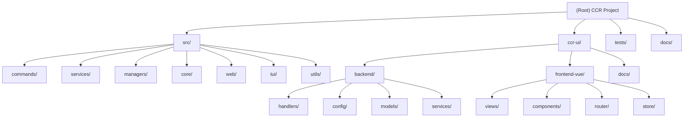

# CCR - Claude Code Configuration Switcher

## Change Log (Changelog)
- **2025-10-22 00:04:36 CST**: Initial AI context documentation created

## Project Vision

CCR (Claude Code Configuration Switcher) is a Rust-powered configuration management tool that provides direct, safe, and auditable control over Claude Code's settings. The project delivers a complete ecosystem including:

- A robust CLI tool with 13+ commands for config management
- A full-featured TUI (Terminal User Interface) for visual management
- A lightweight web API server for programmatic access
- A comprehensive full-stack web application (ccr-ui) with Vue.js frontend and Axum backend
- Support for multiple AI platforms: Claude Code, Codex, Gemini, Qwen, and iFlow

The core philosophy emphasizes **reliability** (atomic operations, file locking), **auditability** (complete history tracking), and **safety** (automatic backups, validation).

## Architecture Overview

CCR follows a strict layered architecture pattern:

```
CLI/Web Layer → Services → Managers → Core/Utils
```

### Key Architectural Principles

1. **Separation of Concerns**: Each layer has well-defined responsibilities
2. **Atomic Operations**: All file modifications use temporary files + atomic rename
3. **Concurrency Safety**: File locking prevents corruption across multiple processes
4. **Complete Audit Trail**: Every operation logged with UUID, timestamp, and actor
5. **Fail-Safe Design**: Automatic backups before destructive operations

### Technology Stack

- **Core**: Rust (Edition 2024, v1.4.4)
- **CLI Framework**: Clap 4.5
- **Web Server**: Axum 0.8 + Tokio async runtime
- **TUI**: Ratatui 0.29 + Crossterm
- **Frontend**: Vue.js 3.5 + TypeScript + Tailwind CSS
- **Serialization**: Serde + TOML + JSON
- **Testing**: 95%+ coverage with integration tests

## Module Structure Diagram



## Module Index

| Module | Path | Responsibility | Language | Entry Point |
|--------|------|----------------|----------|-------------|
| **Core CLI** | `/src/` | Main CCR CLI tool with commands, services, managers | Rust | `src/main.rs` |
| **UI Backend** | `/ccr-ui/backend/` | Axum server with 129 API endpoints for multi-platform config management | Rust | `ccr-ui/backend/src/main.rs` |
| **UI Frontend** | `/ccr-ui/frontend-vue/` | Vue.js 3 frontend with liquid glass design | TypeScript/Vue | `ccr-ui/frontend-vue/src/main.ts` |
| **Integration Tests** | `/tests/` | Comprehensive test suite with 95%+ coverage | Rust | Various test files |
| **Documentation** | `/docs/` | VitePress documentation site | Markdown/TypeScript | VitePress config |

## Running and Development

### Prerequisites

- Rust 1.85+ (for edition 2024 features)
- Node.js 18+ (for ccr-ui frontend)
- Cargo and npm/yarn/pnpm

### Quick Start

```bash
# Install from GitHub
cargo install --git https://github.com/bahayonghang/ccr ccr

# Or build from source
git clone https://github.com/bahayonghang/ccr.git
cd ccr
cargo install --path .

# Initialize configuration
ccr init

# Launch TUI
ccr tui

# Launch full web UI
ccr ui
```

### Development Workflow

```bash
# Core CLI development
cargo build                    # Build debug
cargo test                     # Run all tests
cargo clippy                   # Lint
cargo fmt                      # Format
cargo build --release          # Production build

# CCR UI development
cd ccr-ui
just s                         # Start dev environment
just i                         # Install dependencies
just b                         # Build production
just t                         # Run tests

# Environment variables for debugging
export CCR_LOG_LEVEL=debug     # Set log level (trace|debug|info|warn|error)
```

### Project Structure

```
ccr/
├── Cargo.toml                 # Rust workspace config
├── src/                       # Core CLI module
│   ├── main.rs               # CLI entry point
│   ├── lib.rs                # Library exports
│   ├── commands/             # 13+ CLI commands
│   ├── services/             # 6 business services
│   ├── managers/             # 3 data managers
│   ├── core/                 # Infrastructure (error, lock, logging)
│   ├── web/                  # Axum web server (14 endpoints)
│   ├── tui/                  # Terminal UI
│   └── utils/                # Validation, masking
├── ccr-ui/                   # Full-stack web application
│   ├── backend/              # Axum backend (129 endpoints)
│   └── frontend-vue/         # Vue.js frontend
├── tests/                    # Integration tests
└── docs/                     # VitePress documentation
```

## Testing Strategy

### Test Coverage

- **Unit Tests**: Embedded in source modules
- **Integration Tests**: `/tests/` directory with 6 comprehensive test files
- **Coverage Target**: 95%+ overall coverage
- **Test Categories**:
  - Service workflow tests
  - Manager tests
  - Concurrent access tests
  - End-to-end tests
  - Add/delete operation tests

### Running Tests

```bash
# Run all tests
cargo test

# Run specific test file
cargo test --test integration_test

# Run with output
cargo test -- --nocapture

# Run concurrent tests
cargo test --test concurrent_tests

# Check test coverage (requires tarpaulin)
cargo tarpaulin --out Html
```

## Coding Standards

### Rust Code Style

1. **Edition**: 2024 (requires Rust 1.85+)
2. **Formatting**: Use `cargo fmt` with default rustfmt settings
3. **Linting**: Pass `cargo clippy` without warnings
4. **Error Handling**: Use custom `CcrError` type with detailed error messages
5. **Documentation**: Inline comments in Chinese for internal logic, English for public APIs
6. **Naming**:
   - Module names: `snake_case`
   - Type names: `PascalCase`
   - Function names: `snake_case`
   - Constants: `SCREAMING_SNAKE_CASE`

### Code Organization Principles

1. **Layered Architecture**: Strict separation of CLI/Web → Services → Managers → Core
2. **Service Layer**: Business logic, orchestration, transactions
3. **Manager Layer**: Data access, file I/O, persistence
4. **Core Layer**: Infrastructure, error handling, logging, locking
5. **No Circular Dependencies**: Dependencies flow one direction only

### TypeScript/Vue Standards

1. **TypeScript**: Strict mode enabled
2. **Vue**: Composition API with `<script setup>`
3. **Styling**: Tailwind CSS utility classes
4. **Components**: Functional, reusable components in `/components/`
5. **State Management**: Pinia stores for global state

## AI Usage Guidelines

### When Using AI Assistance

1. **Code Generation**: AI can generate boilerplate and standard patterns
2. **Refactoring**: AI can help refactor while maintaining architecture
3. **Testing**: AI can write test cases following existing patterns
4. **Documentation**: AI can generate or improve documentation

### What to Preserve

1. **Architecture**: Don't violate the layered architecture
2. **Error Handling**: Maintain consistent error handling with `CcrError`
3. **Atomic Operations**: Never bypass atomic write patterns
4. **File Locking**: Don't remove or weaken file locking mechanisms
5. **Audit Trail**: Always log operations to history

### Code Review Checklist

- [ ] Follows layered architecture
- [ ] Uses atomic file operations for writes
- [ ] Proper error handling with context
- [ ] Tests added/updated
- [ ] Documentation updated
- [ ] No security vulnerabilities (API keys masked)
- [ ] Passes `cargo clippy` and `cargo fmt`

## Key Files and Configuration

### Configuration Files

- `~/.ccs_config.toml` - Main configuration file (shared with CCS)
- `~/.claude/settings.json` - Claude Code settings (managed by CCR)
- `~/.claude/ccr_history.json` - Operation audit log

### Important Paths

- `~/.claude/backups/` - Automatic backups
- `~/.claude/.locks/` - File locks (auto-cleanup)
- `~/.ccr/ccr-ui/` - User directory installation of ccr-ui

### Entry Points

- **CLI**: `src/main.rs` - Main CLI entry with Clap parser
- **Library**: `src/lib.rs` - Public API exports
- **Web Server**: `src/web/server.rs` - Axum server (port 8080)
- **TUI**: `src/tui/mod.rs` - Terminal UI entry
- **UI Backend**: `ccr-ui/backend/src/main.rs` - Full backend (port 8081)
- **UI Frontend**: `ccr-ui/frontend-vue/src/main.ts` - Vue app (port 3000)

## External Interfaces

### CLI Commands (13+)

- `ccr init` - Initialize configuration
- `ccr list` - List all configs
- `ccr current` - Show current config
- `ccr switch <name>` - Switch configuration
- `ccr add` - Add new config
- `ccr delete <name>` - Delete config
- `ccr validate` - Validate configs
- `ccr history` - View operation history
- `ccr web` - Launch web server
- `ccr ui` - Launch full UI
- `ccr tui` - Launch TUI
- `ccr sync [config|status|push|pull]` - WebDAV sync
- `ccr update` - Update from GitHub

### Web API Endpoints (14)

See `src/web/routes.rs` for complete list:
- Config management: GET/POST/PUT/DELETE `/api/configs`
- History: GET `/api/history`
- Settings: GET/POST `/api/settings`
- System info: GET `/api/system`
- Validation: POST `/api/validate`
- Import/Export: POST `/api/import`, POST `/api/export`
- Backup/Restore: GET/POST `/api/settings/backups`, POST `/api/settings/restore`
- Clean: POST `/api/clean`

### UI Backend API (129 endpoints)

See `ccr-ui/backend/src/main.rs` for complete list. Supports:
- **Claude Code**: MCP, agents, slash commands, plugins, config
- **Codex**: MCP, profiles, agents, slash commands, plugins, config
- **Gemini CLI**: MCP, agents, slash commands, plugins, config
- **Qwen**: MCP, agents, slash commands, plugins, config
- **iFlow**: Basic support (stub)
- **Utilities**: Converter, sync, command execution, system info

## Dependencies and Third-Party Services

### Core Rust Dependencies

- `clap` 4.5 - CLI argument parsing
- `serde` 1.0 + `serde_json` + `toml` - Serialization
- `anyhow` + `thiserror` - Error handling
- `tokio` 1.48 - Async runtime
- `axum` 0.8 - Web framework
- `ratatui` 0.29 - TUI framework
- `crossterm` 0.29 - Terminal handling

### Frontend Dependencies

- `vue` 3.5.22 - UI framework
- `vue-router` 4.4 - Routing
- `pinia` 2.2 - State management
- `axios` 1.7 - HTTP client
- `tailwindcss` 3.4 - Styling

### External Services

- **WebDAV**: Optional cloud sync (Nutstore, Nextcloud, ownCloud)
- **GitHub**: Auto-update feature downloads from GitHub releases
- **File System**: Direct access to `~/.claude/` and `~/.ccs_config.toml`

## Common Issues and Solutions

### Issue: Lock timeout

**Symptoms**: "Lock acquisition timeout" error

**Solution**:
```bash
# Check for zombie processes
ps aux | grep ccr

# Clean stale locks
rm -rf ~/.claude/.locks/*
```

### Issue: Permission denied on settings.json

**Symptoms**: Cannot read/write settings file

**Solution**:
```bash
chmod 600 ~/.claude/settings.json
chmod 644 ~/.ccs_config.toml
```

### Issue: CCR UI download fails

**Symptoms**: `ccr ui` fails to download ccr-ui

**Solution**:
```bash
# Manual clone
mkdir -p ~/.ccr
cd ~/.ccr
git clone https://github.com/bahayonghang/ccr.git
mv ccr/ccr-ui .
```

## Related Resources

- **GitHub Repository**: https://github.com/bahayonghang/ccr
- **Related Project**: CCS (Shell version) - https://github.com/bahayonghang/ccs
- **License**: MIT
- **Rust Edition**: 2024
- **Minimum Rust Version**: 1.85
