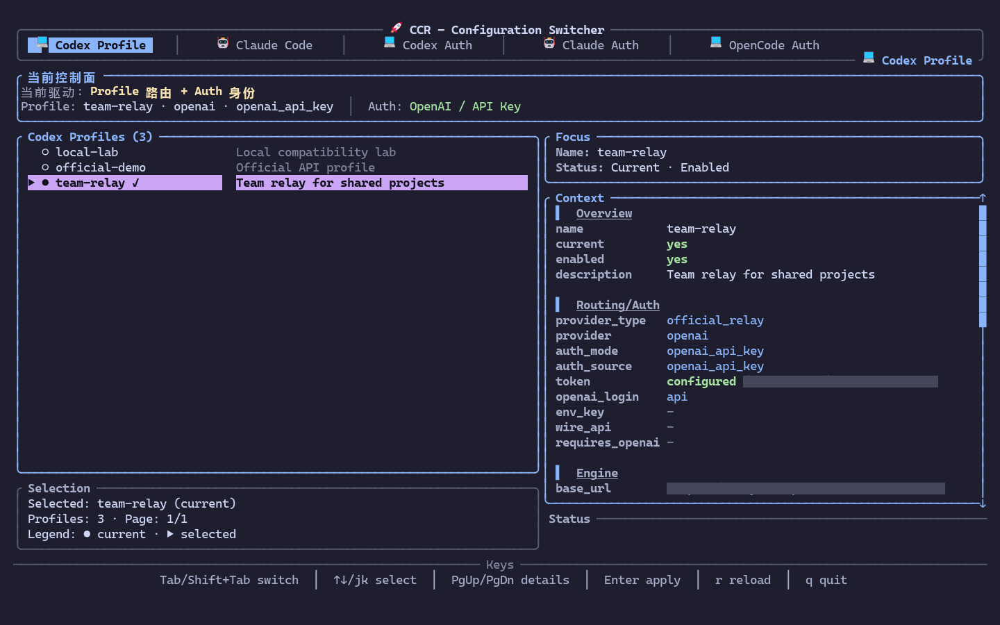
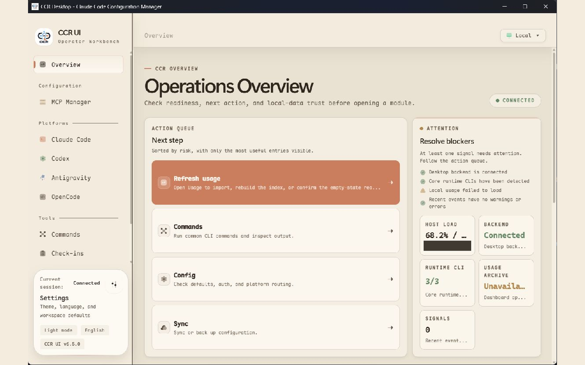
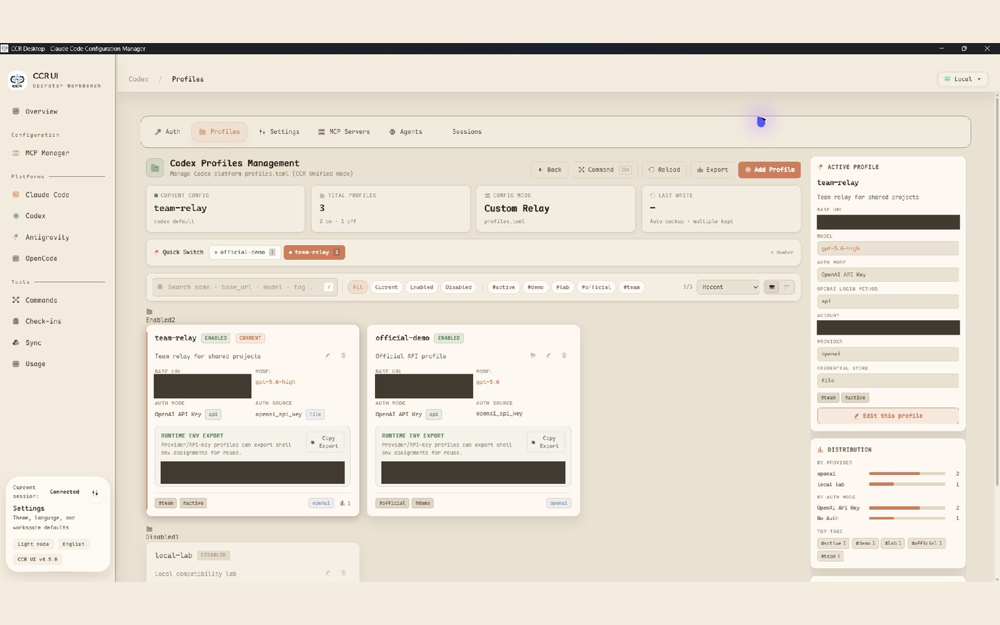

# CCR

**Unified entrypoint for AI CLI configuration management, written in Rust.**  
CLI-first workflow with explicit Claude Runtime / Codex Runtime state, plus TUI and the full CCR UI.

## ✨ Features

- **Explicit Runtime Model**: Claude and Codex runtime state are first-class and shown side by side through `ccr current`.
- **Platform-Scoped Profile Routing**: Use `ccr claude profile ...` and `ccr codex profile ...` instead of the retired global `ccr switch` path.
- **Enterprise-Grade Safety**: Atomic writes, file locking (`fs4`), audit logs, and automatic backups.
- **Multi-Interface**: CLI, TUI, and CCR UI.
- **Auth Portability**: Save/export/import Codex auth and migrate compatible accounts into OpenCode.
- **Smart Sync**: WebDAV-based multi-folder synchronization.

## Interface Preview

### TUI

The terminal interface keeps profile switching, the active routing/auth context, selected-profile details, and keyboard actions in a single view.



### CCR UI Dashboard

The Dashboard surfaces desktop-backend readiness, the next recommended action, runtime availability, and platform signals before you enter a module.



### CCR UI Codex Profiles

Codex Profiles combines quick switching, search and status filters, profile cards, active-profile context, and configuration distribution in one management view.



## 🚀 Quick Start

```bash
ccr init
ccr current
ccr add
ccr claude profile list
ccr claude profile switch <name>
ccr validate
```

### Migration quick map

| Legacy | Current |
|---|---|
| `ccr switch <name>` | `ccr claude profile switch <name>` or `ccr codex profile switch <name>` |
| `ccr <name>` | retired shortcut; use the same explicit command |
| `ccr platform switch <platform>` | retired for auth/profile routing |
| `ccr platform current` | `ccr current` |
| `ccr platform profile ...` | `ccr claude profile ...` / `ccr codex profile ...` |

## 🔐 Runtime Commands

```bash
ccr claude profile list
ccr claude profile switch work
ccr claude profile off
ccr codex auth current
ccr codex profile list
ccr codex profile switch proxy
ccr codex profile off
```

## 🛠️ Development

```bash
just build
just test
just ci
```
