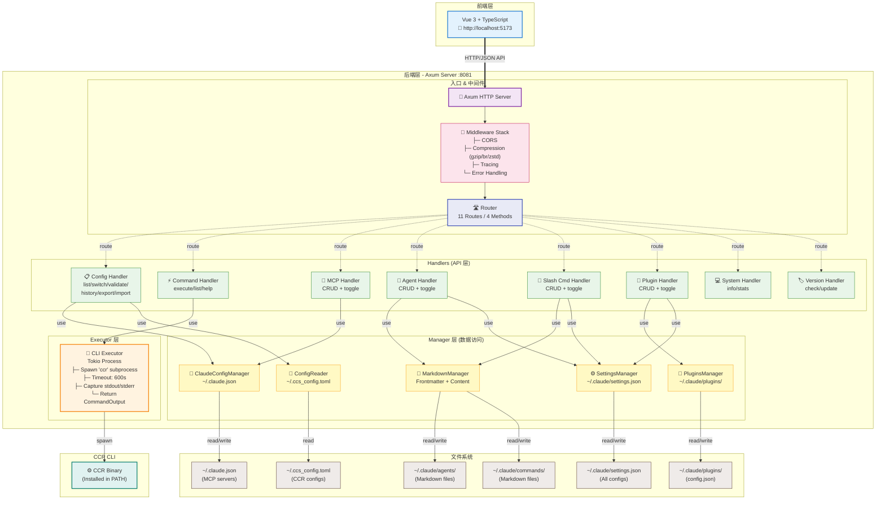
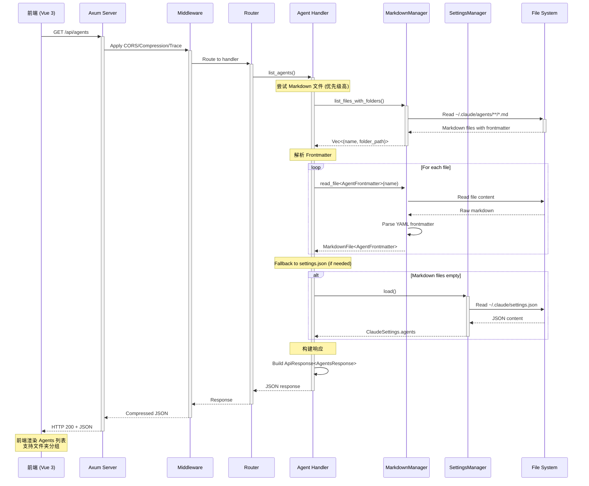
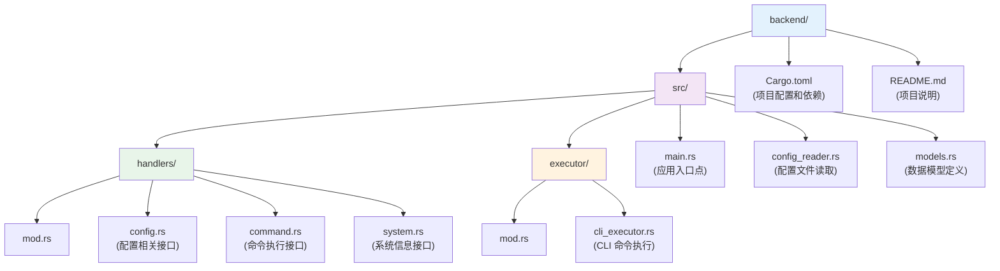

# 后端架构设计

CCR UI 的后端是一个基于 Rust 和 Axum 构建的高性能 Web 服务，负责处理前端请求、执行 CCR 命令并返回结果。v1.2.0 版本已从 Actix Web 迁移到 Axum，提供更好的性能和类型安全。

## 🎯 设计目标

后端架构的主要设计目标：

- **高性能**：利用 Rust 的零成本抽象和 Actix Web 的异步特性
- **安全性**：内存安全、类型安全，防止常见的安全漏洞
- **可靠性**：错误处理完善，系统稳定性高
- **可扩展性**：模块化设计，易于添加新功能
- **易维护性**：清晰的代码结构和完善的文档

## 🏗️ 整体架构

### 系统架构图



### 数据流示例

以下展示一个典型的 **Agent 管理** 请求处理流程：



### 技术栈

| 组件 | 技术 | 版本 | 用途 |
|------|------|------|------|
| Web 框架 | Axum | 0.7 | HTTP 服务器和路由 |
| 中间件 | Tower + Tower-HTTP | 0.5/0.6 | CORS、压缩、日志 |
| 异步运行时 | Tokio | 1.42 | 异步任务执行 |
| 序列化 | Serde | 1.0 | JSON 序列化/反序列化 |
| 错误处理 | Anyhow/Thiserror | 1.0/2.0 | 错误处理和传播 |
| 日志 | Tracing | 0.1 | 结构化日志记录 |
| CLI 解析 | Clap | 4.5 | 命令行参数解析 |
| 系统信息 | Sysinfo | 0.32 | 系统信息获取 |

## 📁 项目结构



## 🔧 核心模块设计

### 1. 主应用模块 (main.rs)

```rust
use axum::{
    routing::{get, post, put, delete},
    Router,
};
use tower_http::{
    cors::{Any, CorsLayer},
    compression::CompressionLayer,
    trace::TraceLayer,
};
use tower::ServiceBuilder;

#[tokio::main]
async fn main() {
    // 初始化日志
    tracing_subscriber::fmt::init();
    
    // 解析命令行参数
    let args = Args::parse();
    
    tracing::info!("Starting CCR UI Backend on {}:{}", args.host, args.port);
    
    // 配置中间件
    let cors = CorsLayer::new()
        .allow_origin(Any)
        .allow_methods(Any)
        .allow_headers(Any);
    
    let middleware = ServiceBuilder::new()
        .layer(TraceLayer::new_for_http())
        .layer(CompressionLayer::new())
        .layer(cors);
    
    // 创建路由
    let app = Router::new()
        .route("/health", get(health_check))
        .route("/api/configs", get(handlers::config::list_configs))
        .route("/api/switch", post(handlers::config::switch_config))
        .route("/api/history", get(handlers::config::get_history))
        .route("/api/configs/:name", put(handlers::config::update_config))
        .route("/api/configs/:name", delete(handlers::config::delete_config))
        .route("/api/command/execute", post(handlers::command::execute_command))
        .route("/api/command/list", get(handlers::command::list_commands))
        .route("/api/system", get(handlers::system::get_system_info))
        .layer(middleware);
    
    // 启动服务器
    let listener = tokio::net::TcpListener::bind(format!("{}:{}", args.host, args.port))
        .await
        .unwrap();
    
    axum::serve(listener, app).await.unwrap();
}
```

### 2. 数据模型 (models.rs)

```rust
use serde::{Deserialize, Serialize};
use axum::{http::StatusCode, response::{IntoResponse, Response}, Json};

#[derive(Debug, Serialize, Deserialize)]
pub struct Config {
    pub name: String,
    pub path: String,
    pub is_active: bool,
}

#[derive(Debug, Deserialize)]
pub struct SwitchConfigRequest {
    pub config_name: String,
}

#[derive(Debug, Deserialize)]
pub struct ExecuteCommandRequest {
    pub command: String,
    pub args: Vec<String>,
}

#[derive(Debug, Serialize)]
pub struct CommandOutput {
    pub success: bool,
    pub stdout: String,
    pub stderr: String,
    pub exit_code: Option<i32>,
    pub execution_time_ms: u64,
}

#[derive(Debug, Serialize)]
pub struct SystemInfo {
    pub os: String,
    pub arch: String,
    pub cpu_count: usize,
    pub username: String,
    pub ccr_version: Option<String>,
}

#[derive(Debug, Serialize)]
pub struct ApiResponse<T: Serialize> {
    pub success: bool,
    pub data: Option<T>,
    pub message: Option<String>,
}

// 实现 IntoResponse 用于 Axum
impl<T: Serialize> IntoResponse for ApiResponse<T> {
    fn into_response(self) -> Response {
        let status = if self.success {
            StatusCode::OK
        } else {
            StatusCode::BAD_REQUEST
        };
        (status, Json(self)).into_response()
    }
}
```

### 3. 配置处理器 (handlers/config.rs)

```rust
use axum::{
    extract::{Path, Json},
    http::StatusCode,
    response::IntoResponse,
};
use crate::{models::*, config_reader::ConfigReader};

/// GET /api/configs - 列出所有配置
pub async fn list_configs() -> impl IntoResponse {
    let reader = ConfigReader::new();
    match reader.read_configs() {
        Ok(configs) => {
            let current = reader.get_current_config();
            let default = reader.get_default_config();
            
            ApiResponse {
                success: true,
                data: Some(ConfigListResponse {
                    current_config: current,
                    default_config: default,
                    configs,
                }),
                message: None,
            }
        }
        Err(e) => {
            tracing::error!("Failed to read configs: {}", e);
            ApiResponse::<ConfigListResponse> {
                success: false,
                data: None,
                message: Some(format!("Failed to read configs: {}", e)),
            }
        }
    }
}

#[actix_web::post("/configs/switch")]
pub async fn switch_config(req: web::Json<SwitchConfigRequest>) -> Result<HttpResponse> {
    match execute_ccr_command("switch", &[&req.config_name]).await {
        Ok(output) => {
            if output.success {
                Ok(HttpResponse::Ok().json(ApiResponse {
                    success: true,
                    data: Some(format!("Switched to config: {}", req.config_name)),
                    error: None,
                }))
            } else {
                Ok(HttpResponse::BadRequest().json(ApiResponse::<String> {
                    success: false,
                    data: None,
                    error: Some(output.stderr),
                }))
            }
        }
        Err(e) => {
            log::error!("Failed to switch config: {}", e);
            Ok(HttpResponse::InternalServerError().json(ApiResponse::<String> {
                success: false,
                data: None,
                error: Some(e.to_string()),
            }))
        }
    }
}

fn parse_config_list(output: &str) -> Result<Vec<Config>, Box<dyn std::error::Error>> {
    let mut configs = Vec::new();
    
    for line in output.lines() {
        if let Some(config) = parse_config_line(line) {
            configs.push(config);
        }
    }
    
    Ok(configs)
}

fn parse_config_line(line: &str) -> Option<Config> {
    // 解析 CCR list 命令的输出格式
    // 例如: "* config-name (/path/to/config)"
    if line.trim().is_empty() {
        return None;
    }
    
    let is_active = line.starts_with('*');
    let line = line.trim_start_matches('*').trim();
    
    if let Some(space_pos) = line.find(' ') {
        let name = line[..space_pos].to_string();
        let path = line[space_pos + 1..].trim_matches(|c| c == '(' || c == ')').to_string();
        
        Some(Config {
            name,
            path,
            is_active,
        })
    } else {
        None
    }
}
```

### 4. 命令执行器 (executor/cli_executor.rs)

```rust
use std::process::Stdio;
use std::time::{Duration, Instant};
use tokio::process::Command;
use tokio::time::timeout;
use anyhow::{Result, anyhow};
use crate::models::CommandOutput;

const COMMAND_TIMEOUT: Duration = Duration::from_secs(30);

pub async fn execute_ccr_command(command: &str, args: &[&str]) -> Result<CommandOutput> {
    let start_time = Instant::now();
    
    log::info!("Executing CCR command: ccr {} {}", command, args.join(" "));
    
    let mut cmd = Command::new("ccr");
    cmd.arg(command);
    cmd.args(args);
    cmd.stdout(Stdio::piped());
    cmd.stderr(Stdio::piped());
    
    // 设置超时执行
    let result = timeout(COMMAND_TIMEOUT, cmd.output()).await;
    
    let execution_time = start_time.elapsed();
    
    match result {
        Ok(Ok(output)) => {
            let stdout = String::from_utf8_lossy(&output.stdout).to_string();
            let stderr = String::from_utf8_lossy(&output.stderr).to_string();
            let success = output.status.success();
            let exit_code = output.status.code();
            
            log::info!(
                "Command completed in {}ms, success: {}, exit_code: {:?}",
                execution_time.as_millis(),
                success,
                exit_code
            );
            
            if !success {
                log::warn!("Command stderr: {}", stderr);
            }
            
            Ok(CommandOutput {
                success,
                stdout,
                stderr,
                exit_code,
                execution_time_ms: execution_time.as_millis() as u64,
            })
        }
        Ok(Err(e)) => {
            log::error!("Failed to execute command: {}", e);
            Err(anyhow!("Failed to execute command: {}", e))
        }
        Err(_) => {
            log::error!("Command timed out after {}s", COMMAND_TIMEOUT.as_secs());
            Err(anyhow!("Command timed out after {}s", COMMAND_TIMEOUT.as_secs()))
        }
    }
}

pub async fn execute_arbitrary_command(command: &str, args: &[String]) -> Result<CommandOutput> {
    let start_time = Instant::now();
    
    log::info!("Executing command: {} {}", command, args.join(" "));
    
    let mut cmd = Command::new(command);
    cmd.args(args);
    cmd.stdout(Stdio::piped());
    cmd.stderr(Stdio::piped());
    
    let result = timeout(COMMAND_TIMEOUT, cmd.output()).await;
    let execution_time = start_time.elapsed();
    
    match result {
        Ok(Ok(output)) => {
            let stdout = String::from_utf8_lossy(&output.stdout).to_string();
            let stderr = String::from_utf8_lossy(&output.stderr).to_string();
            let success = output.status.success();
            let exit_code = output.status.code();
            
            Ok(CommandOutput {
                success,
                stdout,
                stderr,
                exit_code,
                execution_time_ms: execution_time.as_millis() as u64,
            })
        }
        Ok(Err(e)) => Err(anyhow!("Failed to execute command: {}", e)),
        Err(_) => Err(anyhow!("Command timed out")),
    }
}
```

### 5. 系统信息处理器 (handlers/system.rs)

```rust
use actix_web::{HttpResponse, Result};
use crate::{models::*, executor::cli_executor::execute_ccr_command};

#[actix_web::get("/system/info")]
pub async fn get_system_info() -> Result<HttpResponse> {
    let system_info = SystemInfo {
        os: std::env::consts::OS.to_string(),
        arch: std::env::consts::ARCH.to_string(),
        cpu_count: num_cpus::get(),
        username: whoami::username(),
        ccr_version: get_ccr_version().await,
    };
    
    Ok(HttpResponse::Ok().json(ApiResponse {
        success: true,
        data: Some(system_info),
        error: None,
    }))
}

async fn get_ccr_version() -> Option<String> {
    match execute_ccr_command("--version", &[]).await {
        Ok(output) if output.success => {
            Some(output.stdout.trim().to_string())
        }
        _ => None,
    }
}
```

## 🔒 安全性设计

### 1. 命令注入防护

```rust
use regex::Regex;

fn validate_command_args(args: &[String]) -> Result<(), String> {
    let dangerous_patterns = [
        r"[;&|`$()]",  // Shell 特殊字符
        r"\.\./",      // 路径遍历
        r"^-",         // 防止参数注入
    ];
    
    for arg in args {
        for pattern in &dangerous_patterns {
            let re = Regex::new(pattern).unwrap();
            if re.is_match(arg) {
                return Err(format!("Dangerous pattern detected in argument: {}", arg));
            }
        }
    }
    
    Ok(())
}
```

### 2. 输入验证

```rust
use serde::de::{self, Deserializer, Visitor};

impl<'de> Deserialize<'de> for SwitchConfigRequest {
    fn deserialize<D>(deserializer: D) -> Result<Self, D::Error>
    where
        D: Deserializer<'de>,
    {
        #[derive(Deserialize)]
        struct Helper {
            config_name: String,
        }
        
        let helper = Helper::deserialize(deserializer)?;
        
        // 验证配置名称格式
        if helper.config_name.is_empty() {
            return Err(de::Error::custom("config_name cannot be empty"));
        }
        
        if helper.config_name.len() > 100 {
            return Err(de::Error::custom("config_name too long"));
        }
        
        // 只允许字母、数字、连字符和下划线
        if !helper.config_name.chars().all(|c| c.is_alphanumeric() || c == '-' || c == '_') {
            return Err(de::Error::custom("config_name contains invalid characters"));
        }
        
        Ok(SwitchConfigRequest {
            config_name: helper.config_name,
        })
    }
}
```

### 3. CORS 配置

```rust
use actix_cors::Cors;

fn cors_config() -> Cors {
    Cors::default()
        .allowed_origin("http://localhost:5173")  // 开发环境
        .allowed_origin("http://127.0.0.1:5173")
        .allowed_methods(vec!["GET", "POST", "PUT", "DELETE"])
        .allowed_headers(vec!["Content-Type", "Authorization"])
        .max_age(3600)
}
```

## 📊 错误处理策略

### 1. 错误类型定义

```rust
use thiserror::Error;

#[derive(Error, Debug)]
pub enum AppError {
    #[error("CCR command failed: {0}")]
    CcrCommandError(String),
    
    #[error("Configuration not found: {0}")]
    ConfigNotFound(String),
    
    #[error("Invalid input: {0}")]
    InvalidInput(String),
    
    #[error("System error: {0}")]
    SystemError(String),
    
    #[error("Timeout error: operation took too long")]
    TimeoutError,
}

impl actix_web::ResponseError for AppError {
    fn error_response(&self) -> HttpResponse {
        match self {
            AppError::CcrCommandError(msg) => {
                HttpResponse::InternalServerError().json(ApiResponse::<()> {
                    success: false,
                    data: None,
                    error: Some(msg.clone()),
                })
            }
            AppError::ConfigNotFound(msg) => {
                HttpResponse::NotFound().json(ApiResponse::<()> {
                    success: false,
                    data: None,
                    error: Some(msg.clone()),
                })
            }
            AppError::InvalidInput(msg) => {
                HttpResponse::BadRequest().json(ApiResponse::<()> {
                    success: false,
                    data: None,
                    error: Some(msg.clone()),
                })
            }
            AppError::TimeoutError => {
                HttpResponse::RequestTimeout().json(ApiResponse::<()> {
                    success: false,
                    data: None,
                    error: Some("Request timeout".to_string()),
                })
            }
            AppError::SystemError(msg) => {
                HttpResponse::InternalServerError().json(ApiResponse::<()> {
                    success: false,
                    data: None,
                    error: Some(msg.clone()),
                })
            }
        }
    }
}
```

### 2. 统一错误处理中间件

```rust
use actix_web::{dev::ServiceRequest, Error, HttpMessage};
use actix_web::middleware::ErrorHandlerResponse;

pub fn error_handler<B>(res: dev::ServiceResponse<B>) -> Result<ErrorHandlerResponse<B>, Error> {
    let status = res.status();
    
    log::error!("HTTP Error {}: {}", status.as_u16(), status.canonical_reason().unwrap_or("Unknown"));
    
    Ok(ErrorHandlerResponse::Response(res.map_into_left_body()))
}
```

## 📈 性能优化

### 1. 异步处理

```rust
use tokio::task;
use std::sync::Arc;

pub async fn execute_multiple_commands(commands: Vec<String>) -> Vec<CommandOutput> {
    let tasks: Vec<_> = commands
        .into_iter()
        .map(|cmd| {
            task::spawn(async move {
                execute_ccr_command(&cmd, &[]).await
            })
        })
        .collect();
    
    let mut results = Vec::new();
    for task in tasks {
        match task.await {
            Ok(Ok(output)) => results.push(output),
            Ok(Err(e)) => {
                log::error!("Command execution failed: {}", e);
                results.push(CommandOutput {
                    success: false,
                    stdout: String::new(),
                    stderr: e.to_string(),
                    exit_code: None,
                    execution_time_ms: 0,
                });
            }
            Err(e) => {
                log::error!("Task join failed: {}", e);
            }
        }
    }
    
    results
}
```

### 2. 缓存机制

```rust
use std::collections::HashMap;
use std::sync::RwLock;
use std::time::{Duration, Instant};

pub struct CacheEntry<T> {
    data: T,
    timestamp: Instant,
    ttl: Duration,
}

pub struct Cache<T> {
    store: RwLock<HashMap<String, CacheEntry<T>>>,
}

impl<T: Clone> Cache<T> {
    pub fn new() -> Self {
        Self {
            store: RwLock::new(HashMap::new()),
        }
    }
    
    pub fn get(&self, key: &str) -> Option<T> {
        let store = self.store.read().unwrap();
        if let Some(entry) = store.get(key) {
            if entry.timestamp.elapsed() < entry.ttl {
                return Some(entry.data.clone());
            }
        }
        None
    }
    
    pub fn set(&self, key: String, data: T, ttl: Duration) {
        let mut store = self.store.write().unwrap();
        store.insert(key, CacheEntry {
            data,
            timestamp: Instant::now(),
            ttl,
        });
    }
}
```

## 🧪 测试策略

### 1. 单元测试

```rust
#[cfg(test)]
mod tests {
    use super::*;
    
    #[tokio::test]
    async fn test_execute_ccr_command() {
        let result = execute_ccr_command("--version", &[]).await;
        assert!(result.is_ok());
        
        let output = result.unwrap();
        assert!(output.success);
        assert!(!output.stdout.is_empty());
    }
    
    #[test]
    fn test_parse_config_line() {
        let line = "* test-config (/path/to/config)";
        let config = parse_config_line(line).unwrap();
        
        assert_eq!(config.name, "test-config");
        assert_eq!(config.path, "/path/to/config");
        assert!(config.is_active);
    }
}
```

### 2. 集成测试

```rust
#[cfg(test)]
mod integration_tests {
    use actix_web::{test, App};
    use super::*;
    
    #[actix_web::test]
    async fn test_get_configs_endpoint() {
        let app = test::init_service(
            App::new().configure(configure_routes)
        ).await;
        
        let req = test::TestRequest::get()
            .uri("/api/configs")
            .to_request();
            
        let resp = test::call_service(&app, req).await;
        assert!(resp.status().is_success());
    }
}
```

## 🚀 部署配置

### 1. Docker 支持

```dockerfile
FROM rust:1.70 as builder

WORKDIR /app
COPY Cargo.toml Cargo.lock ./
COPY src ./src

RUN cargo build --release

FROM debian:bookworm-slim

RUN apt-get update && apt-get install -y \
    ca-certificates \
    && rm -rf /var/lib/apt/lists/*

COPY --from=builder /app/target/release/ccr-ui-backend /usr/local/bin/

EXPOSE 8081

CMD ["ccr-ui-backend", "--port", "8081"]
```

### 2. 系统服务配置

```ini
[Unit]
Description=CCR UI Backend
After=network.target

[Service]
Type=simple
User=ccr-ui
WorkingDirectory=/opt/ccr-ui
ExecStart=/opt/ccr-ui/ccr-ui-backend --port 8081
Restart=always
RestartSec=5

[Install]
WantedBy=multi-user.target
```

## 📚 相关文档

- [技术栈详解](/backend/tech-stack)
- [开发指南](/backend/development)
- [API 文档](/backend/api)
- [部署指南](/backend/deployment)
- [错误处理](/backend/error-handling)