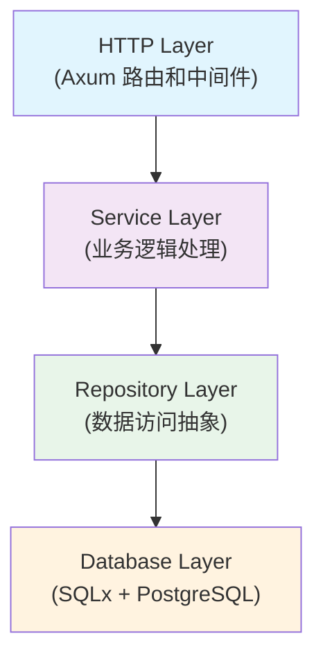

# 后端技术栈

CCR UI 后端采用现代化的 Rust 技术栈，提供高性能、安全可靠的 API 服务和配置管理功能。

> **📢 重要更新**: v1.2.0 版本已从 Actix Web 迁移到 Axum。详见 [Axum 迁移说明](./MIGRATION_AXUM.md)。

## 🦀 核心技术栈

### Rust 生态系统

**Rust 版本**: `1.75+`
- **内存安全**: 零成本抽象，无垃圾回收器
- **并发安全**: 所有权系统防止数据竞争
- **性能优异**: 接近 C/C++ 的运行时性能
- **类型安全**: 强类型系统，编译时错误检查

### Web 框架 - Axum

**版本**: `0.7+` (自 v1.2.0 起，从 Actix Web 迁移)

**核心特性**:
```rust
// 基础服务器配置
use axum::{
    routing::{get, post},
    Router,
    Json,
    extract::{State, Path, Query},
    response::Json as ResponseJson,
    http::StatusCode,
};

// 路由定义
fn create_router() -> Router<AppState> {
    Router::new()
        .route("/api/configs", get(list_configs).post(create_config))
        .route("/api/configs/:name", get(get_config).put(update_config).delete(delete_config))
        .route("/api/configs/current", get(get_current_config))
        .route("/api/configs/switch", post(switch_config))
        .route("/api/commands/execute", post(execute_command))
        .route("/api/commands/history", get(get_command_history))
        .route("/api/system/status", get(system_status))
        .with_state(app_state)
}
```

**优势**:
- 基于 Tokio 异步运行时
- 类型安全的路由和中间件
- 优秀的性能和内存效率
- 与 Tower 生态系统完美集成

### 异步运行时 - Tokio

**版本**: `1.35+`

**配置示例**:
```rust
// main.rs
#[tokio::main]
async fn main() -> Result<(), Box<dyn std::error::Error>> {
    // 初始化日志
    tracing_subscriber::init();
    
    // 创建应用状态
    let app_state = AppState::new().await?;
    
    // 创建路由
    let app = create_router().with_state(app_state);
    
    // 启动服务器
    let listener = tokio::net::TcpListener::bind("0.0.0.0:8080").await?;
    println!("Server running on http://0.0.0.0:8080");
    
    axum::serve(listener, app).await?;
    Ok(())
}
```

**特性**:
- 高性能异步 I/O
- 任务调度和并发控制
- 网络编程支持
- 定时器和延迟执行

### 序列化 - Serde

**版本**: `1.0+`

**JSON 处理**:
```rust
use serde::{Deserialize, Serialize};

#[derive(Debug, Serialize, Deserialize)]
pub struct ConfigItem {
    pub name: String,
    pub description: Option<String>,
    pub provider: String,
    pub model: String,
    pub account: String,
    pub tags: Vec<String>,
    pub is_default: bool,
    #[serde(with = "chrono::serde::ts_seconds")]
    pub created_at: DateTime<Utc>,
    #[serde(with = "chrono::serde::ts_seconds")]
    pub updated_at: DateTime<Utc>,
}

#[derive(Debug, Deserialize)]
pub struct CreateConfigRequest {
    pub name: String,
    pub description: Option<String>,
    pub provider: String,
    pub model: String,
    pub account: String,
    pub tags: Option<Vec<String>>,
    pub is_default: Option<bool>,
    pub config_data: serde_json::Value,
}
```

**TOML 配置**:
```rust
use serde::{Deserialize, Serialize};

#[derive(Debug, Deserialize, Serialize)]
pub struct ServerConfig {
    pub host: String,
    pub port: u16,
    pub database_url: String,
    pub log_level: String,
    pub cors_origins: Vec<String>,
}

// 加载配置
pub fn load_config() -> Result<ServerConfig, ConfigError> {
    let config_str = std::fs::read_to_string("config.toml")?;
    let config: ServerConfig = toml::from_str(&config_str)?;
    Ok(config)
}
```

### 数据库 - SQLx

**版本**: `0.7+`

**连接池配置**:
```rust
use sqlx::{PgPool, Row};
use sqlx::postgres::PgPoolOptions;

pub async fn create_db_pool(database_url: &str) -> Result<PgPool, sqlx::Error> {
    PgPoolOptions::new()
        .max_connections(20)
        .min_connections(5)
        .acquire_timeout(Duration::from_secs(30))
        .idle_timeout(Duration::from_secs(600))
        .max_lifetime(Duration::from_secs(1800))
        .connect(database_url)
        .await
}
```

**查询示例**:
```rust
// 异步查询
pub async fn get_config_by_name(
    pool: &PgPool, 
    name: &str
) -> Result<Option<ConfigItem>, sqlx::Error> {
    let row = sqlx::query!(
        "SELECT * FROM configs WHERE name = $1",
        name
    )
    .fetch_optional(pool)
    .await?;
    
    match row {
        Some(row) => Ok(Some(ConfigItem {
            name: row.name,
            description: row.description,
            provider: row.provider,
            model: row.model,
            account: row.account,
            tags: row.tags.unwrap_or_default(),
            is_default: row.is_default,
            created_at: row.created_at,
            updated_at: row.updated_at,
        })),
        None => Ok(None),
    }
}

// 事务处理
pub async fn create_config_with_transaction(
    pool: &PgPool,
    config: &CreateConfigRequest,
) -> Result<ConfigItem, sqlx::Error> {
    let mut tx = pool.begin().await?;
    
    // 如果设置为默认，先取消其他默认配置
    if config.is_default.unwrap_or(false) {
        sqlx::query!("UPDATE configs SET is_default = false WHERE is_default = true")
            .execute(&mut *tx)
            .await?;
    }
    
    // 插入新配置
    let config_item = sqlx::query_as!(
        ConfigItem,
        r#"
        INSERT INTO configs (name, description, provider, model, account, tags, is_default)
        VALUES ($1, $2, $3, $4, $5, $6, $7)
        RETURNING *
        "#,
        config.name,
        config.description,
        config.provider,
        config.model,
        config.account,
        &config.tags.clone().unwrap_or_default(),
        config.is_default.unwrap_or(false)
    )
    .fetch_one(&mut *tx)
    .await?;
    
    tx.commit().await?;
    Ok(config_item)
}
```

### 日志系统 - Tracing

**版本**: `0.1+`

**配置示例**:
```rust
use tracing::{info, warn, error, debug, instrument};
use tracing_subscriber::{layer::SubscriberExt, util::SubscriberInitExt};

// 初始化日志系统
pub fn init_tracing() {
    tracing_subscriber::registry()
        .with(
            tracing_subscriber::EnvFilter::try_from_default_env()
                .unwrap_or_else(|_| "ccr_ui_backend=debug,tower_http=debug".into()),
        )
        .with(tracing_subscriber::fmt::layer())
        .init();
}

// 使用 instrument 宏自动记录函数调用
#[instrument(skip(pool))]
pub async fn switch_config(
    pool: &PgPool,
    config_name: &str,
) -> Result<SwitchConfigResponse, AppError> {
    info!("Switching to config: {}", config_name);
    
    // 检查配置是否存在
    let config = get_config_by_name(pool, config_name).await?;
    match config {
        Some(config) => {
            info!("Config found: {:?}", config);
            // 执行切换逻辑
            Ok(SwitchConfigResponse {
                success: true,
                message: format!("Switched to config: {}", config_name),
                current_config: config_name.to_string(),
                previous_config: None,
            })
        }
        None => {
            warn!("Config not found: {}", config_name);
            Err(AppError::ConfigNotFound(config_name.to_string()))
        }
    }
}
```

### 错误处理 - Anyhow & Thiserror

**Anyhow** (简单错误处理):
```rust
use anyhow::{Result, Context, bail};

pub async fn load_config_file(path: &str) -> Result<ServerConfig> {
    let content = tokio::fs::read_to_string(path)
        .await
        .with_context(|| format!("Failed to read config file: {}", path))?;
    
    let config: ServerConfig = toml::from_str(&content)
        .with_context(|| "Failed to parse config file")?;
    
    if config.port == 0 {
        bail!("Invalid port number: 0");
    }
    
    Ok(config)
}
```

**Thiserror** (结构化错误):
```rust
use thiserror::Error;

#[derive(Error, Debug)]
pub enum AppError {
    #[error("Configuration not found: {0}")]
    ConfigNotFound(String),
    
    #[error("Database error: {0}")]
    Database(#[from] sqlx::Error),
    
    #[error("IO error: {0}")]
    Io(#[from] std::io::Error),
    
    #[error("Serialization error: {0}")]
    Serialization(#[from] serde_json::Error),
    
    #[error("Command execution failed: {message}")]
    CommandExecution { message: String },
    
    #[error("Validation error: {field} - {message}")]
    Validation { field: String, message: String },
}

// 实现 IntoResponse 用于 Axum
impl IntoResponse for AppError {
    fn into_response(self) -> Response {
        let (status, error_message) = match self {
            AppError::ConfigNotFound(_) => (StatusCode::NOT_FOUND, self.to_string()),
            AppError::Database(_) => (StatusCode::INTERNAL_SERVER_ERROR, "Database error".to_string()),
            AppError::Validation { .. } => (StatusCode::BAD_REQUEST, self.to_string()),
            _ => (StatusCode::INTERNAL_SERVER_ERROR, "Internal server error".to_string()),
        };

        let body = Json(serde_json::json!({
            "error": {
                "message": error_message,
                "code": status.as_u16(),
                "timestamp": chrono::Utc::now().to_rfc3339(),
            }
        }));

        (status, body).into_response()
    }
}
```

### 时间处理 - Chrono

**版本**: `0.4+`

```rust
use chrono::{DateTime, Utc, Duration, NaiveDateTime};

// 时间戳处理
pub fn current_timestamp() -> DateTime<Utc> {
    Utc::now()
}

// 时间格式化
pub fn format_timestamp(dt: DateTime<Utc>) -> String {
    dt.format("%Y-%m-%d %H:%M:%S UTC").to_string()
}

// 时间计算
pub fn add_duration(dt: DateTime<Utc>, hours: i64) -> DateTime<Utc> {
    dt + Duration::hours(hours)
}

// 解析时间字符串
pub fn parse_timestamp(s: &str) -> Result<DateTime<Utc>, chrono::ParseError> {
    DateTime::parse_from_rfc3339(s).map(|dt| dt.with_timezone(&Utc))
}
```

### UUID 生成 - Uuid

**版本**: `1.6+`

```rust
use uuid::Uuid;

// 生成随机 UUID
pub fn generate_id() -> String {
    Uuid::new_v4().to_string()
}

// 生成基于时间的 UUID
pub fn generate_time_based_id() -> String {
    Uuid::now_v7().to_string()
}

// UUID 验证
pub fn is_valid_uuid(s: &str) -> bool {
    Uuid::parse_str(s).is_ok()
}
```

## 🏗️ 架构模式

### 分层架构



### 依赖注入模式

```rust
// 应用状态管理
#[derive(Clone)]
pub struct AppState {
    pub db_pool: PgPool,
    pub config_service: Arc<ConfigService>,
    pub command_service: Arc<CommandService>,
    pub mcp_service: Arc<MCPService>,
}

impl AppState {
    pub async fn new() -> Result<Self, Box<dyn std::error::Error>> {
        let config = load_config()?;
        let db_pool = create_db_pool(&config.database_url).await?;
        
        let config_service = Arc::new(ConfigService::new(db_pool.clone()));
        let command_service = Arc::new(CommandService::new());
        let mcp_service = Arc::new(MCPService::new());
        
        Ok(Self {
            db_pool,
            config_service,
            command_service,
            mcp_service,
        })
    }
}
```

### Repository 模式

```rust
// 配置仓库接口
#[async_trait]
pub trait ConfigRepository {
    async fn find_all(&self) -> Result<Vec<ConfigItem>, AppError>;
    async fn find_by_name(&self, name: &str) -> Result<Option<ConfigItem>, AppError>;
    async fn create(&self, config: &CreateConfigRequest) -> Result<ConfigItem, AppError>;
    async fn update(&self, name: &str, updates: &UpdateConfigRequest) -> Result<ConfigItem, AppError>;
    async fn delete(&self, name: &str) -> Result<(), AppError>;
    async fn find_current(&self) -> Result<Option<ConfigItem>, AppError>;
}

// PostgreSQL 实现
pub struct PostgresConfigRepository {
    pool: PgPool,
}

#[async_trait]
impl ConfigRepository for PostgresConfigRepository {
    async fn find_all(&self) -> Result<Vec<ConfigItem>, AppError> {
        let configs = sqlx::query_as!(
            ConfigItem,
            "SELECT * FROM configs ORDER BY created_at DESC"
        )
        .fetch_all(&self.pool)
        .await?;
        
        Ok(configs)
    }
    
    // 其他方法实现...
}
```

### Service 模式

```rust
// 配置服务
pub struct ConfigService {
    repository: Arc<dyn ConfigRepository + Send + Sync>,
}

impl ConfigService {
    pub fn new(repository: Arc<dyn ConfigRepository + Send + Sync>) -> Self {
        Self { repository }
    }
    
    #[instrument(skip(self))]
    pub async fn list_configs(&self) -> Result<ConfigListResponse, AppError> {
        let configs = self.repository.find_all().await?;
        let current_config = self.repository.find_current().await?;
        
        Ok(ConfigListResponse {
            configs,
            current_config: current_config.map(|c| c.name),
            total: configs.len(),
        })
    }
    
    #[instrument(skip(self))]
    pub async fn switch_config(&self, config_name: &str) -> Result<SwitchConfigResponse, AppError> {
        // 验证配置存在
        let config = self.repository.find_by_name(config_name).await?;
        if config.is_none() {
            return Err(AppError::ConfigNotFound(config_name.to_string()));
        }
        
        // 执行切换逻辑
        // ...
        
        Ok(SwitchConfigResponse {
            success: true,
            message: format!("Switched to config: {}", config_name),
            current_config: config_name.to_string(),
            previous_config: None,
        })
    }
}
```

## 🔧 开发工具

### Cargo 配置

**Cargo.toml**:
```toml
[package]
name = "ccr-ui-backend"
version = "0.1.0"
edition = "2021"

[dependencies]
# Web 框架
axum = { version = "0.7", features = ["macros"] }
tokio = { version = "1.35", features = ["full"] }
tower = "0.4"
tower-http = { version = "0.5", features = ["cors", "trace"] }

# 序列化
serde = { version = "1.0", features = ["derive"] }
serde_json = "1.0"
toml = "0.8"

# 数据库
sqlx = { version = "0.7", features = ["runtime-tokio-rustls", "postgres", "chrono", "uuid"] }

# 日志
tracing = "0.1"
tracing-subscriber = { version = "0.3", features = ["env-filter"] }

# 错误处理
anyhow = "1.0"
thiserror = "1.0"

# 工具库
chrono = { version = "0.4", features = ["serde"] }
uuid = { version = "1.6", features = ["v4", "v7", "serde"] }

[dev-dependencies]
# 测试工具
tokio-test = "0.4"
sqlx-test = "0.1"
```

### 代码格式化

**.rustfmt.toml**:
```toml
max_width = 100
hard_tabs = false
tab_spaces = 4
newline_style = "Unix"
use_small_heuristics = "Default"
reorder_imports = true
reorder_modules = true
remove_nested_parens = true
edition = "2021"
```

### Clippy 配置

**.clippy.toml**:
```toml
# 允许的 lint
allow = [
    "clippy::module_name_repetitions",
    "clippy::missing_errors_doc",
]

# 禁止的 lint
deny = [
    "clippy::unwrap_used",
    "clippy::expect_used",
    "clippy::panic",
]
```

## 🚀 性能优化

### 编译优化

**Cargo.toml** (Release 配置):
```toml
[profile.release]
opt-level = 3
lto = true
codegen-units = 1
panic = "abort"
strip = true
```

### 运行时优化

```rust
// 连接池优化
pub async fn create_optimized_db_pool(database_url: &str) -> Result<PgPool, sqlx::Error> {
    PgPoolOptions::new()
        .max_connections(50)           // 根据负载调整
        .min_connections(10)           // 保持最小连接数
        .acquire_timeout(Duration::from_secs(30))
        .idle_timeout(Duration::from_secs(300))
        .max_lifetime(Duration::from_secs(1800))
        .test_before_acquire(true)     // 连接健康检查
        .connect(database_url)
        .await
}

// 查询优化
pub async fn get_configs_with_pagination(
    pool: &PgPool,
    limit: i64,
    offset: i64,
) -> Result<Vec<ConfigItem>, sqlx::Error> {
    sqlx::query_as!(
        ConfigItem,
        r#"
        SELECT * FROM configs 
        ORDER BY created_at DESC 
        LIMIT $1 OFFSET $2
        "#,
        limit,
        offset
    )
    .fetch_all(pool)
    .await
}
```

## 📊 监控和指标

### 健康检查

```rust
use axum::{http::StatusCode, Json};

#[derive(Serialize)]
pub struct HealthResponse {
    status: String,
    version: String,
    uptime: u64,
    database: String,
}

pub async fn health_check(State(state): State<AppState>) -> Result<Json<HealthResponse>, StatusCode> {
    // 检查数据库连接
    let db_status = match sqlx::query("SELECT 1").fetch_one(&state.db_pool).await {
        Ok(_) => "healthy".to_string(),
        Err(_) => "unhealthy".to_string(),
    };
    
    Ok(Json(HealthResponse {
        status: "ok".to_string(),
        version: env!("CARGO_PKG_VERSION").to_string(),
        uptime: 0, // 实际实现中计算运行时间
        database: db_status,
    }))
}
```

### 性能指标

```rust
use std::time::Instant;

// 请求计时中间件
pub async fn timing_middleware<B>(
    request: Request<B>,
    next: Next<B>,
) -> Response {
    let start = Instant::now();
    let method = request.method().clone();
    let uri = request.uri().clone();
    
    let response = next.run(request).await;
    
    let duration = start.elapsed();
    tracing::info!(
        method = %method,
        uri = %uri,
        status = %response.status(),
        duration_ms = %duration.as_millis(),
        "Request completed"
    );
    
    response
}
```

## 📚 相关文档

- [架构设计](/backend/architecture)
- [开发指南](/backend/development)
- [API 文档](/backend/api)
- [部署指南](/backend/deployment)
- [错误处理](/backend/error-handling)