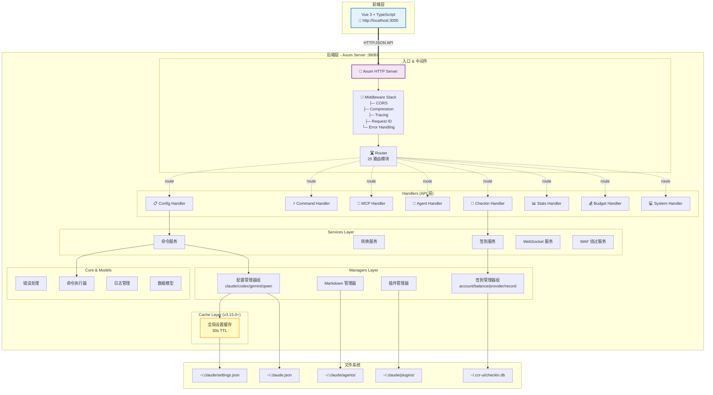

# 后端架构设计

CCR UI 的后端是一个基于 Rust 和 Axum 0.8 构建的高性能 Web 服务。

> **版本**: v3.16.2  
> **最后更新**: 2025-12-28  
> **框架**: Axum 0.8.6  
> **架构模式**: 分层架构（6 层）

## 🎯 设计目标

后端架构的主要设计目标：

- **高性能**：利用 Rust 的零成本抽象和 Axum 的异步特性
- **安全性**：内存安全、类型安全，防止常见的安全漏洞
- **可靠性**：错误处理完善，系统稳定性高
- **可扩展性**：模块化设计，易于添加新功能
- **易维护性**：清晰的代码结构和完善的文档
- **高并发**：支持大量并发请求

## 🏗️ 整体架构

### 分层架构（v3.15.0）

CCR UI Backend 采用严格的 6 层架构，实现了关注点分离和依赖管理：

```
┌──────────────────────────────────────────────────────┐
│  Routes Layer (路由层)                                 │
│  - 25+ 路由模块，按功能严格分类                          │
│  - HTTP 路由定义、中间件配置                            │
└──────────────────────────────────────────────────────┘
                        ↓
┌──────────────────────────────────────────────────────┐
│  API Layer (API 处理层)                                │
│  - handlers/ 目录：16+ 处理器文件                       │
│  - HTTP 请求处理、参数验证、响应构建                     │
└──────────────────────────────────────────────────────┘
                        ↓
┌──────────────────────────────────────────────────────┐
│  Services Layer (服务层)                               │
│  - 业务逻辑编排、事务管理                               │
│  - 跨平台转换、命令执行、签到服务                        │
└──────────────────────────────────────────────────────┘
                        ↓
┌──────────────────────────────────────────────────────┐
│  Managers Layer (管理层)                               │
│  - 数据访问、文件 I/O、持久化操作                        │
│  - config/: 5 个平台配置管理器                          │
│  - checkin/: 8 个签到管理器                            │
│  - 其他: markdown, plugins, ui_state                 │
└──────────────────────────────────────────────────────┘
                        ↓
┌──────────────────────────────────────────────────────┐
│  Cache Layer (缓存层) - v3.15.0+                       │
│  - 全局设置缓存 (30s TTL)                              │
│  - 减少 80% 文件 I/O，性能提升 50-100x                  │
└──────────────────────────────────────────────────────┘
                        ↓
┌──────────────────────────────────────────────────────┐
│  Models Layer (模型层)                                 │
│  - 数据结构定义、序列化/反序列化                         │
│  - API 模型、平台模型、签到模型                          │
└──────────────────────────────────────────────────────┘
                        ↓
┌──────────────────────────────────────────────────────┐
│  Core Layer (核心层)                                   │
│  - 基础设施：error, crypto, executor                   │
│  - log_manager, bom_writer                          │
└──────────────────────────────────────────────────────┘
                        ↓
┌──────────────────────────────────────────────────────┐
│  Utils Layer (工具层)                                  │
│  - 通用工具函数、配置读取                                │
└──────────────────────────────────────────────────────┘
```

**依赖规则**：
- ✅ **严格单向依赖**：只能向下依赖，不能反向依赖
- ✅ **无循环依赖**：任何两层之间不能形成循环
- ✅ **跨层调用禁止**：不能跨层直接调用（如 API 直接调用 Managers）

### 系统架构图



## 📦 主要模块

### 1. Routes Layer (路由层)

位于 `src/routes/`，定义所有 HTTP 路由。

**25+ 路由模块**：
```
routes/
├── mod.rs                      # 路由组装与中间件
├── agents_routes.rs            # Agents 管理路由
├── budget_routes.rs            # 预算管理路由
├── builtin_prompts_routes.rs  # 内置提示词路由
├── checkin_routes.rs           # 签到管理路由
├── codex_routes.rs             # Codex 平台路由
├── command_routes.rs           # 命令执行路由
├── config_routes.rs            # 配置管理路由
├── converter_routes.rs         # 配置转换路由
├── gemini_routes.rs            # Gemini 平台路由
├── mcp_routes.rs               # MCP 管理路由
├── other_routes.rs             # 其他路由
├── platform_routes.rs          # 平台管理路由
├── plugins_routes.rs           # 插件管理路由
├── pricing_routes.rs           # 定价管理路由
├── prompts_routes.rs           # 提示词管理路由
├── provider_health_routes.rs  # 提供商健康检查路由
├── qwen_routes.rs              # Qwen 平台路由
├── sessions_routes.rs          # 会话管理路由
├── skills_routes.rs            # 技能管理路由
├── slash_commands_routes.rs   # 斜杠命令路由
├── stats_routes.rs             # 统计路由
├── sync_routes.rs              # 同步路由
├── system_routes.rs            # 系统信息路由
├── ui_state_routes.rs          # UI 状态路由
├── usage_routes.rs             # 使用记录路由
└── version_routes.rs           # 版本管理路由
```

**中间件栈**（在 `routes/mod.rs::apply_middleware()`）：
1. **Request ID**: 生成和传播唯一请求 ID
2. **Tracing**: 结构化日志记录
3. **CORS**: 跨域资源共享（允许所有来源）
4. **Compression**: 自动压缩响应（gzip/br/zstd）

### 2. API Layer (API 处理层)

位于 `src/api/handlers/`，处理 HTTP 请求。

**16+ 处理器文件**：
```
api/handlers/
├── mod.rs                  # Handler 导出
├── agents.rs               # Agents CRUD
├── budget.rs               # 预算查询
├── builtin_prompts.rs      # 内置提示词
├── checkin.rs              # 签到功能（重要！）
├── command.rs              # 命令执行
├── config.rs               # 配置管理
├── converter.rs            # 格式转换
├── logs.rs                 # 日志查询
├── mcp.rs                  # MCP 服务器
├── mcp_presets.rs          # MCP 预设
├── platform.rs             # 平台管理
├── platforms/              # 平台专属处理器
│   ├── codex.rs
│   ├── gemini.rs
│   ├── qwen.rs
│   └── iflow.rs
├── plugins.rs              # 插件管理
├── pricing.rs              # 定价信息
├── prompts.rs              # 提示词管理
├── response.rs             # 响应构建
├── skills.rs               # 技能管理
├── slash_commands.rs       # 斜杠命令
├── stats.rs                # 统计数据
├── sync.rs                 # WebDAV 同步
├── system.rs               # 系统信息
├── ui_state.rs             # UI 状态
├── usage.rs                # 使用记录
└── version.rs              # 版本信息
```

### 3. Services Layer (服务层)

位于 `src/services/`，实现业务逻辑。

**7 个服务模块**：
```
services/
├── mod.rs
├── checkin_service.rs      # 签到业务逻辑
├── commands.rs             # 命令服务
├── converter_service.rs    # 配置转换服务
├── log_persistence.rs      # 日志持久化
├── waf_bypass.rs           # WAF 绕过（签到专用）
└── websocket.rs            # WebSocket 服务
```

**关键服务**：
- `checkin_service`: 管理签到流程、账号、提供商
- `converter_service`: 跨平台配置格式转换
- `waf_bypass`: 使用 chromiumoxide 绕过 WAF 限制

### 4. Managers Layer (管理层)

位于 `src/managers/`，负责数据访问和持久化。

**Config 管理器组** (`managers/config/`):
```
config/
├── mod.rs
├── platform_manager.rs     # 平台抽象接口
├── claude_manager.rs       # Claude Code 配置
├── codex_manager.rs        # Codex 配置
├── gemini_manager.rs       # Gemini CLI 配置
└── qwen_manager.rs         # Qwen 配置
```

**Checkin 管理器组** (`managers/checkin/`) - **新增 v3.7+**:
```
checkin/
├── mod.rs
├── account_manager.rs      # 账号管理
├── balance_manager.rs      # 余额查询
├── provider_manager.rs     # 提供商管理
├── record_manager.rs       # 签到记录
├── waf_cookie_manager.rs   # Cookie 管理
├── builtin_providers.rs    # 内置提供商配置
└── export_manager.rs       # 导入导出
```

**其他管理器**：
```
managers/
├── markdown_manager.rs     # Markdown 文件 CRUD
├── plugins_manager.rs      # 插件配置管理
├── settings_manager.rs     # 设置管理（已废弃）
└── ui_state_manager.rs     # UI 状态持久化
```

### 5. Cache Layer (缓存层) - **v3.15.0+**

位于 `src/cache/`，全局缓存机制。

**特性**：
- **TTL**: 30 秒自动过期
- **性能**: 减少 80% 文件 I/O，提升 50-100x
- **线程安全**: 使用 `Arc<RwLock<T>>`
- **自动刷新**: 过期时自动重新加载

**缓存的数据**：
- `~/.claude/settings.json` 的全局配置
- MCP 服务器列表
- Agents 列表
- 插件配置

### 6. Models Layer (模型层)

位于 `src/models/`，定义数据结构。

```
models/
├── mod.rs
├── api.rs                  # 通用 API 模型
├── converter.rs            # 转换器模型
├── monitoring.rs           # 监控模型
├── ui_state.rs             # UI 状态模型
├── usage.rs                # 使用记录模型
├── checkin/                # 签到模型
│   ├── account.rs
│   ├── balance.rs
│   ├── provider.rs
│   ├── record.rs
│   ├── dashboard.rs
│   └── export.rs
└── platforms/              # 平台特定模型
    ├── codex.rs
    ├── gemini.rs
    └── qwen.rs
```

### 7. Core Layer (核心层)

位于 `src/core/`，基础设施。

```
core/
├── mod.rs
├── error.rs                # 统一错误类型
├── executor.rs             # CCR 命令执行器
├── log_manager.rs          # 日志轮转与清理
├── crypto.rs               # AES-256-GCM 加密（签到用）
└── bom_writer.rs           # UTF-8 BOM 写入（Windows 兼容）
```

**关键模块**：
- `error.rs`: 定义 `AppError` 枚举，统一错误处理
- `executor.rs`: 通过子进程调用 CCR CLI
- `crypto.rs`: API Key 加密存储（签到功能专用）
- `log_manager.rs`: 日志文件日轮转、自动清理

### 8. Utils Layer (工具层)

位于 `src/utils/`，通用工具函数。

```
utils/
├── mod.rs
└── config_reader.rs        # 通用配置读取工具
```

## 🔑 核心功能模块

### 签到管理系统 (v3.7+)

**架构**：
```
Handlers → CheckinService → CheckinManagers → Models → SQLite
```

**功能**：
1. **提供商管理**: 内置 + 自定义提供商
2. **账号管理**: 多提供商、多账号支持
3. **自动签到**: 批量签到、定时任务
4. **余额查询**: 实时查询账号余额
5. **记录追踪**: 签到历史、成功/失败统计
6. **WAF 绕过**: 使用 Chromium 绕过 CloudFlare

**内置提供商**：
- AnyRouter (`anyrouter.top`) - 需 WAF 绕过
- AgentRouter (`agentrouter.org`) - 自动签到
- CodeRouter (`api.codemirror.codes`) - 无签到

**数据存储**: `~/.ccr-ui/checkin.db` (SQLite)

### WebSocket 实时通信

**用途**：
- 实时日志流
- 命令执行进度
- 系统状态更新

**端点**: `/ws`

## 🔒 安全特性

1. **API Key 加密**: 使用 AES-256-GCM 加密存储
2. **CORS 配置**: 可配置的跨域策略
3. **Request ID**: 请求追踪和审计
4. **错误隐藏**: 生产环境不暴露敏感错误
5. **原子操作**: 文件写入使用临时文件 + 原子重命名

## 📊 技术栈

| 组件 | 技术 | 版本 | 用途 |
|------|------|------|------|
| **Web 框架** | Axum | 0.8.6 | HTTP 服务器和路由 |
| **中间件** | Tower + Tower-HTTP | 0.5/0.6 | CORS、压缩、日志 |
| **异步运行时** | Tokio | 1.48.0 | 异步任务执行 |
| **序列化** | Serde + Serde JSON | 1.0 | JSON/TOML 序列化 |
| **配置解析** | TOML | 0.9 | 配置文件解析 |
| **错误处理** | Anyhow/Thiserror | 1.0/2.0 | 错误处理和传播 |
| **日志** | Tracing | 0.1 | 结构化日志记录 |
| **CLI 解析** | Clap | 4.5 | 命令行参数解析 |
| **系统信息** | Sysinfo | 0.37.2 | 系统信息获取 |
| **HTTP 客户端** | Reqwest | 0.12.25 | 签到 API 调用 |
| **加密** | AES-GCM | 0.10 | API Key 加密 |
| **浏览器自动化** | chromiumoxide | 0.8 | WAF 绕过 |

## 📁 项目结构

完整的目录结构请参考 [`backend/CLAUDE.md`](../../backend/CLAUDE.md)。

## 🚀 构建和部署

### 开发模式

```bash
cd ccr-ui/backend
cargo run -- --port 38081

# 启用调试日志
RUST_LOG=debug cargo run
```

### 生产构建

```bash
cd ccr-ui/backend
cargo build --release

# 二进制文件: target/release/ccr-ui-backend
./target/release/ccr-ui-backend --port 38081
```

### Docker 部署

```dockerfile
FROM rust:1.85 as builder
WORKDIR /app
COPY . .
RUN cargo build --release

FROM debian:bookworm-slim
COPY --from=builder /app/target/release/ccr-ui-backend /usr/local/bin/
EXPOSE 38081
CMD ["ccr-ui-backend", "--port", "38081"]
```

## 📚 相关文档

- [技术栈详解](./tech-stack.md)
- [开发指南](./development.md)
- [API 文档](./api.md)
- [部署指南](./deployment.md)
- [错误处理](./error-handling.md)
- [Backend CLAUDE.md](../../backend/CLAUDE.md) - 最详细的开发文档