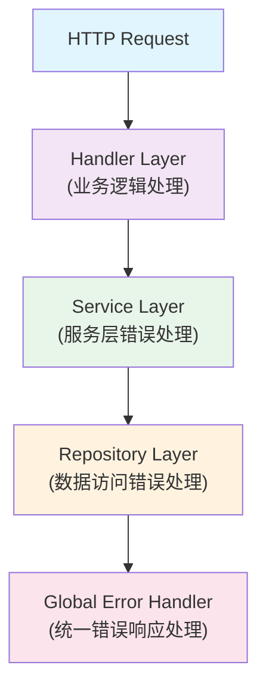

# 错误处理指南

本文档详细介绍 CCR UI 后端的错误处理机制，包括错误类型定义、处理策略、日志记录、监控告警和最佳实践。

> **📢 重要更新**: v1.2.0 版本已从 Actix Web 迁移到 Axum。错误处理机制已优化为使用 Axum 的 `IntoResponse` trait。详见 [Axum 迁移说明](./MIGRATION_AXUM.md)。

## 🎯 错误处理概览

### 设计原则

- **统一性**: 所有错误都通过统一的错误类型处理
- **可追踪性**: 每个错误都有唯一标识符和完整的上下文信息
- **用户友好**: 向用户返回清晰、有用的错误信息
- **开发友好**: 为开发者提供详细的调试信息
- **安全性**: 不泄露敏感信息给最终用户

### 错误处理架构



## 🔧 错误类型定义

### 核心错误类型

```rust
use axum::{
    http::StatusCode,
    response::{IntoResponse, Response},
    Json,
};
use serde::{Deserialize, Serialize};
use thiserror::Error;
use uuid::Uuid;

/// 应用程序主要错误类型
#[derive(Error, Debug)]
pub enum AppError {
    // 数据库相关错误
    #[error("Database error: {message}")]
    Database {
        message: String,
        source: Option<Box<dyn std::error::Error + Send + Sync>>,
        error_id: Uuid,
    },

    // 验证错误
    #[error("Validation error: {field} - {message}")]
    Validation {
        field: String,
        message: String,
        error_id: Uuid,
    },

    // 认证错误
    #[error("Authentication error: {message}")]
    Authentication {
        message: String,
        error_id: Uuid,
    },

    // 授权错误
    #[error("Authorization error: {message}")]
    Authorization {
        message: String,
        error_id: Uuid,
    },

    // 资源未找到
    #[error("Resource not found: {resource_type} with {identifier}")]
    NotFound {
        resource_type: String,
        identifier: String,
        error_id: Uuid,
    },

    // 资源冲突
    #[error("Resource conflict: {message}")]
    Conflict {
        message: String,
        error_id: Uuid,
    },

    // 外部服务错误
    #[error("External service error: {service} - {message}")]
    ExternalService {
        service: String,
        message: String,
        status_code: Option<u16>,
        error_id: Uuid,
    },

    // 配置错误
    #[error("Configuration error: {message}")]
    Configuration {
        message: String,
        error_id: Uuid,
    },

    // 业务逻辑错误
    #[error("Business logic error: {message}")]
    BusinessLogic {
        message: String,
        context: serde_json::Value,
        error_id: Uuid,
    },

    // 速率限制错误
    #[error("Rate limit exceeded: {message}")]
    RateLimit {
        message: String,
        retry_after: Option<u64>,
        error_id: Uuid,
    },

    // 内部服务器错误
    #[error("Internal server error: {message}")]
    Internal {
        message: String,
        source: Option<Box<dyn std::error::Error + Send + Sync>>,
        error_id: Uuid,
    },
}

/// 错误响应结构
#[derive(Serialize, Deserialize, Debug)]
pub struct ErrorResponse {
    pub error: ErrorDetail,
    pub request_id: Option<String>,
    pub timestamp: chrono::DateTime<chrono::Utc>,
}

#[derive(Serialize, Deserialize, Debug)]
pub struct ErrorDetail {
    pub code: String,
    pub message: String,
    pub details: Option<serde_json::Value>,
    pub error_id: Uuid,
}
```

### 特定领域错误

```rust
/// 配置管理相关错误
#[derive(Error, Debug)]
pub enum ConfigError {
    #[error("Configuration '{name}' not found")]
    NotFound { name: String },

    #[error("Configuration '{name}' already exists")]
    AlreadyExists { name: String },

    #[error("Invalid configuration format: {message}")]
    InvalidFormat { message: String },

    #[error("Configuration validation failed: {field} - {message}")]
    ValidationFailed { field: String, message: String },

    #[error("Configuration is currently in use and cannot be deleted")]
    InUse,

    #[error("Configuration provider '{provider}' is not supported")]
    UnsupportedProvider { provider: String },
}

/// 命令执行相关错误
#[derive(Error, Debug)]
pub enum CommandError {
    #[error("Command execution failed: {message}")]
    ExecutionFailed { message: String, exit_code: Option<i32> },

    #[error("Command timeout after {timeout_seconds} seconds")]
    Timeout { timeout_seconds: u64 },

    #[error("Command not found: {command}")]
    NotFound { command: String },

    #[error("Permission denied for command: {command}")]
    PermissionDenied { command: String },

    #[error("Invalid command syntax: {message}")]
    InvalidSyntax { message: String },
}

/// MCP 服务器相关错误
#[derive(Error, Debug)]
pub enum McpError {
    #[error("MCP server '{name}' not found")]
    ServerNotFound { name: String },

    #[error("MCP server '{name}' is not running")]
    ServerNotRunning { name: String },

    #[error("MCP server '{name}' failed to start: {message}")]
    StartupFailed { name: String, message: String },

    #[error("MCP protocol error: {message}")]
    ProtocolError { message: String },

    #[error("MCP server communication timeout")]
    CommunicationTimeout,
}
```

## 🛠️ 错误处理实现

### 错误转换和映射

```rust
impl AppError {
    /// 创建数据库错误
    pub fn database<E>(message: impl Into<String>, source: E) -> Self
    where
        E: std::error::Error + Send + Sync + 'static,
    {
        Self::Database {
            message: message.into(),
            source: Some(Box::new(source)),
            error_id: Uuid::new_v4(),
        }
    }

    /// 创建验证错误
    pub fn validation(field: impl Into<String>, message: impl Into<String>) -> Self {
        Self::Validation {
            field: field.into(),
            message: message.into(),
            error_id: Uuid::new_v4(),
        }
    }

    /// 创建未找到错误
    pub fn not_found(resource_type: impl Into<String>, identifier: impl Into<String>) -> Self {
        Self::NotFound {
            resource_type: resource_type.into(),
            identifier: identifier.into(),
            error_id: Uuid::new_v4(),
        }
    }

    /// 获取错误ID
    pub fn error_id(&self) -> Uuid {
        match self {
            Self::Database { error_id, .. } => *error_id,
            Self::Validation { error_id, .. } => *error_id,
            Self::Authentication { error_id, .. } => *error_id,
            Self::Authorization { error_id, .. } => *error_id,
            Self::NotFound { error_id, .. } => *error_id,
            Self::Conflict { error_id, .. } => *error_id,
            Self::ExternalService { error_id, .. } => *error_id,
            Self::Configuration { error_id, .. } => *error_id,
            Self::BusinessLogic { error_id, .. } => *error_id,
            Self::RateLimit { error_id, .. } => *error_id,
            Self::Internal { error_id, .. } => *error_id,
        }
    }

    /// 获取 HTTP 状态码
    pub fn status_code(&self) -> StatusCode {
        match self {
            Self::Database { .. } => StatusCode::INTERNAL_SERVER_ERROR,
            Self::Validation { .. } => StatusCode::BAD_REQUEST,
            Self::Authentication { .. } => StatusCode::UNAUTHORIZED,
            Self::Authorization { .. } => StatusCode::FORBIDDEN,
            Self::NotFound { .. } => StatusCode::NOT_FOUND,
            Self::Conflict { .. } => StatusCode::CONFLICT,
            Self::ExternalService { .. } => StatusCode::BAD_GATEWAY,
            Self::Configuration { .. } => StatusCode::INTERNAL_SERVER_ERROR,
            Self::BusinessLogic { .. } => StatusCode::UNPROCESSABLE_ENTITY,
            Self::RateLimit { .. } => StatusCode::TOO_MANY_REQUESTS,
            Self::Internal { .. } => StatusCode::INTERNAL_SERVER_ERROR,
        }
    }

    /// 获取错误代码
    pub fn error_code(&self) -> &'static str {
        match self {
            Self::Database { .. } => "DATABASE_ERROR",
            Self::Validation { .. } => "VALIDATION_ERROR",
            Self::Authentication { .. } => "AUTHENTICATION_ERROR",
            Self::Authorization { .. } => "AUTHORIZATION_ERROR",
            Self::NotFound { .. } => "NOT_FOUND",
            Self::Conflict { .. } => "CONFLICT",
            Self::ExternalService { .. } => "EXTERNAL_SERVICE_ERROR",
            Self::Configuration { .. } => "CONFIGURATION_ERROR",
            Self::BusinessLogic { .. } => "BUSINESS_LOGIC_ERROR",
            Self::RateLimit { .. } => "RATE_LIMIT_EXCEEDED",
            Self::Internal { .. } => "INTERNAL_SERVER_ERROR",
        }
    }
}
```

### 外部错误转换

```rust
// SQLx 错误转换
impl From<sqlx::Error> for AppError {
    fn from(err: sqlx::Error) -> Self {
        match err {
            sqlx::Error::RowNotFound => Self::not_found("record", "query result"),
            sqlx::Error::Database(db_err) => {
                if let Some(constraint) = db_err.constraint() {
                    Self::Conflict {
                        message: format!("Database constraint violation: {}", constraint),
                        error_id: Uuid::new_v4(),
                    }
                } else {
                    Self::database("Database operation failed", err)
                }
            }
            _ => Self::database("Database error", err),
        }
    }
}

// Serde JSON 错误转换
impl From<serde_json::Error> for AppError {
    fn from(err: serde_json::Error) -> Self {
        Self::validation("json", format!("JSON parsing error: {}", err))
    }
}

// HTTP 客户端错误转换
impl From<reqwest::Error> for AppError {
    fn from(err: reqwest::Error) -> Self {
        let status_code = err.status().map(|s| s.as_u16());
        Self::ExternalService {
            service: "http_client".to_string(),
            message: err.to_string(),
            status_code,
            error_id: Uuid::new_v4(),
        }
    }
}

// 配置错误转换
impl From<ConfigError> for AppError {
    fn from(err: ConfigError) -> Self {
        match err {
            ConfigError::NotFound { name } => Self::not_found("configuration", name),
            ConfigError::AlreadyExists { name } => Self::Conflict {
                message: format!("Configuration '{}' already exists", name),
                error_id: Uuid::new_v4(),
            },
            ConfigError::ValidationFailed { field, message } => {
                Self::validation(field, message)
            }
            _ => Self::BusinessLogic {
                message: err.to_string(),
                context: serde_json::json!({"error_type": "config_error"}),
                error_id: Uuid::new_v4(),
            },
        }
    }
}
```

### HTTP 响应实现

```rust
impl IntoResponse for AppError {
    fn into_response(self) -> Response {
        let error_id = self.error_id();
        let status_code = self.status_code();
        let error_code = self.error_code();

        // 记录错误日志
        match &self {
            Self::Internal { .. } | Self::Database { .. } => {
                tracing::error!(
                    error_id = %error_id,
                    error = %self,
                    "Internal error occurred"
                );
            }
            _ => {
                tracing::warn!(
                    error_id = %error_id,
                    error = %self,
                    "Client error occurred"
                );
            }
        }

        // 构建错误响应
        let error_response = ErrorResponse {
            error: ErrorDetail {
                code: error_code.to_string(),
                message: self.user_message(),
                details: self.error_details(),
                error_id,
            },
            request_id: None, // 可以从请求上下文中获取
            timestamp: chrono::Utc::now(),
        };

        (status_code, Json(error_response)).into_response()
    }
}

impl AppError {
    /// 获取用户友好的错误消息
    fn user_message(&self) -> String {
        match self {
            Self::Database { .. } => "数据库操作失败，请稍后重试".to_string(),
            Self::Validation { field, message, .. } => {
                format!("输入验证失败: {} - {}", field, message)
            }
            Self::Authentication { .. } => "身份验证失败，请重新登录".to_string(),
            Self::Authorization { .. } => "权限不足，无法执行此操作".to_string(),
            Self::NotFound { resource_type, .. } => {
                format!("未找到指定的{}", resource_type)
            }
            Self::Conflict { message, .. } => message.clone(),
            Self::ExternalService { service, .. } => {
                format!("外部服务 {} 暂时不可用，请稍后重试", service)
            }
            Self::Configuration { .. } => "系统配置错误，请联系管理员".to_string(),
            Self::BusinessLogic { message, .. } => message.clone(),
            Self::RateLimit { .. } => "请求过于频繁，请稍后重试".to_string(),
            Self::Internal { .. } => "服务器内部错误，请稍后重试".to_string(),
        }
    }

    /// 获取错误详细信息
    fn error_details(&self) -> Option<serde_json::Value> {
        match self {
            Self::Validation { field, .. } => Some(serde_json::json!({
                "field": field
            })),
            Self::NotFound { resource_type, identifier, .. } => Some(serde_json::json!({
                "resource_type": resource_type,
                "identifier": identifier
            })),
            Self::ExternalService { service, status_code, .. } => Some(serde_json::json!({
                "service": service,
                "status_code": status_code
            })),
            Self::RateLimit { retry_after, .. } => Some(serde_json::json!({
                "retry_after": retry_after
            })),
            Self::BusinessLogic { context, .. } => Some(context.clone()),
            _ => None,
        }
    }
}
```

## 🔍 错误处理中间件

### 全局错误处理中间件

```rust
use axum::{
    extract::Request,
    http::HeaderMap,
    middleware::Next,
    response::Response,
};
use uuid::Uuid;

/// 请求追踪中间件
pub async fn request_tracing_middleware(
    mut request: Request,
    next: Next,
) -> Response {
    let request_id = Uuid::new_v4();
    
    // 添加请求ID到请求头
    request.headers_mut().insert(
        "x-request-id",
        request_id.to_string().parse().unwrap(),
    );

    // 记录请求开始
    let method = request.method().clone();
    let uri = request.uri().clone();
    let start_time = std::time::Instant::now();

    tracing::info!(
        request_id = %request_id,
        method = %method,
        uri = %uri,
        "Request started"
    );

    // 执行请求
    let mut response = next.run(request).await;

    // 记录请求完成
    let duration = start_time.elapsed();
    let status = response.status();

    tracing::info!(
        request_id = %request_id,
        method = %method,
        uri = %uri,
        status = %status,
        duration_ms = %duration.as_millis(),
        "Request completed"
    );

    // 添加请求ID到响应头
    response.headers_mut().insert(
        "x-request-id",
        request_id.to_string().parse().unwrap(),
    );

    response
}

/// 错误恢复中间件
pub async fn error_recovery_middleware(
    request: Request,
    next: Next,
) -> Response {
    match std::panic::catch_unwind(std::panic::AssertUnwindSafe(|| {
        tokio::runtime::Handle::current().block_on(next.run(request))
    })) {
        Ok(response) => response,
        Err(panic_info) => {
            let error_id = Uuid::new_v4();
            
            tracing::error!(
                error_id = %error_id,
                panic_info = ?panic_info,
                "Panic occurred during request processing"
            );

            AppError::Internal {
                message: "Unexpected server error".to_string(),
                source: None,
                error_id,
            }.into_response()
        }
    }
}
```

### 验证中间件

```rust
use axum::{
    extract::{Json, State},
    http::StatusCode,
};
use serde::de::DeserializeOwned;
use validator::Validate;

/// 验证请求体的通用函数
pub async fn validate_json<T>(
    Json(payload): Json<T>,
) -> Result<T, AppError>
where
    T: DeserializeOwned + Validate,
{
    payload.validate().map_err(|validation_errors| {
        let mut error_messages = Vec::new();
        
        for (field, errors) in validation_errors.field_errors() {
            for error in errors {
                let message = error.message
                    .as_ref()
                    .map(|m| m.to_string())
                    .unwrap_or_else(|| "Invalid value".to_string());
                
                error_messages.push(format!("{}: {}", field, message));
            }
        }

        AppError::validation(
            "request_body",
            error_messages.join(", ")
        )
    })?;

    Ok(payload)
}

/// 验证查询参数的通用函数
pub fn validate_query_params<T>(params: T) -> Result<T, AppError>
where
    T: Validate,
{
    params.validate().map_err(|validation_errors| {
        let mut error_messages = Vec::new();
        
        for (field, errors) in validation_errors.field_errors() {
            for error in errors {
                let message = error.message
                    .as_ref()
                    .map(|m| m.to_string())
                    .unwrap_or_else(|| "Invalid value".to_string());
                
                error_messages.push(format!("{}: {}", field, message));
            }
        }

        AppError::validation(
            "query_parameters",
            error_messages.join(", ")
        )
    })?;

    Ok(params)
}
```

## 📊 错误监控和告警

### 错误指标收集

```rust
use prometheus::{Counter, Histogram, IntCounterVec, register_counter, register_histogram, register_int_counter_vec};
use once_cell::sync::Lazy;

/// 错误计数器
static ERROR_COUNTER: Lazy<IntCounterVec> = Lazy::new(|| {
    register_int_counter_vec!(
        "ccr_ui_errors_total",
        "Total number of errors by type and endpoint",
        &["error_type", "endpoint", "method"]
    ).unwrap()
});

/// 错误响应时间
static ERROR_RESPONSE_TIME: Lazy<Histogram> = Lazy::new(|| {
    register_histogram!(
        "ccr_ui_error_response_duration_seconds",
        "Time spent processing error responses"
    ).unwrap()
});

/// 数据库错误计数器
static DATABASE_ERROR_COUNTER: Lazy<Counter> = Lazy::new(|| {
    register_counter!(
        "ccr_ui_database_errors_total",
        "Total number of database errors"
    ).unwrap()
});

/// 记录错误指标
pub fn record_error_metrics(error: &AppError, endpoint: &str, method: &str) {
    let error_type = error.error_code();
    
    ERROR_COUNTER
        .with_label_values(&[error_type, endpoint, method])
        .inc();

    // 记录特定类型的错误
    match error {
        AppError::Database { .. } => {
            DATABASE_ERROR_COUNTER.inc();
        }
        _ => {}
    }
}
```

### 错误告警配置

**Prometheus 告警规则** (`alerts.yml`):
```yaml
groups:
  - name: ccr-ui-errors
    rules:
      # 高错误率告警
      - alert: HighErrorRate
        expr: |
          (
            rate(ccr_ui_errors_total[5m]) / 
            rate(http_requests_total[5m])
          ) > 0.05
        for: 2m
        labels:
          severity: warning
        annotations:
          summary: "CCR UI high error rate detected"
          description: "Error rate is {{ $value | humanizePercentage }} over the last 5 minutes"

      # 数据库错误告警
      - alert: DatabaseErrors
        expr: rate(ccr_ui_database_errors_total[5m]) > 0.1
        for: 1m
        labels:
          severity: critical
        annotations:
          summary: "CCR UI database errors detected"
          description: "Database error rate is {{ $value }} errors per second"

      # 认证错误激增
      - alert: AuthenticationErrorSpike
        expr: |
          rate(ccr_ui_errors_total{error_type="AUTHENTICATION_ERROR"}[5m]) > 1
        for: 2m
        labels:
          severity: warning
        annotations:
          summary: "CCR UI authentication error spike"
          description: "Authentication error rate is {{ $value }} errors per second"

      # 外部服务错误
      - alert: ExternalServiceErrors
        expr: |
          rate(ccr_ui_errors_total{error_type="EXTERNAL_SERVICE_ERROR"}[5m]) > 0.5
        for: 3m
        labels:
          severity: warning
        annotations:
          summary: "CCR UI external service errors"
          description: "External service error rate is {{ $value }} errors per second"
```

### 错误日志聚合

```rust
use tracing::{error, warn, info};
use serde_json::json;

/// 结构化错误日志记录
pub fn log_error_with_context(
    error: &AppError,
    context: &ErrorContext,
) {
    let error_id = error.error_id();
    let log_level = match error {
        AppError::Internal { .. } | AppError::Database { .. } => "error",
        AppError::ExternalService { .. } => "warn",
        _ => "info",
    };

    let log_data = json!({
        "error_id": error_id,
        "error_type": error.error_code(),
        "error_message": error.to_string(),
        "user_id": context.user_id,
        "request_id": context.request_id,
        "endpoint": context.endpoint,
        "method": context.method,
        "user_agent": context.user_agent,
        "ip_address": context.ip_address,
        "timestamp": chrono::Utc::now(),
        "stack_trace": context.stack_trace,
    });

    match log_level {
        "error" => error!(target: "ccr_ui::errors", "{}", log_data),
        "warn" => warn!(target: "ccr_ui::errors", "{}", log_data),
        _ => info!(target: "ccr_ui::errors", "{}", log_data),
    }
}

#[derive(Debug)]
pub struct ErrorContext {
    pub user_id: Option<String>,
    pub request_id: Option<String>,
    pub endpoint: String,
    pub method: String,
    pub user_agent: Option<String>,
    pub ip_address: Option<String>,
    pub stack_trace: Option<String>,
}
```

## 🧪 错误处理测试

### 单元测试

```rust
#[cfg(test)]
mod tests {
    use super::*;
    use axum::http::StatusCode;

    #[test]
    fn test_app_error_status_codes() {
        assert_eq!(
            AppError::validation("field", "message").status_code(),
            StatusCode::BAD_REQUEST
        );

        assert_eq!(
            AppError::not_found("user", "123").status_code(),
            StatusCode::NOT_FOUND
        );

        assert_eq!(
            AppError::Authentication {
                message: "Invalid token".to_string(),
                error_id: Uuid::new_v4(),
            }.status_code(),
            StatusCode::UNAUTHORIZED
        );
    }

    #[test]
    fn test_error_conversion() {
        let sqlx_error = sqlx::Error::RowNotFound;
        let app_error: AppError = sqlx_error.into();
        
        match app_error {
            AppError::NotFound { resource_type, .. } => {
                assert_eq!(resource_type, "record");
            }
            _ => panic!("Expected NotFound error"),
        }
    }

    #[test]
    fn test_error_serialization() {
        let error = AppError::validation("email", "Invalid email format");
        let response = error.into_response();
        
        assert_eq!(response.status(), StatusCode::BAD_REQUEST);
    }
}
```

### 集成测试

```rust
#[cfg(test)]
mod integration_tests {
    use super::*;
    use axum::{
        body::Body,
        http::{Request, StatusCode},
        Router,
    };
    use tower::ServiceExt;

    async fn create_test_app() -> Router {
        Router::new()
            .route("/test-validation", axum::routing::post(test_validation_handler))
            .route("/test-not-found", axum::routing::get(test_not_found_handler))
            .layer(axum::middleware::from_fn(request_tracing_middleware))
    }

    async fn test_validation_handler(
        Json(payload): Json<TestRequest>,
    ) -> Result<Json<TestResponse>, AppError> {
        validate_json(Json(payload)).await?;
        Ok(Json(TestResponse { success: true }))
    }

    async fn test_not_found_handler() -> Result<Json<TestResponse>, AppError> {
        Err(AppError::not_found("test_resource", "123"))
    }

    #[tokio::test]
    async fn test_validation_error_response() {
        let app = create_test_app().await;

        let request = Request::builder()
            .method("POST")
            .uri("/test-validation")
            .header("content-type", "application/json")
            .body(Body::from(r#"{"invalid": "data"}"#))
            .unwrap();

        let response = app.oneshot(request).await.unwrap();
        assert_eq!(response.status(), StatusCode::BAD_REQUEST);

        let body = hyper::body::to_bytes(response.into_body()).await.unwrap();
        let error_response: ErrorResponse = serde_json::from_slice(&body).unwrap();
        
        assert_eq!(error_response.error.code, "VALIDATION_ERROR");
        assert!(error_response.error.error_id != Uuid::nil());
    }

    #[tokio::test]
    async fn test_not_found_error_response() {
        let app = create_test_app().await;

        let request = Request::builder()
            .method("GET")
            .uri("/test-not-found")
            .body(Body::empty())
            .unwrap();

        let response = app.oneshot(request).await.unwrap();
        assert_eq!(response.status(), StatusCode::NOT_FOUND);

        let body = hyper::body::to_bytes(response.into_body()).await.unwrap();
        let error_response: ErrorResponse = serde_json::from_slice(&body).unwrap();
        
        assert_eq!(error_response.error.code, "NOT_FOUND");
        assert_eq!(error_response.error.details.unwrap()["resource_type"], "test_resource");
    }
}
```

## 🎯 最佳实践

### 错误处理原则

#### 1. 早期验证

```rust
/// 在处理开始时就进行所有必要的验证
pub async fn create_config_handler(
    State(state): State<AppState>,
    Json(request): Json<CreateConfigRequest>,
) -> Result<Json<ConfigResponse>, AppError> {
    // 1. 输入验证
    validate_json(Json(request.clone())).await?;
    
    // 2. 业务规则验证
    if request.name.is_empty() {
        return Err(AppError::validation("name", "Configuration name cannot be empty"));
    }
    
    if !is_valid_provider(&request.provider) {
        return Err(AppError::validation("provider", "Unsupported provider"));
    }
    
    // 3. 权限检查
    check_create_permission(&state.auth_service, &request.user_id).await?;
    
    // 4. 业务逻辑处理
    let config = state.config_service.create_config(request).await?;
    
    Ok(Json(ConfigResponse::from(config)))
}
```

#### 2. 上下文保持

```rust
/// 在错误传播过程中保持上下文信息
pub async fn process_config_update(
    config_id: &str,
    update_request: &UpdateConfigRequest,
) -> Result<ConfigItem, AppError> {
    // 获取现有配置
    let existing_config = get_config_by_id(config_id)
        .await
        .map_err(|e| AppError::database(
            format!("Failed to fetch config {}", config_id),
            e
        ))?;

    // 验证更新权限
    validate_update_permission(&existing_config, &update_request.user_id)
        .await
        .map_err(|e| AppError::Authorization {
            message: format!("Cannot update config {}: {}", config_id, e),
            error_id: Uuid::new_v4(),
        })?;

    // 执行更新
    update_config_in_database(&existing_config, update_request)
        .await
        .map_err(|e| AppError::database(
            format!("Failed to update config {}", config_id),
            e
        ))
}
```

#### 3. 错误恢复策略

```rust
/// 实现重试和降级机制
pub async fn fetch_external_config(
    provider: &str,
    config_name: &str,
) -> Result<ExternalConfig, AppError> {
    let mut last_error = None;
    
    // 重试机制
    for attempt in 1..=3 {
        match fetch_from_provider(provider, config_name).await {
            Ok(config) => return Ok(config),
            Err(e) => {
                last_error = Some(e);
                
                if attempt < 3 {
                    let delay = Duration::from_millis(100 * attempt as u64);
                    tokio::time::sleep(delay).await;
                    
                    tracing::warn!(
                        provider = provider,
                        config_name = config_name,
                        attempt = attempt,
                        "Retrying external config fetch"
                    );
                }
            }
        }
    }
    
    // 降级策略：尝试从缓存获取
    if let Ok(cached_config) = get_cached_config(provider, config_name).await {
        tracing::warn!(
            provider = provider,
            config_name = config_name,
            "Using cached config due to external service failure"
        );
        return Ok(cached_config);
    }
    
    // 最终失败
    Err(AppError::ExternalService {
        service: provider.to_string(),
        message: format!("Failed to fetch config after 3 attempts: {}", 
                        last_error.unwrap()),
        status_code: None,
        error_id: Uuid::new_v4(),
    })
}
```

#### 4. 安全错误处理

```rust
/// 避免信息泄露的安全错误处理
pub async fn authenticate_user(
    credentials: &UserCredentials,
) -> Result<AuthToken, AppError> {
    // 查找用户
    let user = match find_user_by_email(&credentials.email).await {
        Ok(user) => user,
        Err(_) => {
            // 不暴露用户是否存在的信息
            return Err(AppError::Authentication {
                message: "Invalid credentials".to_string(),
                error_id: Uuid::new_v4(),
            });
        }
    };
    
    // 验证密码
    if !verify_password(&credentials.password, &user.password_hash) {
        // 记录安全事件但不暴露具体原因
        tracing::warn!(
            user_id = %user.id,
            email = %credentials.email,
            "Failed authentication attempt"
        );
        
        return Err(AppError::Authentication {
            message: "Invalid credentials".to_string(),
            error_id: Uuid::new_v4(),
        });
    }
    
    // 生成令牌
    generate_auth_token(&user).await
}
```

### 错误文档化

#### 1. API 错误文档

```rust
/// 配置创建 API
/// 
/// # 错误响应
/// 
/// - `400 Bad Request`: 输入验证失败
///   - `VALIDATION_ERROR`: 请求参数不符合要求
/// - `401 Unauthorized`: 身份验证失败
///   - `AUTHENTICATION_ERROR`: 无效的认证令牌
/// - `403 Forbidden`: 权限不足
///   - `AUTHORIZATION_ERROR`: 没有创建配置的权限
/// - `409 Conflict`: 资源冲突
///   - `CONFLICT`: 配置名称已存在
/// - `500 Internal Server Error`: 服务器内部错误
///   - `DATABASE_ERROR`: 数据库操作失败
///   - `INTERNAL_SERVER_ERROR`: 未预期的服务器错误
/// 
/// # 示例错误响应
/// 
/// ```json
/// {
///   "error": {
///     "code": "VALIDATION_ERROR",
///     "message": "输入验证失败: name - 配置名称不能为空",
///     "details": {
///       "field": "name"
///     },
///     "error_id": "550e8400-e29b-41d4-a716-446655440000"
///   },
///   "request_id": "req_123456789",
///   "timestamp": "2024-01-15T10:30:00Z"
/// }
/// ```
pub async fn create_config(
    State(state): State<AppState>,
    Json(request): Json<CreateConfigRequest>,
) -> Result<Json<ConfigResponse>, AppError> {
    // 实现...
}
```

#### 2. 错误处理指南

```markdown
# 错误处理指南

## 客户端错误处理

### 1. 错误响应格式
所有错误响应都遵循统一格式：
- `error.code`: 错误类型代码
- `error.message`: 用户友好的错误消息
- `error.details`: 错误详细信息（可选）
- `error.error_id`: 唯一错误标识符
- `request_id`: 请求追踪ID
- `timestamp`: 错误发生时间

### 2. 常见错误处理策略

#### 验证错误 (400)
- 显示具体的字段错误信息
- 高亮有问题的输入字段
- 提供修正建议

#### 认证错误 (401)
- 清除本地认证状态
- 重定向到登录页面
- 提示用户重新登录

#### 权限错误 (403)
- 显示权限不足提示
- 提供联系管理员的方式
- 隐藏无权限的功能

#### 资源未找到 (404)
- 显示友好的"未找到"页面
- 提供返回主页的链接
- 记录可能的链接错误

#### 服务器错误 (500)
- 显示通用错误页面
- 提供错误ID供技术支持查询
- 建议用户稍后重试
```

## 📚 相关文档

- [技术栈详解](/backend/tech-stack)
- [架构设计](/backend/architecture)
- [开发指南](/backend/development)
- [API 文档](/backend/api)
- [部署指南](/backend/deployment)