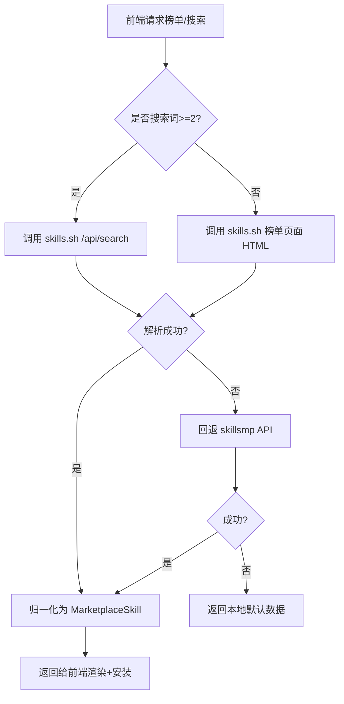

# skills.sh 获取方式说明（初版实现）

> 目标：说明最开始“浏览技能”功能如何从 `https://skills.sh/` 拉取并构建可安装的 skill 列表，供 `agentkit-desktop` 复用。

## 1. 数据源与入口

初版采用**双源策略**：

1. 主源：`skills.sh`
2. 回退源：`skillsmp`（当主源失败时）
3. 最终兜底：本地默认样例数据（离线可展示）

`skills.sh` 入口映射：

- `hot` -> `https://skills.sh/hot`
- `trending` -> `https://skills.sh/trending`
- `all_time` -> `https://skills.sh/`
- 搜索 -> `https://skills.sh/api/search?q=<keyword>&limit=<n>`

## 2. 获取流程（最开始版本）



## 3. `skills.sh` 榜单抓取（HTML）

### 3.1 请求

- 使用浏览器风格 `User-Agent` 与常规 `Accept` 头，降低被风控拦截概率。
- 超时收敛（例如 4s），避免卡住首屏。

### 3.2 解析（两级策略）

1. 主解析（结构化）
- 逐行匹配榜单项 `<a class="group ..." href="/owner/repo/skill">...`。
- 从行内提取：
  - `href` -> `owner/repo/skill`
  - 标题文本 -> `name`
  - 仓库文本 -> `source`（通常 `owner/repo`）
  - 指标文本 -> `metric_value` / `metric_delta`

2. 退化解析（抗结构变化）
- 若 class 结构变动导致主解析失败，退化为全局抓取 `href="/owner/repo/skill"`。
- 至少保留 `id/owner/repo/skill`，指标允许为空。

## 4. `skills.sh` 搜索抓取（JSON）

### 4.1 请求

`GET /api/search?q=<keyword>&limit=<n>`

### 4.2 关键词限制

- 搜索词长度 `< 2`：不发请求，直接返回空（或保持当前列表）。

### 4.3 解析字段

从 `skills[]` 提取：

- `id`（如 `owner/repo/skill`）
- `skillId`
- `name`
- `installs`
- `source`

## 5. 数据归一化规则

统一映射到 `MarketplaceSkill`：

- `id`: 固定为 `owner/repo/skill`
- `owner` / `repo` / `skill`: 从 `id` 或 `href` 拆分
- `name`: 优先使用页面/接口名称，缺失时回退 skill slug
- `source`: 优先接口值，否则 `owner/repo`
- `metric_label`:
  - `hot` -> `1H`
  - `trending` -> `24H Installs`
  - `all_time` 或搜索 -> `Installs`
- `metric_value` / `metric_delta`: 按榜单文本提取，可为空

## 6. 安装粒度（skill 级）

初版目标不是 repo 粒度，而是 skill 粒度：

```bash
npx skills add https://github.com/<owner>/<repo> --skill <skill> -y
```

对应卸载：

```bash
npx skills remove https://github.com/<owner>/<repo> --skill <skill> -y
```

## 7. 失败回退与性能策略（初版）

1. 主链路：`skills.sh`
2. 失败：立即回退 `skillsmp`
3. 再失败：返回内置默认 skill 列表，保证 UI 可用
4. 榜单缓存：建议本地 snapshot（TTL 15 分钟）
5. Node.js 检测：建议会话缓存（TTL 10 分钟）

## 8. 与当前项目代码对应（便于定位）

- 主客户端与解析：`agentkit-desktop/src-tauri/src/marketplace.rs`
- 命令入口与回退：`agentkit-desktop/src-tauri/src/commands/marketplace.rs`
- 快照缓存：`agentkit-desktop/src-tauri/src/marketplace_cache.rs`
- 安装命令：`agentkit-desktop/src-tauri/src/skill_installer.rs`

## 9. 最小伪代码

```rust
if is_skills_sh_query(query) {
    if let Some(cached) = snapshot_cache.get(sort) {
        return cached;
    }

    match skills_sh.fetch(query).await {
        Ok(skills) => {
            snapshot_cache.set(sort, skills);
            return skills;
        }
        Err(_) => {
            if let Some(stale) = snapshot_cache.get_stale(sort) {
                return stale;
            }
        }
    }
}

match skillsmp.fetch(query).await {
    Ok(skills) => skills,
    Err(_) => default_skills(),
}
```

---

该文档描述的是“最开始的 skills.sh 获取方式”及其落地关键点，适合作为在 `agentkit-desktop` 中复刻浏览技能能力的实现基线。
