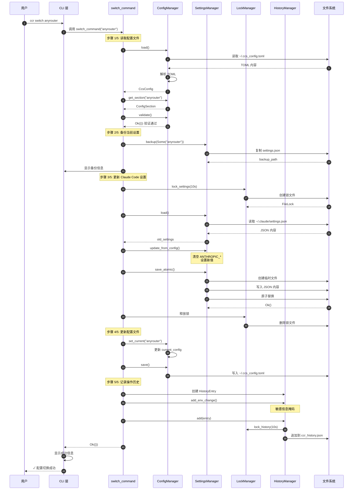
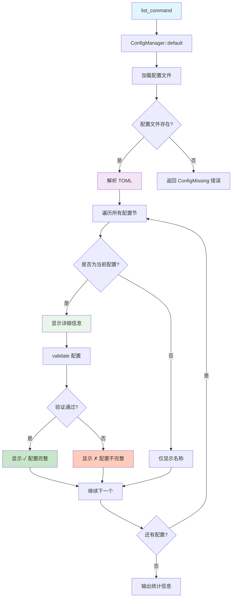
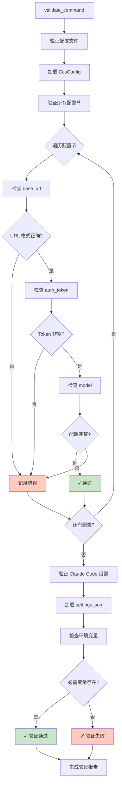
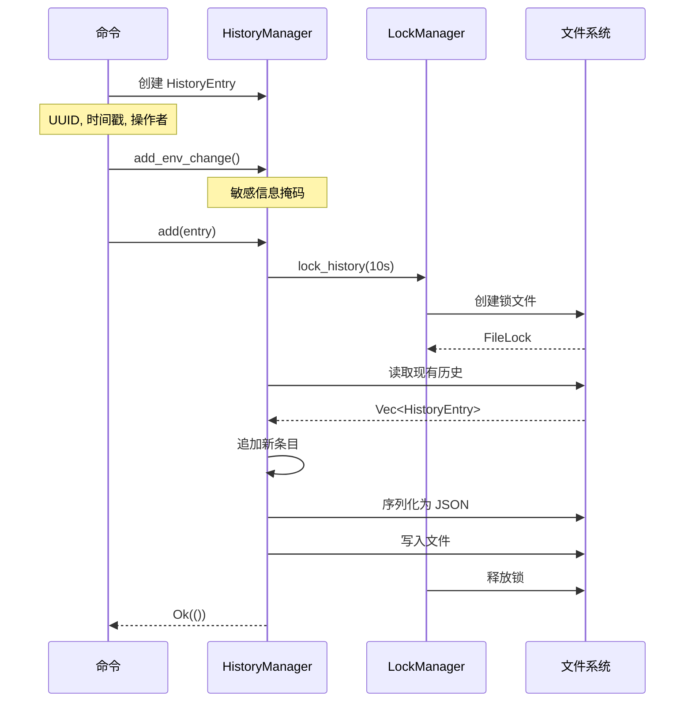
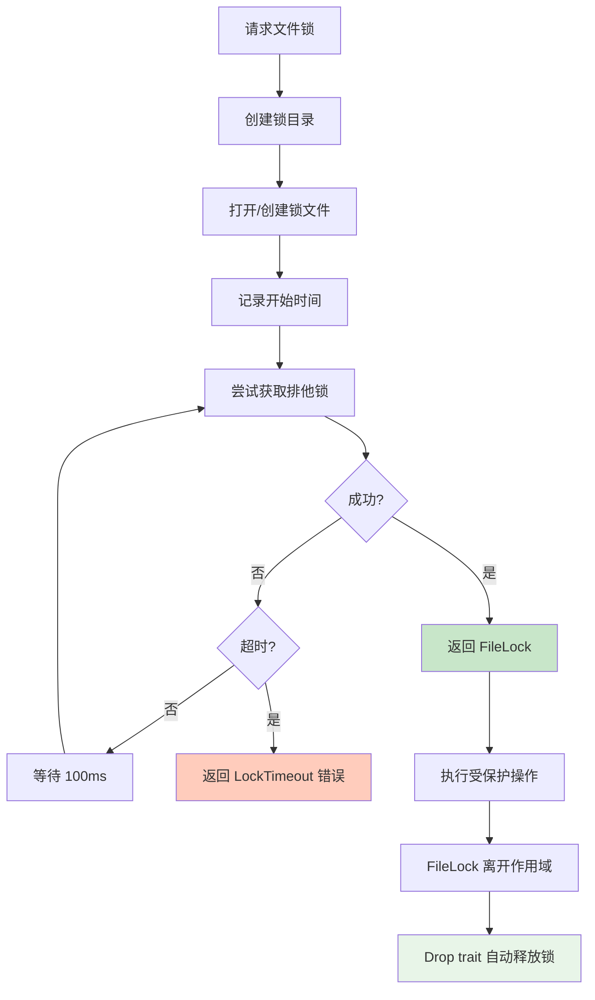
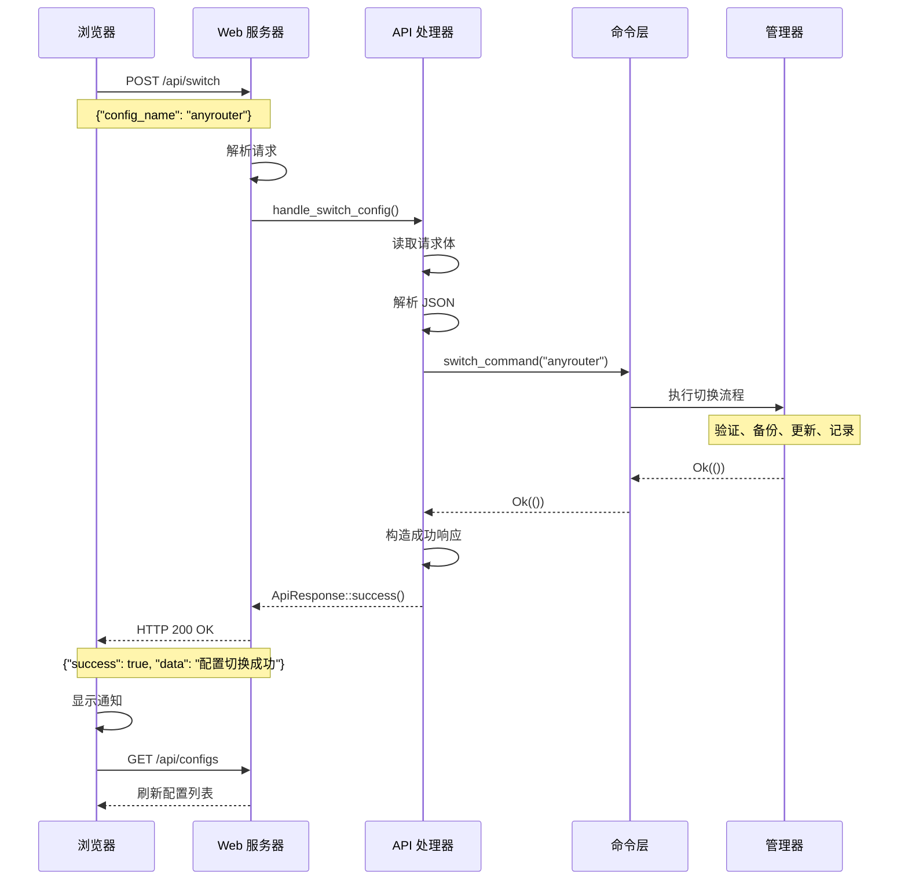
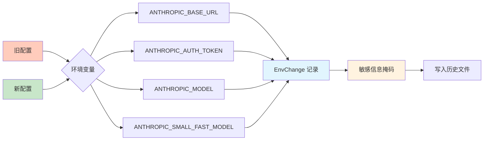
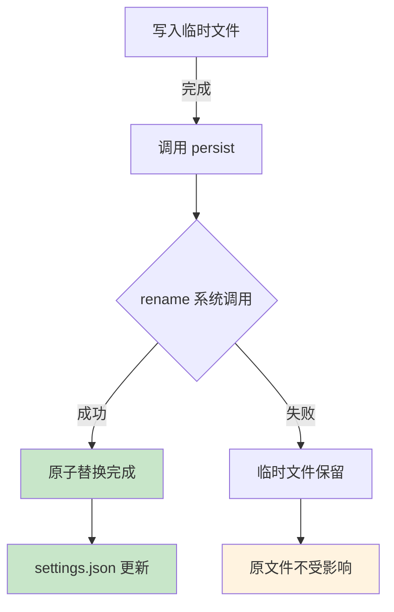

# 数据流程

本章详细介绍 CCR 各个操作的完整数据流程，帮助理解系统的工作原理。

## 🔄 配置切换流程

### 完整流程图



### 流程细节

#### 阶段 1: 配置验证

```rust
// 1.1 加载配置文件
let config_manager = ConfigManager::default()?;
let mut config = config_manager.load()?;

// 1.2 获取目标配置节
let target_section = config.get_section(config_name)?;

// 1.3 验证配置完整性
target_section.validate()?;
```

**验证检查项**:
- `base_url` 必须存在且非空
- `base_url` 必须以 `http://` 或 `https://` 开头
- `auth_token` 必须存在且非空
- `model` 如果提供则不能为空字符串

#### 阶段 2: 备份当前设置

```rust
// 2.1 检查设置文件是否存在
if settings_manager.settings_path().exists() {
    // 2.2 执行备份
    let backup_path = settings_manager.backup(Some(config_name))?;
    
    // 2.3 输出备份路径
    ColorOutput::success(&format!("设置已备份: {}", backup_path.display()));
}
```

**备份文件命名**:
```
settings.{config_name}.{timestamp}.json.bak

示例:
settings.anyrouter.20250110_143022.json.bak
```

#### 阶段 3: 更新 Claude Code 设置

```rust
// 3.1 加载现有设置（保留其他字段）
let old_settings = settings_manager.load().ok();
let mut new_settings = old_settings.unwrap_or_default();

// 3.2 更新环境变量
new_settings.update_from_config(&target_section);

// 3.3 原子保存
settings_manager.save_atomic(&new_settings)?;
```

**原子保存细节**:
```rust
pub fn save_atomic(&self, settings: &ClaudeSettings) -> Result<()> {
    // a. 获取文件锁（10 秒超时）
    let _lock = self.lock_manager.lock_settings(Duration::from_secs(10))?;
    
    // b. 序列化为 JSON
    let content = serde_json::to_string_pretty(settings)?;
    
    // c. 写入临时文件
    let temp_file = NamedTempFile::new_in(
        self.settings_path.parent().unwrap()
    )?;
    fs::write(temp_file.path(), content)?;
    
    // d. 原子替换（这一步是原子操作）
    temp_file.persist(&self.settings_path)?;
    
    Ok(())
}
```

#### 阶段 4: 更新配置指针

```rust
// 4.1 更新 current_config 字段
config.set_current(config_name)?;

// 4.2 保存配置文件
config_manager.save(&config)?;
```

#### 阶段 5: 记录历史

```rust
// 5.1 创建历史条目
let mut history_entry = HistoryEntry::new(
    OperationType::Switch,
    OperationDetails {
        from_config: Some(old_config.clone()),
        to_config: Some(config_name.to_string()),
        backup_path: Some(backup_path_str),
        extra: None,
    },
    OperationResult::Success,
);

// 5.2 记录环境变量变更
for (var_name, new_value) in new_env {
    let old_value = old_env.get(&var_name).and_then(|v| v.clone());
    history_entry.add_env_change(var_name, old_value, new_value);
}

// 5.3 保存历史
history_manager.add(history_entry)?;
```

## 📋 列出配置流程



## 🔍 验证流程

### 配置验证流程



## 📜 历史记录流程

### 添加历史记录



### 查询历史记录

```rust
// 获取最近 N 条
pub fn get_recent(&self, limit: usize) -> Result<Vec<HistoryEntry>> {
    let mut entries = self.load()?;
    
    // 按时间戳降序排序
    entries.sort_by(|a, b| b.timestamp.cmp(&a.timestamp));
    
    // 截断到 limit
    entries.truncate(limit);
    
    Ok(entries)
}

// 按类型筛选
pub fn filter_by_operation(&self, op_type: OperationType) -> Result<Vec<HistoryEntry>> {
    let entries = self.load()?;
    Ok(entries.into_iter()
        .filter(|e| e.operation == op_type)
        .collect())
}
```

## 🔒 文件锁流程

### 锁获取流程



### 并发场景

```rust
// 场景：两个 CCR 进程同时切换配置

// 进程 A
let _lock_a = lock_manager.lock_settings(Duration::from_secs(10))?;
// 成功获取锁，执行操作
settings_manager.save_atomic(&settings)?;
// 锁自动释放

// 进程 B（几乎同时启动）
let _lock_b = lock_manager.lock_settings(Duration::from_secs(10))?;
// 等待进程 A 释放锁
// 超时前获取到锁，继续执行
```

## 🌐 Web API 流程

### HTTP 请求处理



## 📊 环境变量更新流程

### 更新机制

```rust
impl ClaudeSettings {
    pub fn update_from_config(&mut self, section: &ConfigSection) {
        // 1. 清空旧的 ANTHROPIC_* 变量
        self.env.retain(|key, _| !key.starts_with("ANTHROPIC_"));
        
        // 2. 设置新的环境变量
        if let Some(base_url) = &section.base_url {
            self.env.insert("ANTHROPIC_BASE_URL".into(), base_url.clone());
        }
        
        if let Some(auth_token) = &section.auth_token {
            self.env.insert("ANTHROPIC_AUTH_TOKEN".into(), auth_token.clone());
        }
        
        if let Some(model) = &section.model {
            self.env.insert("ANTHROPIC_MODEL".into(), model.clone());
        }
        
        if let Some(small_model) = &section.small_fast_model {
            self.env.insert("ANTHROPIC_SMALL_FAST_MODEL".into(), small_model.clone());
        }
    }
}
```

### 变更追踪



## 💾 原子写入机制

### NamedTempFile + persist()

```rust
// 1. 在目标目录创建临时文件
let temp_file = NamedTempFile::new_in(
    self.settings_path.parent().unwrap()
)?;

// 2. 写入内容到临时文件
fs::write(temp_file.path(), content)?;

// 3. 原子替换（这一步是原子的）
temp_file.persist(&self.settings_path)?;
```

**为什么是原子的？**



**关键点**:
- `rename()` 系统调用是原子操作
- 要么完全成功，要么完全失败
- 不会出现部分写入的情况
- 崩溃时原文件保持完整

## 🔍 配置解析流程

### TOML 解析

```rust
// 使用 toml crate 反序列化
let content = fs::read_to_string(&self.config_path)?;
let config: CcsConfig = toml::from_str(&content)?;
```

**Serde 自动处理**:
- `#[serde(flatten)]` - 扁平化 sections HashMap
- `#[serde(skip_serializing_if)]` - 跳过空值
- 自动类型转换和验证

### JSON 序列化

```rust
// 设置保留机制
#[derive(Serialize, Deserialize)]
pub struct ClaudeSettings {
    #[serde(default)]
    pub env: HashMap<String, String>,
    
    #[serde(flatten)]  // ← 关键：保留其他字段
    pub other: HashMap<String, Value>,
}
```

**工作原理**:
```json
// 读取时
{
  "env": { "ANTHROPIC_BASE_URL": "..." },
  "otherField": "preserved",
  "anotherField": { ... }
}

// ↓ Serde 反序列化

ClaudeSettings {
  env: { "ANTHROPIC_BASE_URL": "..." },
  other: {
    "otherField": "preserved",
    "anotherField": { ... }
  }
}

// ↓ 修改 env

// ↓ Serde 序列化

// 写入时
{
  "env": { "ANTHROPIC_AUTH_TOKEN": "new" },  // 更新
  "otherField": "preserved",                 // 保留
  "anotherField": { ... }                    // 保留
}
```

## ⚠️ 错误传播流程

### 错误传播链

```rust
// 1. 底层错误
fs::read_to_string(&path)  // io::Error

// 2. 转换为 CcrError
.map_err(|e| CcrError::ConfigError(format!("读取失败: {}", e)))?

// 3. 向上传播
pub fn load(&self) -> Result<CcsConfig> {
    let content = fs::read_to_string(&self.config_path)?;  // ← 传播
    // ...
}

// 4. 命令层捕获
pub fn list_command() -> Result<()> {
    let config = config_manager.load()?;  // ← 传播
    // ...
}

// 5. main 函数处理
fn main() {
    let result = commands::list_command();
    
    if let Err(e) = result {
        ColorOutput::error(&e.user_message());
        std::process::exit(e.exit_code());
    }
}
```

## 🔗 相关文档

- [整体架构](/architecture/)
- [核心模块](/architecture/modules)
- [设计决策](/architecture/design-decisions)
- [文件锁机制](/architecture/locking)

