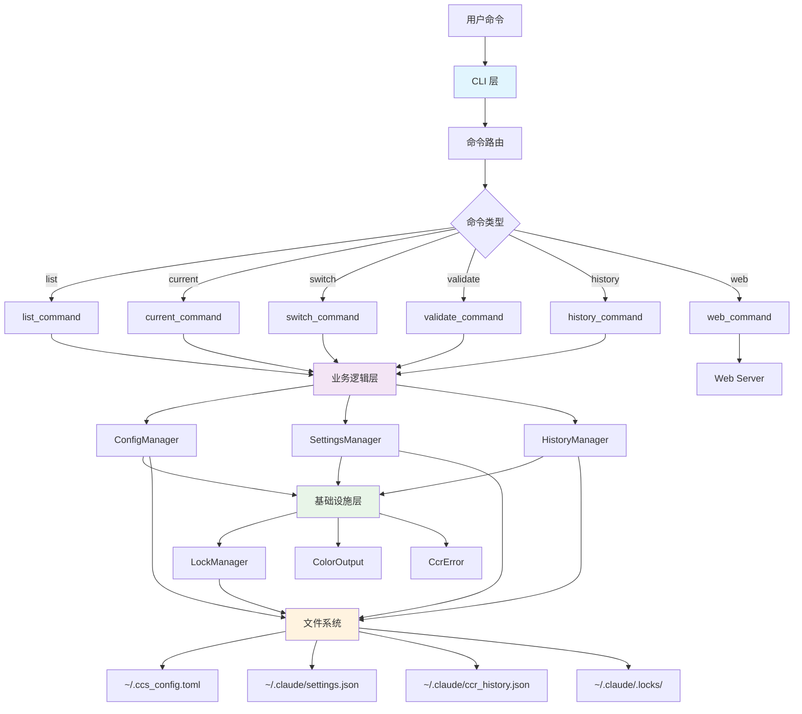
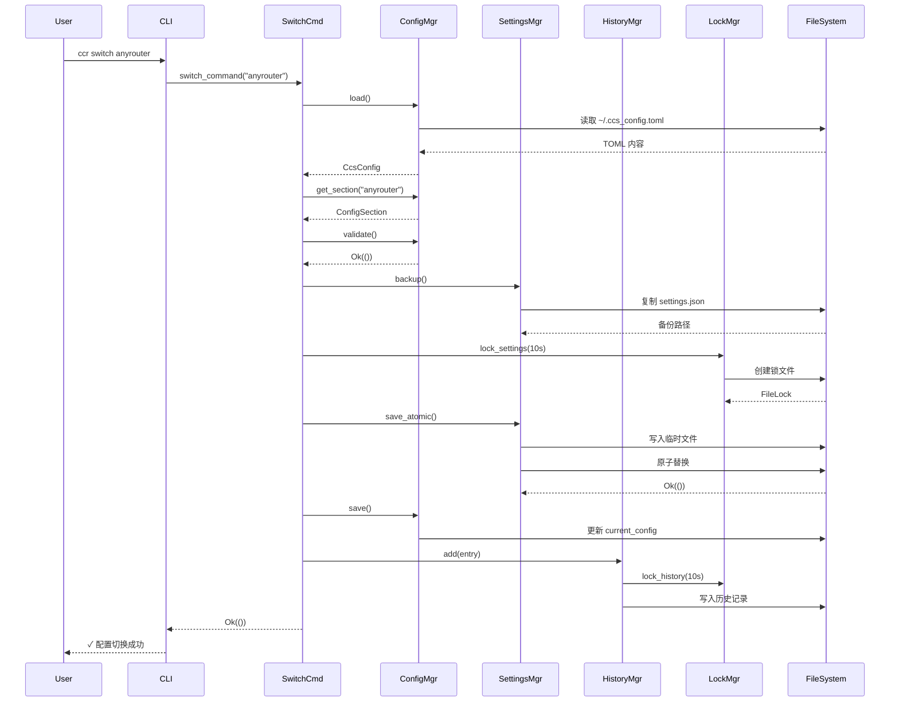
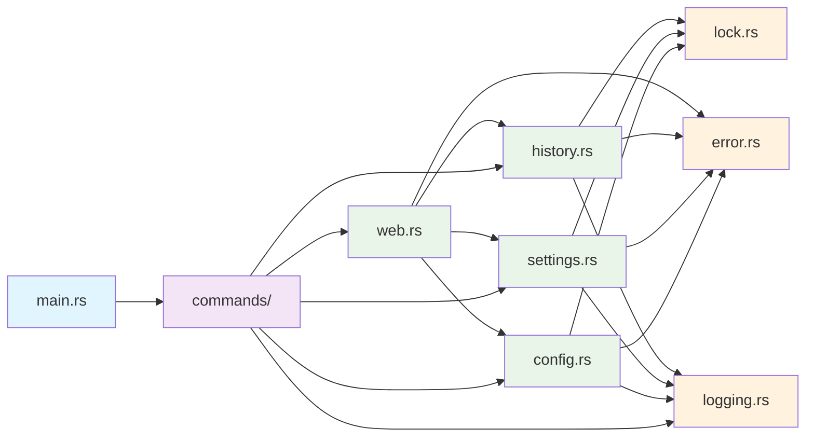

# 整体架构

CCR (Claude Code Configuration Switcher) 采用分层架构设计，将功能划分为 CLI 层、业务逻辑层和基础设施层，确保代码的模块化、可维护性和可扩展性。

## 🏗️ 架构总览



## 📦 分层架构

### 1. CLI 层 (main.rs + commands/)

**职责**: 处理用户交互和命令路由

- **main.rs**: 程序入口和命令行参数解析
  ```rust
  use clap::{Parser, Subcommand};
  
  #[derive(Parser)]
  struct Cli {
      #[command(subcommand)]
      command: Option<Commands>,
      config_name: Option<String>,
  }
  
  #[derive(Subcommand)]
  enum Commands {
      List,
      Current,
      Switch { config_name: String },
      // ...
  }
  ```

- **commands/** 目录**: 各个命令的具体实现
  - `list.rs` - 列出配置
  - `current.rs` - 显示当前状态
  - `switch.rs` - 切换配置
  - `validate.rs` - 验证配置
  - `history_cmd.rs` - 查看历史
  - `mod.rs` - 模块导出

**设计原则**:
- 命令处理函数返回 `Result<()>`
- 所有彩色输出通过 `ColorOutput` 完成
- 错误通过 `CcrError` 统一处理

### 2. 业务逻辑层

#### 2.1 配置管理 (config.rs)

**核心结构**:
```rust
// 配置节
pub struct ConfigSection {
    pub description: Option<String>,
    pub base_url: Option<String>,
    pub auth_token: Option<String>,
    pub model: Option<String>,
    pub small_fast_model: Option<String>,
}

// 配置文件
pub struct CcsConfig {
    pub default_config: String,
    pub current_config: String,
    #[serde(flatten)]
    pub sections: HashMap<String, ConfigSection>,
}

// 配置管理器
pub struct ConfigManager {
    config_path: PathBuf,
}
```

**主要功能**:
- TOML 配置文件的加载和保存
- 配置节的增删改查
- 配置验证和完整性检查
- 配置备份和恢复

#### 2.2 设置管理 (settings.rs)

**核心结构**:
```rust
// Claude Code 设置
pub struct ClaudeSettings {
    #[serde(default)]
    pub env: HashMap<String, String>,
    #[serde(flatten)]
    pub other: HashMap<String, Value>,
}

// 设置管理器
pub struct SettingsManager {
    settings_path: PathBuf,
    backup_dir: PathBuf,
    lock_manager: LockManager,
}
```

**关键特性**:
- 直接操作 `~/.claude/settings.json`
- `#[serde(flatten)]` 保留其他设置
- 原子写入保证数据一致性
- 自动备份机制

#### 2.3 历史记录 (history.rs)

**核心结构**:
```rust
// 历史条目
pub struct HistoryEntry {
    pub id: String,                      // UUID
    pub timestamp: DateTime<Local>,      // 时间戳
    pub actor: String,                   // 操作者
    pub operation: OperationType,        // 操作类型
    pub details: OperationDetails,       // 详情
    pub env_changes: Vec<EnvChange>,     // 环境变量变更
    pub result: OperationResult,         // 结果
    pub notes: Option<String>,           // 备注
}

// 历史管理器
pub struct HistoryManager {
    history_path: PathBuf,
    lock_manager: LockManager,
}
```

**功能**:
- 完整的操作审计追踪
- 敏感信息自动掩码
- 按类型和时间筛选
- 统计信息生成

### 3. 基础设施层

#### 3.1 文件锁管理 (lock.rs)

```rust
pub struct FileLock {
    file: File,
    lock_path: PathBuf,
}

pub struct LockManager {
    lock_dir: PathBuf,
}
```

**特性**:
- 跨进程文件锁
- 超时保护（默认 10 秒）
- 自动释放锁（通过 `Drop` trait）
- 支持多种资源锁（config, settings, history）

#### 3.2 日志输出 (logging.rs)

```rust
pub struct ColorOutput;

impl ColorOutput {
    pub fn success(msg: &str);
    pub fn info(msg: &str);
    pub fn warning(msg: &str);
    pub fn error(msg: &str);
    pub fn mask_sensitive(value: &str) -> String;
    // ...
}
```

**功能**:
- 彩色终端输出
- 敏感信息掩码
- 统一的日志格式
- 进度指示器

#### 3.3 错误处理 (error.rs)

```rust
#[derive(Error, Debug)]
pub enum CcrError {
    ConfigError(String),
    ConfigMissing(String),
    SettingsError(String),
    FileLockError(String),
    ValidationError(String),
    // ... 13 种错误类型
}

impl CcrError {
    pub fn exit_code(&self) -> i32;
    pub fn is_fatal(&self) -> bool;
    pub fn user_message(&self) -> String;
}
```

## 🔄 数据流程

### 配置切换流程



## 🔧 模块关系



## 📂 目录结构

```
ccr/
├── src/
│   ├── main.rs              # 程序入口 (165 行)
│   ├── error.rs             # 错误类型定义 (200 行)
│   ├── logging.rs           # 彩色输出工具 (250 行)
│   ├── lock.rs              # 文件锁机制 (250 行)
│   ├── config.rs            # 配置管理 (350 行)
│   ├── settings.rs          # 设置管理 (400 行) ⭐
│   ├── history.rs           # 历史记录 (400 行)
│   ├── web.rs               # Web 服务器 (490 行)
│   └── commands/            # CLI 命令实现 (600 行)
│       ├── mod.rs
│       ├── list.rs
│       ├── current.rs
│       ├── switch.rs
│       ├── validate.rs
│       └── history_cmd.rs
├── web/
│   └── index.html           # Web 界面 (1346 行)
├── Cargo.toml               # 项目配置
├── Cargo.lock               # 依赖锁定
├── README.md                # 用户文档
├── CLAUDE.md                # 开发文档
└── justfile                 # 构建脚本
```

## 🎯 设计原则

### 1. 单一职责原则
每个模块只负责一个明确的功能领域：
- `config.rs` - 只处理 TOML 配置
- `settings.rs` - 只处理 JSON 设置
- `history.rs` - 只处理历史记录

### 2. 依赖倒置原则
高层模块不依赖低层模块，都依赖于抽象：
- 命令层依赖管理器接口
- 管理器依赖基础设施抽象

### 3. 开闭原则
对扩展开放，对修改封闭：
- 新增命令只需添加新的命令处理函数
- 新增错误类型只需扩展 `CcrError` 枚举

### 4. 接口隔离原则
使用小而专注的接口：
- `ConfigManager` 只提供配置管理方法
- `LockManager` 只提供锁管理方法

## 🔒 安全机制

### 1. 并发安全
- **文件锁**: 使用 `fs4` 提供的跨进程文件锁
- **超时保护**: 防止死锁，默认 10 秒超时
- **自动释放**: 利用 Rust 的 RAII 机制自动释放资源

### 2. 数据完整性
- **原子操作**: 使用 `NamedTempFile` + `persist()` 保证原子替换
- **备份机制**: 操作前自动备份，失败可恢复
- **配置验证**: 写入前验证配置完整性

### 3. 敏感信息保护
- **自动掩码**: API Token 只显示首尾字符
- **历史记录**: 敏感字段自动掩码
- **文件权限**: 配置文件权限设置为 600

## 📊 性能特性

### 1. 编译优化
```toml
[profile.release]
opt-level = 3       # 最高优化级别
lto = true          # 链接时优化
codegen-units = 1   # 单编译单元
strip = true        # 剥离符号信息
```

### 2. 内存效率
- 零拷贝序列化（Serde）
- 流式文件读写
- 及时释放资源

### 3. 启动速度
- 无运行时依赖
- 编译后独立二进制
- 毫秒级启动时间

## 🔗 相关文档

- [核心模块详解](/architecture/modules)
- [数据流程图](/architecture/data-flow)
- [设计决策](/architecture/design-decisions)
- [与 CCS 对比](/architecture/ccs-comparison)

