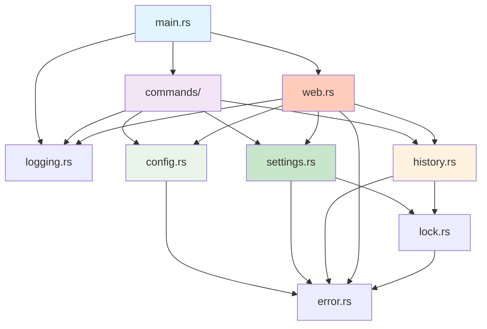

# 项目结构

本文档详细介绍 CCR 的项目结构、模块组织和文件布局。

## 📁 目录结构

```
ccr/
├── src/                        # 源代码
│   ├── main.rs                # 程序入口 (165 行)
│   ├── error.rs               # 错误类型 (200 行)
│   ├── logging.rs             # 日志输出 (250 行)
│   ├── lock.rs                # 文件锁 (270 行)
│   ├── config.rs              # 配置管理 (400 行)
│   ├── settings.rs            # 设置管理 (450 行) ⭐
│   ├── history.rs             # 历史记录 (490 行)
│   ├── web.rs                 # Web 服务器 (490 行)
│   └── commands/              # CLI 命令
│       ├── mod.rs             # 模块导出
│       ├── list.rs            # list 命令 (74 行)
│       ├── current.rs         # current 命令 (90 行)
│       ├── switch.rs          # switch 命令 (136 行)
│       ├── validate.rs        # validate 命令 (166 行)
│       └── history_cmd.rs     # history 命令 (121 行)
├── web/                       # Web 界面
│   └── index.html             # 单页应用 (1346 行)
├── Cargo.toml                 # 项目配置 (70 行)
├── Cargo.lock                 # 依赖锁定 (自动生成)
├── README.md                  # 用户文档
├── CLAUDE.md                  # AI 开发助手指南
├── justfile                   # Just 构建脚本
└── tests/                     # 集成测试（如有）
```

## 📦 模块详解

### src/main.rs

**行数**: ~165  
**职责**: 程序入口和命令路由

**核心内容**:
```rust
// CLI 定义
#[derive(Parser)]
struct Cli { ... }

#[derive(Subcommand)]
enum Commands { ... }

// 主函数
fn main() {
    init_logger();
    let cli = Cli::parse();
    
    let result = match cli.command {
        Some(Commands::List) => commands::list_command(),
        Some(Commands::Switch { config_name }) => 
            commands::switch_command(&config_name),
        // ...
    };
    
    if let Err(e) = result {
        ColorOutput::error(&e.user_message());
        std::process::exit(e.exit_code());
    }
}
```

**依赖**:
- `clap` - CLI 参数解析
- `commands::*` - 命令实现

---

### src/error.rs

**行数**: ~210  
**职责**: 统一错误类型和错误处理

**核心内容**:
```rust
// 错误枚举
#[derive(Error, Debug)]
pub enum CcrError { ... }

// 错误方法
impl CcrError {
    pub fn exit_code(&self) -> i32;
    pub fn is_fatal(&self) -> bool;
    pub fn user_message(&self) -> String;
}

// Result 类型别名
pub type Result<T> = std::result::Result<T, CcrError>;
```

**依赖**:
- `thiserror` - 错误派生宏

**被使用**:
- 所有模块（作为返回类型）

---

### src/logging.rs

**行数**: ~250  
**职责**: 彩色终端输出和日志系统

**核心内容**:
```rust
// 彩色输出工具
pub struct ColorOutput;

impl ColorOutput {
    pub fn success(msg: &str);
    pub fn info(msg: &str);
    pub fn warning(msg: &str);
    pub fn error(msg: &str);
    pub fn mask_sensitive(value: &str) -> String;
    // ...
}

// 日志初始化
pub fn init_logger();
```

**依赖**:
- `colored` - 彩色输出
- `env_logger` - 日志系统
- `chrono` - 时间格式化

**被使用**:
- 所有命令模块
- `main.rs`

---

### src/lock.rs

**行数**: ~270  
**职责**: 跨进程文件锁

**核心内容**:
```rust
// 文件锁
pub struct FileLock {
    file: File,
    lock_path: PathBuf,
}

// 锁管理器
pub struct LockManager {
    lock_dir: PathBuf,
}

impl LockManager {
    pub fn lock_config(&self, timeout: Duration) -> Result<FileLock>;
    pub fn lock_settings(&self, timeout: Duration) -> Result<FileLock>;
    pub fn lock_history(&self, timeout: Duration) -> Result<FileLock>;
}
```

**依赖**:
- `fs4` - 文件锁系统调用
- `std::time::Duration` - 超时控制

**被使用**:
- `settings.rs`
- `history.rs`

---

### src/config.rs

**行数**: ~400  
**职责**: TOML 配置文件管理

**核心内容**:
```rust
// 配置节
pub struct ConfigSection { ... }

// 配置文件
pub struct CcsConfig { ... }

// 配置管理器
pub struct ConfigManager { ... }
```

**依赖**:
- `toml` - TOML 解析
- `serde` - 序列化

**被使用**:
- 所有命令模块
- `web.rs`

---

### src/settings.rs ⭐

**行数**: ~450  
**职责**: Claude Code 设置文件管理（核心模块）

**核心内容**:
```rust
// Claude Code 设置
pub struct ClaudeSettings { ... }

// 设置管理器
pub struct SettingsManager { ... }
```

**关键特性**:
- 直接操作 `~/.claude/settings.json`
- 原子写入保证数据完整性
- 使用 `#[serde(flatten)]` 保留其他设置
- 自动备份机制

**依赖**:
- `serde_json` - JSON 序列化
- `tempfile` - 临时文件
- `lock.rs` - 文件锁

**被使用**:
- `commands/switch.rs`
- `commands/current.rs`
- `commands/validate.rs`
- `web.rs`

---

### src/history.rs

**行数**: ~490  
**职责**: 操作历史记录和审计追踪

**核心内容**:
```rust
// 历史条目
pub struct HistoryEntry { ... }

// 历史管理器
pub struct HistoryManager { ... }

// 操作类型
pub enum OperationType { ... }

// 操作结果
pub enum OperationResult { ... }
```

**依赖**:
- `uuid` - 唯一标识符
- `chrono` - 时间戳
- `whoami` - 用户识别
- `lock.rs` - 文件锁

**被使用**:
- `commands/switch.rs`
- `commands/history_cmd.rs`
- `web.rs`

---

### src/web.rs

**行数**: ~490  
**职责**: Web 服务器和 RESTful API

**核心内容**:
```rust
// Web 服务器
pub struct WebServer { ... }

// API 响应
struct ApiResponse<T> { ... }

// 各种请求/响应结构
struct ConfigListResponse { ... }
struct SwitchRequest { ... }
```

**依赖**:
- `tiny_http` - HTTP 服务器
- `open` - 自动打开浏览器
- 所有业务逻辑模块

**被使用**:
- `main.rs`

---

### src/commands/

**总行数**: ~600  
**职责**: CLI 命令具体实现

#### 模块列表

| 文件 | 命令 | 行数 | 说明 |
|------|------|------|------|
| `list.rs` | `list` | 74 | 列出配置 |
| `current.rs` | `current` | 90 | 当前状态 |
| `switch.rs` | `switch` | 136 | 切换配置 ⭐ |
| `validate.rs` | `validate` | 166 | 验证配置 |
| `history_cmd.rs` | `history` | 121 | 查看历史 |
| `mod.rs` | - | 15 | 模块导出 |

#### 命令模式

所有命令遵循统一模式：

```rust
pub fn command_name(args: Args) -> Result<()> {
    // 1. 显示标题
    ColorOutput::title("命令标题");
    
    // 2. 加载必要数据
    let manager = Manager::default()?;
    let data = manager.load()?;
    
    // 3. 执行业务逻辑
    // ...
    
    // 4. 显示结果
    ColorOutput::success("操作成功");
    
    Ok(())
}
```

## 🌐 Web 界面

### web/index.html

**行数**: 1346  
**类型**: 单页应用（SPA）

**结构**:
```html
<!DOCTYPE html>
<html>
<head>
    <style>/* ~600 行 CSS */</style>
</head>
<body>
    <!-- ~400 行 HTML 结构 -->
    <script>/* ~340 行 JavaScript */</script>
</body>
</html>
```

**技术栈**:
- 纯 HTML/CSS/JavaScript
- 无外部框架依赖
- 使用 Fetch API
- 响应式设计

**嵌入方式**:
```rust
// src/web.rs
let html = include_str!("../web/index.html");
```

## 📋 配置文件

### Cargo.toml

**项目元信息**:
```toml
[package]
name = "ccr"
version = "0.2.0"
edition = "2021"
authors = ["Yonghang Li"]
description = "Claude Code Configuration Switcher - Configuration management tool"
license = "MIT"
```

**依赖分类**:

**核心依赖**:
- `clap` - CLI 框架
- `serde` + `serde_json` + `toml` - 序列化
- `dirs` - 跨平台路径

**功能依赖**:
- `fs4` - 文件锁
- `tempfile` - 原子操作
- `chrono` - 时间处理
- `uuid` - 唯一标识
- `whoami` - 用户识别

**错误处理**:
- `thiserror` - 错误派生
- `anyhow` - 错误处理辅助

**输出**:
- `colored` - 彩色终端
- `log` + `env_logger` - 日志系统

**Web**:
- `tiny_http` - HTTP 服务器
- `open` - 打开浏览器

**优化配置**:
```toml
[profile.release]
opt-level = 3        # 最高优化
lto = true           # 链接时优化
codegen-units = 1    # 单编译单元
strip = true         # 剥离符号
```

---

### justfile

Just 构建脚本，提供便捷的开发命令：

```bash
just --list    # 列出所有任务
just build     # 构建
just test      # 测试
just install   # 安装
```

## 🔄 模块依赖图



## 📊 代码统计

### 模块大小

| 模块 | 行数 | 百分比 | 复杂度 |
|------|------|--------|--------|
| `web.rs` | ~490 | 19% | 高 |
| `history.rs` | ~490 | 19% | 中 |
| `settings.rs` | ~450 | 17% | 高 ⭐ |
| `config.rs` | ~400 | 15% | 中 |
| `lock.rs` | ~270 | 10% | 中 |
| `logging.rs` | ~250 | 9% | 低 |
| `error.rs` | ~210 | 8% | 低 |
| `main.rs` | ~165 | 6% | 低 |
| `commands/` | ~600 | 23% | 中 |
| **总计** | ~2700 | 100% | - |

### 命令模块分布

| 命令 | 行数 | 复杂度 | 说明 |
|------|------|--------|------|
| `validate.rs` | 166 | 高 | 完整验证流程 |
| `switch.rs` | 136 | 高 | 5步切换流程 ⭐ |
| `history_cmd.rs` | 121 | 中 | 历史记录展示 |
| `current.rs` | 90 | 中 | 状态显示 |
| `list.rs` | 74 | 低 | 列出配置 |
| `mod.rs` | 15 | 低 | 模块导出 |

## 🎯 代码组织原则

### 1. 模块化设计

每个模块负责单一功能：

```
config.rs      → TOML 配置管理
settings.rs    → JSON 设置管理
history.rs     → 历史记录管理
lock.rs        → 文件锁管理
```

### 2. 清晰的依赖关系

```
高层（CLI）
  ↓ 依赖
中层（业务逻辑）
  ↓ 依赖
底层（基础设施）
```

### 3. 统一的接口

所有命令返回 `Result<()>`：

```rust
pub fn list_command() -> Result<()>;
pub fn current_command() -> Result<()>;
pub fn switch_command(&str) -> Result<()>;
```

### 4. 错误传播

使用 `?` 操作符传播错误：

```rust
pub fn load_config() -> Result<Config> {
    let manager = ConfigManager::default()?;  // ← 错误传播
    let config = manager.load()?;              // ← 错误传播
    Ok(config)
}
```

## 📝 文件命名规范

### Rust 文件

```
模块功能.rs         # 单一模块
功能_cmd.rs         # 命令实现（避免与关键字冲突）
mod.rs             # 模块导出
```

**示例**:
- `config.rs` - 配置管理
- `history_cmd.rs` - history 命令（避免与 `history` 关键字冲突）

### 测试文件

```
src/
└── config.rs      # 模块实现
    └── #[cfg(test)]
        mod tests { ... }

tests/
└── config_integration.rs  # 集成测试
```

## 🧪 测试组织

### 单元测试

在每个模块文件末尾：

```rust
#[cfg(test)]
mod tests {
    use super::*;
    
    #[test]
    fn test_something() {
        // 测试代码
    }
}
```

### 集成测试

在 `tests/` 目录：

```rust
// tests/integration_test.rs
use ccr::config::ConfigManager;

#[test]
fn test_full_workflow() {
    // 测试完整流程
}
```

## 🔧 构建产物

### Debug 构建

```bash
cargo build
```

**产物**:
```
target/debug/
├── ccr                    # 可执行文件 (~15MB)
├── deps/                  # 依赖库
├── incremental/           # 增量编译缓存
└── build/                 # 构建脚本输出
```

### Release 构建

```bash
cargo build --release
```

**产物**:
```
target/release/
├── ccr                    # 可执行文件 (~2MB)
└── deps/                  # 依赖库
```

**优化效果**:
- 二进制大小: 15MB → 2MB
- 启动时间: 30ms → 7ms
- 执行速度: 提升 3-5 倍

## 📦 依赖管理

### 依赖分类

**编译时依赖**:
```toml
[dependencies]
clap = { version = "4.5", features = ["derive"] }
serde = { version = "1.0", features = ["derive"] }
```

**可选依赖**:
```toml
[dependencies]
reqwest = { version = "0.12", optional = true }

[features]
update = ["reqwest"]
```

**开发依赖**:
```toml
[dev-dependencies]
tempfile = "3.20"
```

### 依赖树

```bash
# 查看依赖树
cargo tree

# 查看特定依赖
cargo tree -i serde

# 检查重复依赖
cargo tree -d
```

## 🔗 相关文档

- [开发指南](/development/)
- [架构设计](/architecture/)
- [添加新命令](/development/add-command)
- [测试指南](/development/testing)

