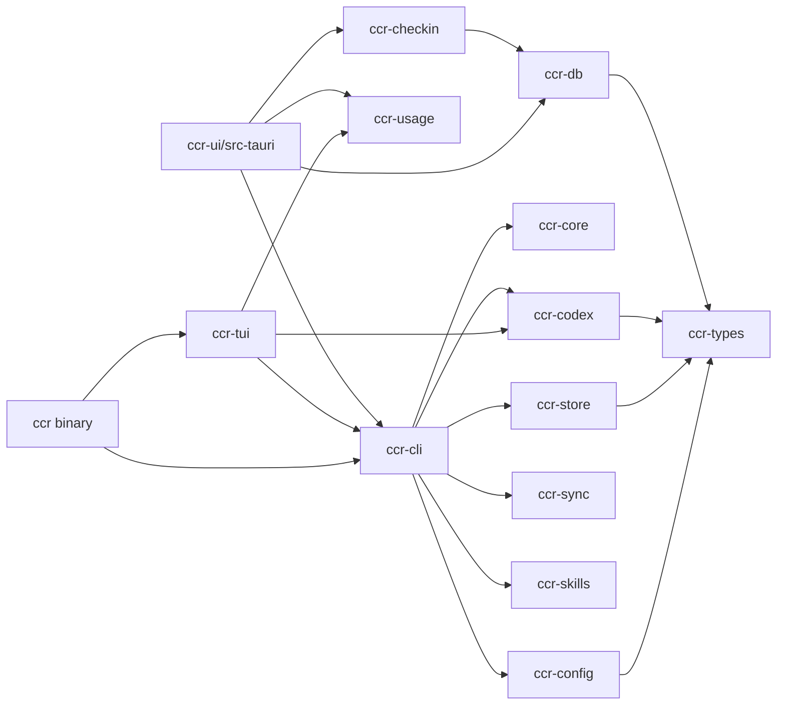

# CCR Architecture

CCR combines 13 Rust workspace crates, a Vue 3 frontend, and a Tauri desktop shell. The installable `ccr` binary owns startup; separate crates own CLI, TUI, configuration, persistence, sync, and platform domains.

## Workspace Composition

| Layer | Crate | Responsibility |
|---|---|---|
| Entrypoint | `crates/ccr` | binary startup, feature composition, CLI/TUI launchers, compatibility re-exports |
| Interaction | `crates/ccr-cli` | Clap definitions, dispatch, user-visible output, CLI application orchestration |
| Interaction | `crates/ccr-tui` | Ratatui terminal UI and Claude/Codex interactive entrypoints |
| Foundation | `crates/ccr-core` | errors, locking, atomic writes, HTTP, logging, shared application infrastructure |
| Configuration | `crates/ccr-config` | platform/profile/settings types, registry, and conversion contracts |
| Persistence | `crates/ccr-store` | CLI history, session index, and SQLite queries |
| Platform | `crates/ccr-codex` | Codex auth, runtime, quota, usage, and session domain |
| Platform | `crates/ccr-sync` | WebDAV configuration, folder registry, and sync operations |
| Platform | `crates/ccr-skills` | skills, builtin prompts, and MCP preset domain |
| Desktop data | `crates/ccr-db` | desktop SQLite, repositories, logs, and data services |
| Desktop domain | `crates/ccr-checkin` | check-in business facade backed by `ccr-db` data services |
| Usage | `crates/ccr-usage` | read-only llmusage projections and optional TypeScript bindings |
| Contracts | `crates/ccr-types` | cross-crate serde types, compatibility fields, and shared DTOs |

See the [Crate Map](./internals/crate-map) for expanded ownership notes.

## Dependency Direction



Entrypoints and adapters depend on shared domains and contracts. New domain behavior should not accumulate in `crates/ccr` or Vue views.

## CLI And TUI

`crates/ccr/src/main.rs` assembles launchers. Command definitions and dispatch live under `crates/ccr-cli/src/cli/`; handlers live under `crates/ccr-cli/src/commands/`. No-subcommand execution can enter the TUI, and `ccr claude`, `ccr codex`, and `ccr grok auth` expose focused interactive entrypoints.

`ccr-tui` owns terminal rendering. `ccr-cli` should call configuration, Codex, sync, skills, and store crates instead of duplicating their lower-level behavior.

## CCR UI And Tauri

`ccr-ui/src/` is the Vue application. `ccr-ui/src-tauri/` registers Rust invoke handlers and links workspace crates directly. The current desktop architecture does not use the removed built-in HTTP API.

```text
Vue view/store
  -> ccr-ui/src/api/domains/*
  -> Tauri invoke
  -> src-tauri/src/commands/*
  -> workspace crate or host integration
```

The UI and CLI share `~/.ccr/` data and platform configuration. The UI is a graphical entrypoint into the same system, not a second source of truth.

## Data Ownership

- `ccr-config` owns profile/settings serialization and conversion contracts.
- `ccr-store` owns CLI history and session-index queries.
- `ccr-db` owns the desktop database, repositories, and services such as logs.
- `ccr-usage` reads supported llmusage projections; it does not own upstream database writes or migrations.
- `ccr-types` owns compatibility behavior; read/write round trips must not silently drop unknown user fields.

## Key Runtime Flows

### Profile operations

1. Clap parses arguments into `Commands` or platform subcommands.
2. `ccr-cli` dispatches to Claude, Codex, or platform handlers.
3. Domain crates load and validate profiles.
4. Write paths preserve locks, backups, and atomic-write behavior.
5. History records a masked result.

### `ccr ui`

1. `ccr-cli` enters the UI service.
2. The service looks for a development checkout or `~/.ccr/ccr-ui/` installation.
3. A missing installation enters the download/update path.
4. The Vue/Tauri application continues to reuse the same workspace domains.

### Usage

1. llmusage owns collection and database writes.
2. `ccr-usage` and the desktop adapter read supported projections.
3. Tauri commands return stable DTOs.
4. Vue usage pages render capability, synchronization, and error states.

## Constraints

- There is no supported built-in web-server command or public HTTP API.
- Production paths must not print tokens, account secrets, or unmasked configuration.
- Configuration writes must preserve backup, locking, and atomic-write semantics.
- CLI, TUI, and UI representations of one concept should depend on shared types or a domain crate.

## Related Pages

- [Crate Map](./internals/crate-map)
- [Runtime Flows](./internals/runtime-flows)
- [Choosing An Entrypoint](/en/guide/entrypoints)
- [UI Module Map](/en/guide/ui-modules)
