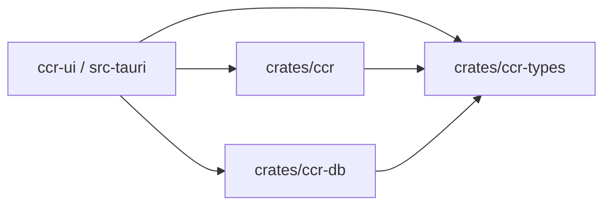
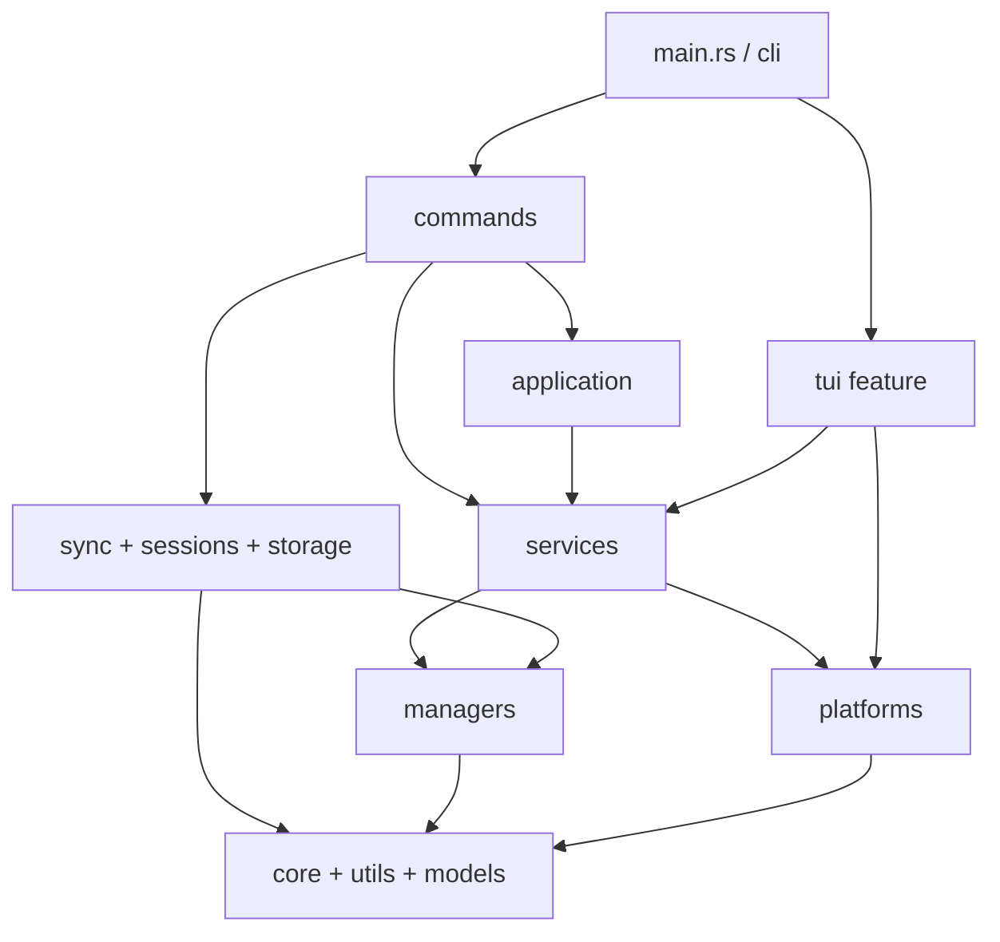

# Architecture

> This page describes the current code truth. CCR is a Rust workspace built around `crates/ccr`, `crates/ccr-db`, and `crates/ccr-types`. The built-in legacy Web API has been removed and is not part of the current runtime surface.

## Overview

- `crates/ccr`: main CLI crate for command entrypoints, platform implementations, config writes, sync, session indexing, TUI, and the `ccr ui` bridge
- `crates/ccr-db`: desktop-side database and service crate for SQLite, CheckIn, usage import, log persistence, and UI state
- `crates/ccr-types`: shared serde types and compatibility rules reused across crates
- `ccr-ui/src-tauri`: desktop shell that links against these crates directly instead of calling an internal HTTP server

## Workspace Dependencies



## Repository Layout

```text
ccr/
├── Cargo.toml
├── crates/
│   ├── ccr/
│   │   ├── src/
│   │   │   ├── application/
│   │   │   ├── cli/
│   │   │   ├── commands/
│   │   │   ├── core/
│   │   │   ├── managers/
│   │   │   ├── models/
│   │   │   ├── platforms/
│   │   │   ├── services/
│   │   │   ├── sessions/
│   │   │   ├── storage/
│   │   │   ├── sync/
│   │   │   ├── tui/        # gated by the `tui` feature
│   │   │   └── utils/
│   │   └── tests/
│   ├── ccr-db/
│   │   └── src/
│   │       ├── core/
│   │       ├── database/
│   │       ├── managers/
│   │       ├── models/
│   │       └── services/
│   └── ccr-types/
│       └── src/
├── ccr-ui/
│   ├── src/
│   └── src-tauri/
├── docs/
├── examples/
└── scripts/
```

## Internal Layering in `crates/ccr`



Important boundaries:

- `cli/` defines arguments and dispatch rules
- `commands/` implements user-facing command behavior
- `services/` orchestrates cross-manager and cross-platform work
- `managers/` owns config, pricing, history, skills, and MCP preset persistence
- `sessions/` + `storage/` handle session indexing and local SQLite-backed storage
- `sync/` owns WebDAV configuration and folder sync flows
- `tui/` is optional at compile time and enabled by default

## `crates/ccr-db` and `crates/ccr-types`

### `ccr-db`

- `database/`: connection pool, schema, migration, repositories
- `managers/checkin/`: account, provider, balance, record, and WAF cookie management
- `services/checkin_service.rs`: check-in execution, balance queries, batch operations, and daily stats
- `services/usage_import_service.rs`: token and cost extraction from Codex and Gemini session files
- `services/log_persistence.rs`: persisted logs and monitoring-related data

### `ccr-types`

- `ClaudeSettings`: shared Claude settings model
- `LoginState` / `TokenFreshness`: Codex auth state models
- `MonitoringEntry` / `FrontendLogInput`: monitoring and frontend log payloads

This crate is about compatibility rather than business orchestration:

- preserve stable serialization behavior
- accept older input shapes
- keep unknown fields instead of dropping user-managed config

## Current Key Flows

### Profile switching

1. `main.rs` parses CLI arguments
2. `cli/dispatch.rs` routes to the concrete command
3. `ConfigService` loads the registry and the current platform profile set
4. `SettingsService` acquires locks, creates backups, and writes the target settings
5. `HistoryService` records the masked operation history

### `ccr ui`

1. `dispatch_ui` enters `UiService`
2. `UiService` probes for a nearby `ccr-ui/` checkout first
3. It falls back to `~/.ccr/ccr-ui/`
4. If still missing, it goes through the GitHub download or update flow

### Session indexing

1. `ccr sessions ...` enters the sessions command group
2. `SessionIndexer` scans Claude, Codex, Gemini, and related session files
3. `SessionStore` persists searchable summaries and statistics locally

## Design Constraints

- there is no current `src/web/**` module and no supported built-in HTTP API
- `ccr ui` is a graphical entrypoint, not a second configuration system
- CCR UI and the CLI share the same config, history, and platform truth

## See Also

- [Crate Map](/en/reference/internals/crate-map)
- [Runtime Flows](/en/reference/internals/runtime-flows)
- [Command Reference](/en/reference/commands/)
- [Migration Guide](/en/reference/migration)
