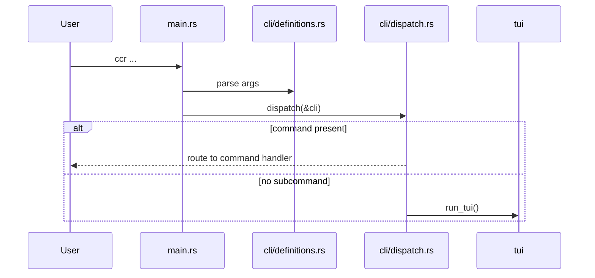
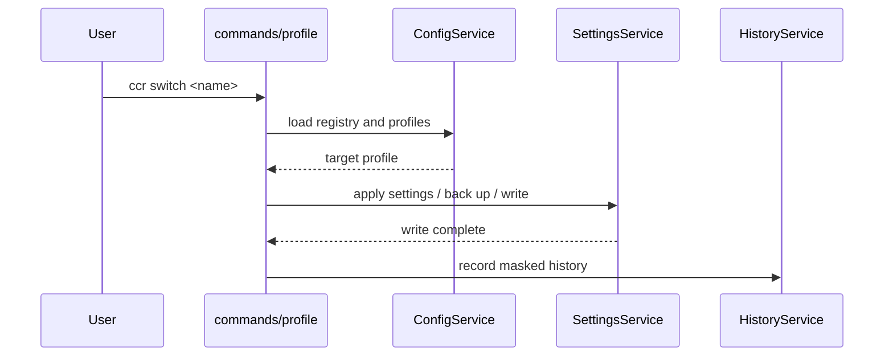
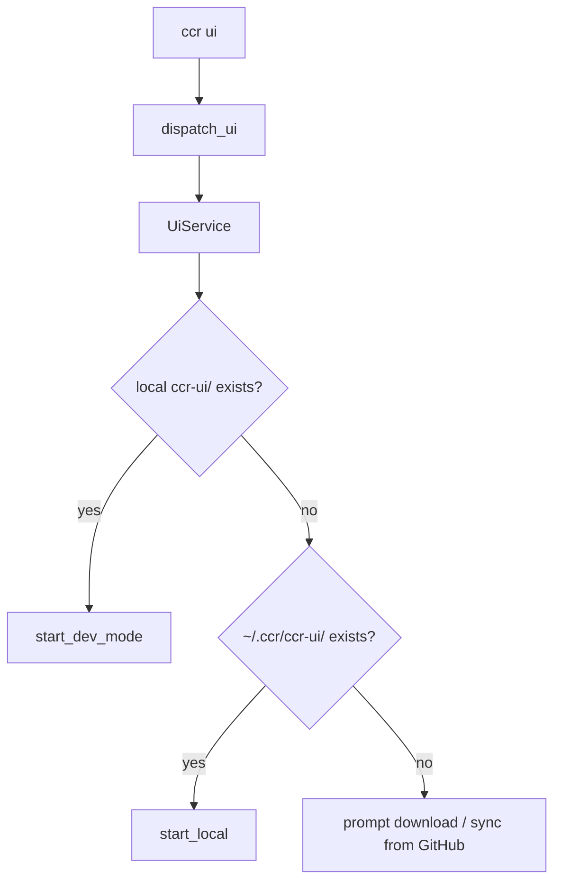
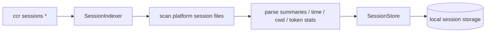
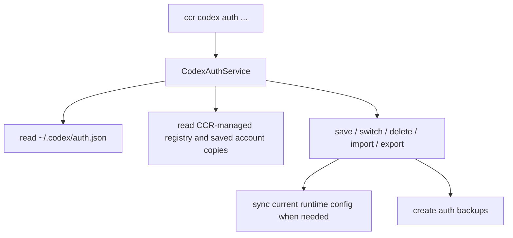
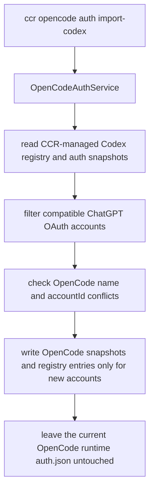
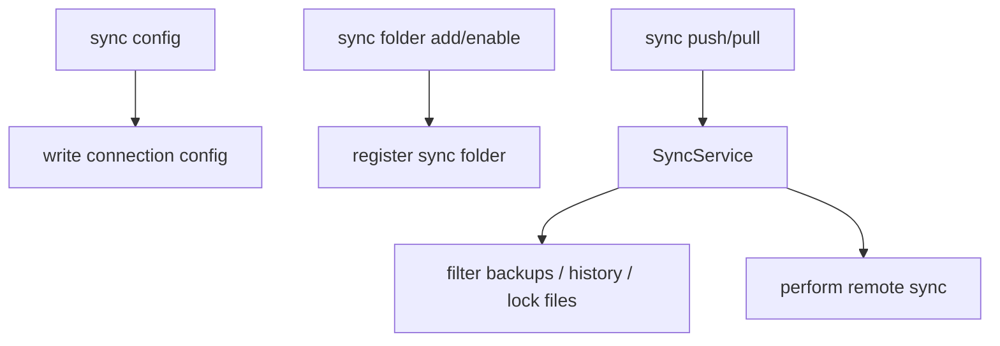

# Runtime Flows

This page records the most important current execution paths so the command surface stays aligned with the implementation.

## 1. CLI entry and no-subcommand behavior

Current facts:

- the default build enables the `tui` feature
- `ccr` with no subcommand and no `config_name` enters TUI
- `ccr codex` with no action is also treated as TUI mode
- `ccr opencode` with no action opens the OpenCode Auth tab

## 2. Profile switching

Relevant components:

- `ConfigService::get_config` and `set_current`
- `SettingsService::apply_config`
- `HistoryService`

## 3. `ccr ui`

Current priority order:

1. a nearby `ccr-ui/` checkout
2. `~/.ccr/ccr-ui/`
3. download or update flow

## 4. Session indexing

Code boundaries:

- `sessions/indexer.rs`: scanning and rebuild orchestration
- `storage/session_store.rs`: upsert, list, search, stats, prune

## 5. Codex multi-account auth

This service owns:

- current login state detection
- account inventory and expiry state
- backup rotation for auth documents
- import/export and switching

## 6. OpenCode auth migration

This flow owns:

- reading only Codex accounts already saved in CCR, not an unsaved runtime login
- mapping compatible Codex token payloads into OpenCode `openai` OAuth snapshots
- skipping API-key entries, missing snapshots, invalid snapshots, and conflicts
- producing a structured migration report shared by CLI and TUI

## 7. WebDAV sync

Relevant modules:

- `sync/config.rs`
- `sync/folder.rs`
- `sync/folder_manager.rs`
- `services/sync_service.rs`
