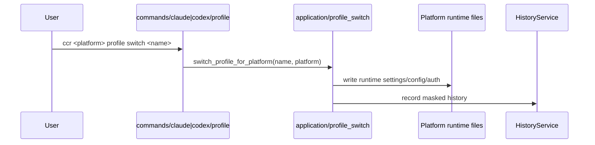

# Runtime Flows

This page records the most important current execution paths, with emphasis on the explicit Claude / Codex runtime model.

## 1. CLI entry

- `ccr` with no subcommand enters TUI
- `ccr current` shows the dual-runtime overview
- `ccr switch <name>` and `ccr <name>` are retired and now return migration errors

## 2. Platform-scoped profile switching

Key point:

- CCR no longer infers the target platform from a global `current_platform`
- the command path itself chooses the platform
- the routing truth in the registry is each platform's `current_profile`

## 3. `ccr current`

`ccr current` aggregates:

- Claude Runtime status card
- Codex Runtime status card
- JSON schema with `schema_version`, `generated_at`, `claude`, and `codex`

The top level no longer exposes `current_platform`.
