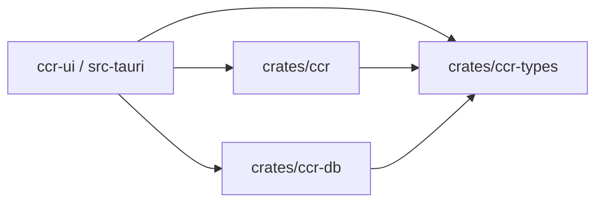
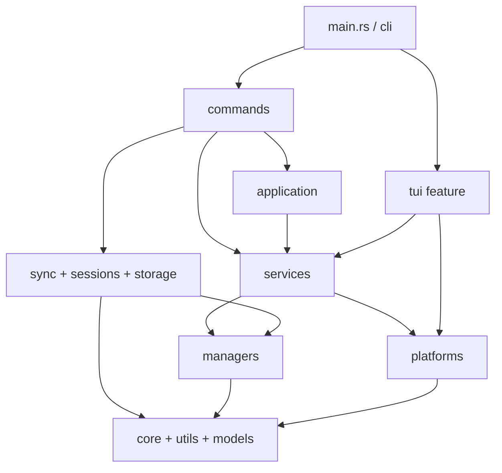

# CCR 架构设计

> 面向当前代码真相的架构说明。CCR 的事实源是 Rust workspace：`crates/ccr`、`crates/ccr-db`、`crates/ccr-types`。内置 legacy Web API 已移除，不再属于当前运行面。

## 总览

- `crates/ccr`：主 CLI crate，负责命令入口、平台实现、配置写入、同步、会话索引、TUI 与 `ccr ui` 启动桥接
- `crates/ccr-db`：桌面侧数据库与业务服务，负责 SQLite、CheckIn、usage import、日志持久化、UI state
- `crates/ccr-types`：跨 crate 共享的 serde 类型与兼容性约束
- `ccr-ui/src-tauri`：桌面壳，直接复用上述 crate，而不是通过旧的内置 HTTP 服务

## Workspace 依赖关系



## 仓库布局

```text
ccr/
├── Cargo.toml
├── crates/
│   ├── ccr/
│   │   ├── src/
│   │   │   ├── application/
│   │   │   ├── cli/
│   │   │   ├── commands/
│   │   │   ├── core/
│   │   │   ├── managers/
│   │   │   ├── models/
│   │   │   ├── platforms/
│   │   │   ├── services/
│   │   │   ├── sessions/
│   │   │   ├── storage/
│   │   │   ├── sync/
│   │   │   ├── tui/        # 由 `tui` feature 控制
│   │   │   └── utils/
│   │   └── tests/
│   ├── ccr-db/
│   │   └── src/
│   │       ├── core/
│   │       ├── database/
│   │       ├── managers/
│   │       ├── models/
│   │       └── services/
│   └── ccr-types/
│       └── src/
├── ccr-ui/
│   ├── src/
│   └── src-tauri/
├── docs/
├── examples/
└── scripts/
```

## `crates/ccr` 内部分层



关键边界：

- `cli/` 负责参数定义与命令分发
- `commands/` 负责用户可见命令行为
- `services/` 负责跨 manager / platform 的业务编排
- `managers/` 负责配置、定价、历史、skills、MCP preset 等持久化与读写
- `sessions/` + `storage/` 负责会话索引与本地 SQLite 存储
- `sync/` 负责 WebDAV 配置与目录同步
- `tui/` 是可选 feature；默认构建启用

## `crates/ccr-db` 与 `crates/ccr-types`

### `ccr-db`

- `database/`：连接池、schema、migration、repository
- `managers/checkin/`：签到账号、提供商、余额、记录、WAF cookie 管理
- `services/checkin_service.rs`：签到执行、余额查询、批量签到、今日统计
- `services/usage_import_service.rs`：从 Codex / Gemini session 文件提取 token 与成本记录
- `services/log_persistence.rs`：持久化日志与监控相关数据

### `ccr-types`

- `ClaudeSettings`：跨 CLI/UI 共享的 Claude settings 结构
- `LoginState` / `TokenFreshness`：Codex auth 状态表达
- `MonitoringEntry` / `FrontendLogInput`：监控与前端日志输入

这个 crate 的重点不是业务逻辑，而是：

- 保持字段序列化兼容
- 接受旧输入格式
- 保留未知字段，避免覆盖用户手写配置

## 当前关键流程

### Profile 切换

1. `main.rs` 解析 CLI 参数
2. `cli/dispatch.rs` 路由到具体命令
3. `ConfigService` 读取平台注册表与当前平台 profile 集合
4. `SettingsService` 获取锁、创建备份、写入目标 settings
5. `HistoryService` 记录掩码后的操作历史

### `ccr ui`

1. `dispatch_ui` 进入 `UiService`
2. `UiService` 先探测当前目录或父目录中的 `ccr-ui/`
3. 不存在时回退到 `~/.ccr/ccr-ui/`
4. 仍缺失时再走 GitHub 下载 / 更新流程

### 会话索引

1. `ccr sessions ...` 进入 `sessions` 命令组
2. `SessionIndexer` 扫描 Claude / Codex / Gemini 等 session 文件
3. `SessionStore` 把摘要、检索字段和统计写入本地存储

## 设计约束

- 当前没有 `src/web/**` 模块，也没有受支持的内置 HTTP API
- `ccr ui` 是图形入口，不是第二套配置系统
- `ccr-ui` 与 CLI 共用同一套配置/历史/平台事实源

## 延伸阅读

- [Crate 地图](/reference/internals/crate-map)
- [运行时流程](/reference/internals/runtime-flows)
- [命令参考](/reference/commands/)
- [迁移指南](/reference/migration)
