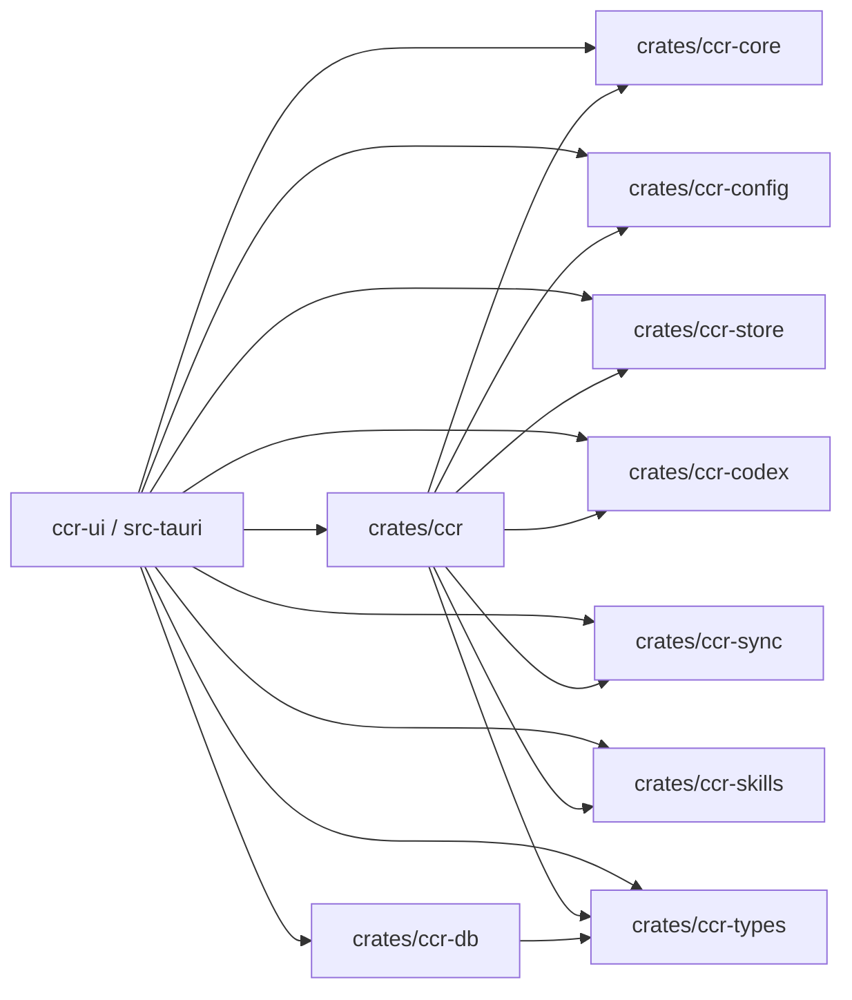
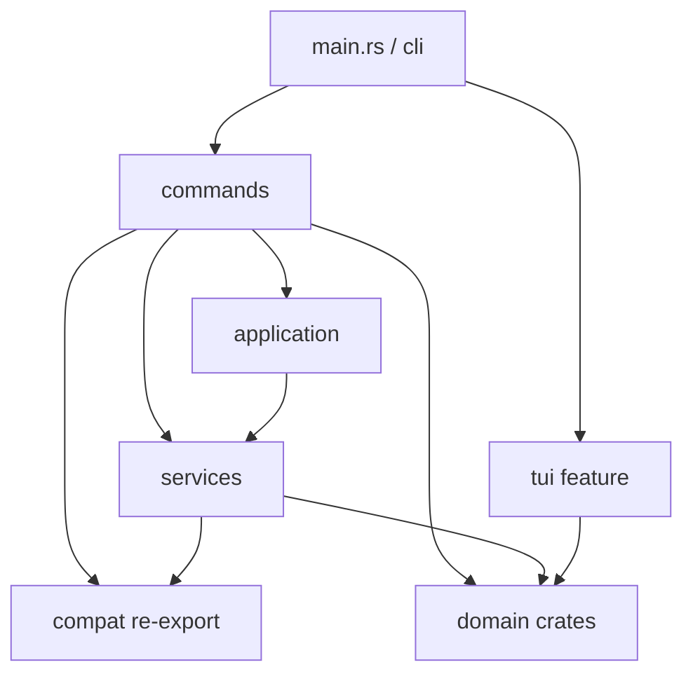

# CCR 架构设计

> 面向当前代码真相的架构说明。CCR 的事实源是 Rust workspace：`crates/ccr`、`crates/ccr-core`、`crates/ccr-config`、`crates/ccr-store`、`crates/ccr-codex`、`crates/ccr-sync`、`crates/ccr-skills`、`crates/ccr-db`、`crates/ccr-types`。内置 legacy Web API 已移除，不再属于当前运行面。

## 总览

- `crates/ccr`：CLI/TUI shell crate，负责命令入口、交互式命令、帮助输出、`ccr ui` 启动桥接与兼容 re-export
- `crates/ccr-core`：共享基础设施，负责错误、锁、原子写入、日志、HTTP 等底层能力
- `crates/ccr-config`：配置与平台契约，负责平台类型、profile/settings 契约、平台注册表与配置 helper
- `crates/ccr-store`：本地持久化与会话索引，负责 history/session/storage
- `crates/ccr-codex`：Codex 专属领域，负责 auth/runtime/quota/usage/session
- `crates/ccr-sync`：同步领域，负责 WebDAV 同步与 sync folder 注册表
- `crates/ccr-skills`：skills / builtin prompts / MCP preset 领域
- `crates/ccr-db`：桌面侧数据库与业务服务，负责 SQLite、CheckIn、usage import、日志持久化、UI state
- `crates/ccr-types`：跨 crate 共享的 serde 类型与兼容性约束
- `ccr-ui/src-tauri`：桌面壳，直接复用上述 domain crate，而不是通过旧的内置 HTTP 服务

## Workspace 依赖关系



## 仓库布局

```text
ccr/
├── Cargo.toml
├── crates/
│   ├── ccr/         # shell / compat facade
│   ├── ccr-core/
│   ├── ccr-config/
│   ├── ccr-store/
│   ├── ccr-codex/
│   ├── ccr-sync/
│   ├── ccr-skills/
│   ├── ccr-db/
│   └── ccr-types/
├── ccr-ui/
│   ├── src/
│   └── src-tauri/
├── docs/
├── examples/
└── scripts/
```

## `crates/ccr` 内部分层



关键边界：

- `cli/` 负责参数定义与命令分发
- `commands/` 负责用户可见命令行为与交互式 shell 流程
- `services/` 只保留 shell 编排与 UI 启动桥接
- domain crate 负责配置、平台、会话、Codex、sync、skills 等真实领域逻辑
- `crates/ccr` 的 `models/`、`managers/`、`services/` 中残留的域对象优先视为 compat facade，而不是新的事实源
- `tui/` 是可选 feature；默认构建启用

## `crates/ccr-db` 与 `crates/ccr-types`

### `ccr-db`

- `database/`：连接池、schema、migration、repository
- `managers/checkin/`：签到账号、提供商、余额、记录、WAF cookie 管理
- `services/checkin_service.rs`：签到执行、余额查询、批量签到、今日统计
- `services/usage_import_service.rs`：从 Codex / Gemini session 文件提取 token 与成本记录
- `services/log_persistence.rs`：持久化日志与监控相关数据

### `ccr-types`

- `ClaudeSettings`：跨 CLI/UI 共享的 Claude settings 结构
- `LoginState` / `TokenFreshness`：Codex auth 状态表达
- `MonitoringEntry` / `FrontendLogInput`：监控与前端日志输入

这个 crate 的重点不是业务逻辑，而是：

- 保持字段序列化兼容
- 接受旧输入格式
- 保留未知字段，避免覆盖用户手写配置
