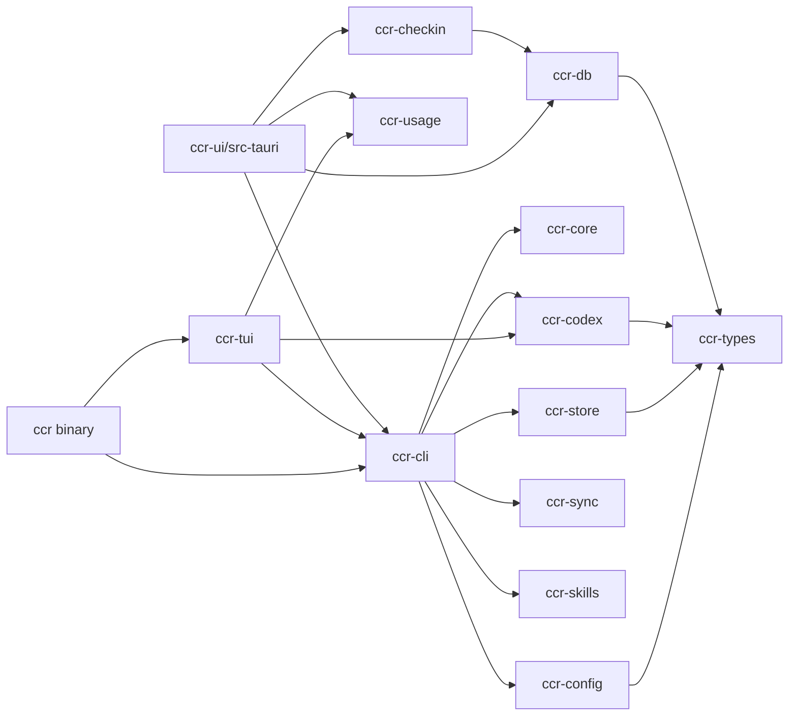

# CCR 架构

CCR 由 13 个 Rust workspace crate、Vue 3 前端和 Tauri 桌面壳组成。可安装的 `ccr` 二进制负责入口，CLI、TUI、配置、持久化、同步和平台领域由独立 crate 持有。

## Workspace 组成

| 层 | Crate | 职责 |
|---|---|---|
| 入口 | `crates/ccr` | 二进制启动、feature 组合、CLI/TUI launcher 和兼容 re-export |
| 交互 | `crates/ccr-cli` | Clap 定义、命令分发、用户可见输出和 CLI 应用编排 |
| 交互 | `crates/ccr-tui` | Ratatui 终端界面和 Claude/Codex 交互入口 |
| 基础 | `crates/ccr-core` | 错误、锁、原子写、HTTP、日志和共享应用基础设施 |
| 配置 | `crates/ccr-config` | 平台/profile/settings 类型、注册表与配置转换契约 |
| 持久化 | `crates/ccr-store` | CLI history、session 索引和 SQLite 查询 |
| 平台 | `crates/ccr-codex` | Codex auth、runtime、quota、usage 和 session 领域 |
| 平台 | `crates/ccr-sync` | WebDAV 配置、目录注册与同步操作 |
| 平台 | `crates/ccr-skills` | skills、builtin prompts 和 MCP preset 领域 |
| 桌面数据 | `crates/ccr-db` | 桌面 SQLite、repository、日志和数据服务 |
| 桌面业务 | `crates/ccr-checkin` | 签到业务门面，复用 `ccr-db` 的数据能力 |
| Usage | `crates/ccr-usage` | 对 llmusage 数据提供只读投影和可选 TypeScript 绑定 |
| 契约 | `crates/ccr-types` | 跨 crate serde 类型、兼容字段和共享 DTO |

展开说明见 [Crate 地图](./internals/crate-map)。

## 依赖方向



依赖从入口和适配层指向共享领域与契约。新的领域行为不应重新堆回 `crates/ccr` 或 Vue 视图。

## CLI 与 TUI

`crates/ccr/src/main.rs` 组装 launcher。命令定义和分发位于 `crates/ccr-cli/src/cli/`，命令处理器位于 `crates/ccr-cli/src/commands/`。无子命令时可以进入 TUI；`ccr claude`、`ccr codex` 和 `ccr grok auth` 也有对应的交互入口。

TUI 渲染由 `ccr-tui` 持有，不应进入 `ccr-cli`。CLI 领域逻辑优先调用配置、Codex、同步、skills 和 store crate，而不是复制底层实现。

## CCR UI 与 Tauri

`ccr-ui/src/` 是 Vue 应用；`ccr-ui/src-tauri/` 注册 Rust invoke handlers，并直接依赖 workspace crate。当前桌面架构不经过已移除的内置 HTTP API。

```text
Vue view/store
  -> ccr-ui/src/api/domains/*
  -> Tauri invoke
  -> src-tauri/src/commands/*
  -> workspace crate or host integration
```

UI 与 CLI 共享 `~/.ccr/` 数据和平台配置。UI 是同一系统的图形入口，不是第二套配置事实源。

## 数据所有权

- `ccr-config` 持有 profile/settings 序列化与转换契约。
- `ccr-store` 持有 CLI history 和 session 索引查询。
- `ccr-db` 持有桌面数据库、repository 和日志等服务。
- `ccr-usage` 只读适配 llmusage 数据，不拥有写入或迁移上游数据库的权限。
- `ccr-types` 负责兼容性；未知用户字段不得在读写往返中静默丢失。

## 关键运行路径

### Profile 操作

1. Clap 将参数解析为 `Commands` 或平台子命令。
2. `ccr-cli` 分发到 Claude/Codex/平台处理器。
3. domain crate 加载并验证 profile。
4. 写入路径使用锁、备份和原子写。
5. history 记录脱敏后的操作结果。

### `ccr ui`

1. `ccr-cli` 进入 UI service。
2. service 查找开发 checkout 或 `~/.ccr/ccr-ui/` 安装。
3. 缺失时进入下载/更新流程。
4. Vue/Tauri 应用继续复用同一 workspace 领域。

### Usage

1. llmusage 负责采集和数据库写入。
2. `ccr-usage` 与桌面 adapter 读取受支持的投影。
3. Tauri command 返回稳定 DTO。
4. Vue usage 页面渲染 capability、同步和错误状态。

## 约束

- 不存在受支持的内置 Web server 命令或公开 HTTP API。
- 生产路径不得打印 token、账号密钥或未脱敏配置。
- 配置写入必须保持备份、锁和原子写语义。
- CLI、TUI 和 UI 的同一概念应依赖共同类型或 domain crate。

## 相关页面

- [Crate 地图](./internals/crate-map)
- [运行时流程](./internals/runtime-flows)
- [入口选择](/guide/entrypoints)
- [UI 模块地图](/guide/ui-modules)
