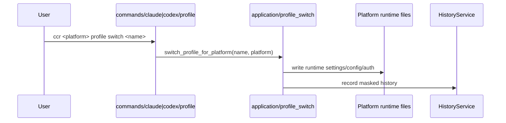

# 运行时流程

本页记录当前最重要的运行路径，重点是新的显式 Claude / Codex runtime 模型。

## 1. CLI 入口

- `ccr` 无子命令时进入 TUI
- `ccr current` 显示双 runtime 总览
- `ccr switch <name>` / `ccr <name>` 已退休并返回迁移错误

## 2. 平台级 profile 切换

核心点：

- 不再通过全局 `current_platform` 推断目标平台
- 目标平台由命令路径显式决定
- registry 的事实源是每个平台自己的 `current_profile`

## 3. `ccr current`

`ccr current` 聚合：

- Claude Runtime 状态卡片
- Codex Runtime 状态卡片
- JSON schema：`schema_version`、`generated_at`、`claude`、`codex`

顶层不再输出 `current_platform`。
