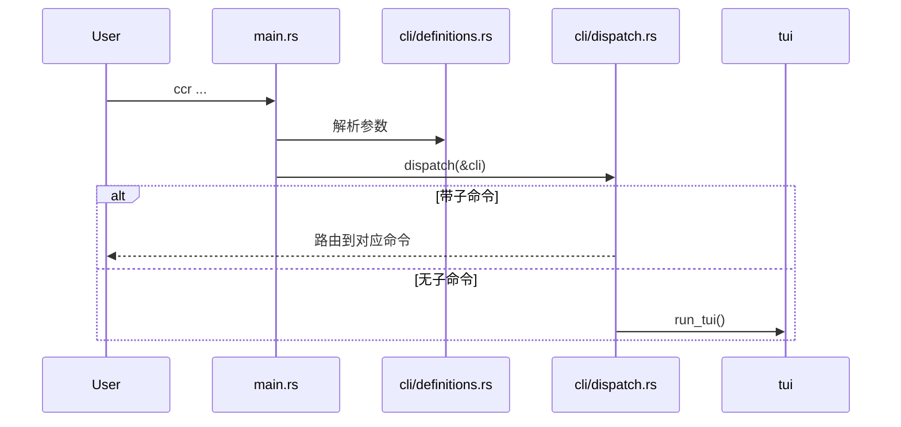
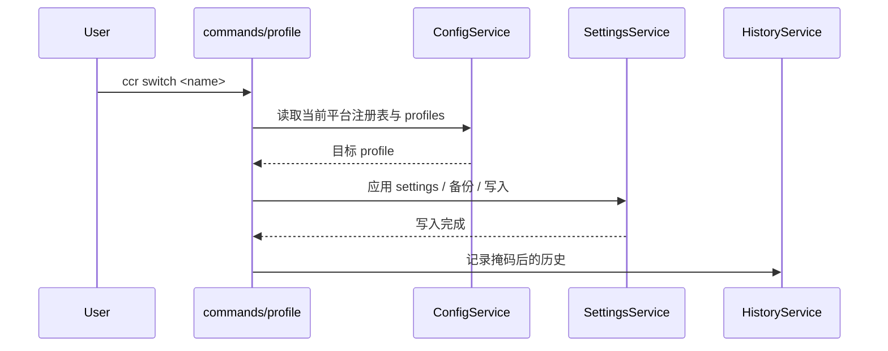
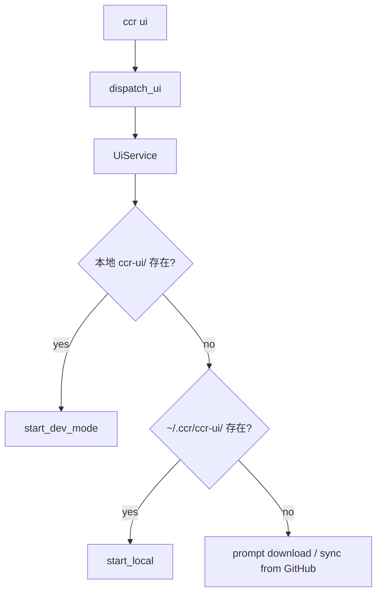
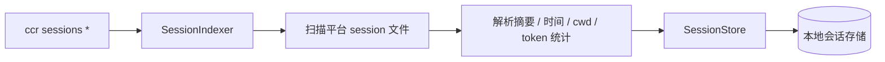
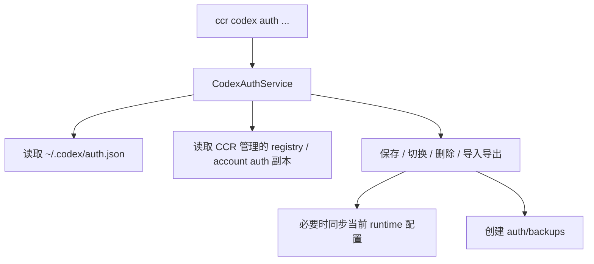
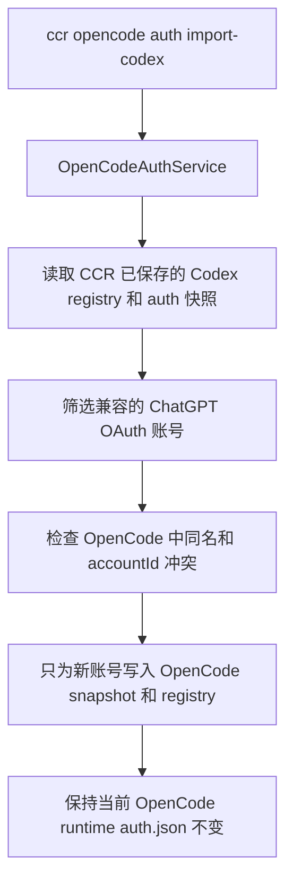
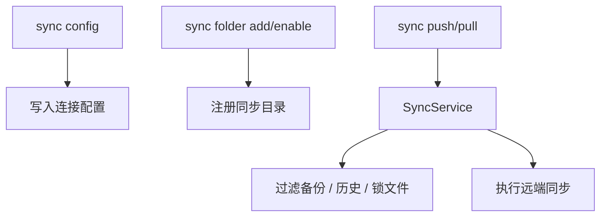

# 运行时流程

本页记录当前代码里最重要的几条运行路径，便于把命令面和内部实现对齐。

## 1. CLI 入口与无子命令行为

事实点：

- 默认构建启用 `tui` feature
- `ccr` 无子命令且无 `config_name` 时进入 TUI
- `ccr codex` 在无 action 时也被视为 TUI 模式
- `ccr opencode` 在无 action 时也会进入 OpenCode Auth 页签

## 2. Profile 切换

相关组件：

- `ConfigService::get_config` / `set_current`
- `SettingsService::apply_config`
- `HistoryService`

## 3. `ccr ui`

当前代码显示的优先级：

1. 当前目录或父目录中的 `ccr-ui/`
2. `~/.ccr/ccr-ui/`
3. 下载 / 更新流程

## 4. Session 索引

代码边界：

- `sessions/indexer.rs`：批量扫描和 rebuild
- `storage/session_store.rs`：upsert、list、search、stats、prune

## 5. Codex 多账号 auth

该服务负责：

- 当前登录态识别
- 账号清单与过期状态
- 当前 auth 的备份与轮转
- 导入 / 导出与切换

## 6. OpenCode auth 迁移

该流程负责：

- 只读取已保存的 Codex 账号，不读取未保存的运行时登录
- 将兼容的 Codex Token 结构映射为 OpenCode `openai` OAuth 快照
- 跳过 API Key、缺少快照、无效快照和冲突账号
- 输出结构化迁移报告，供 CLI 和 TUI 复用

## 7. WebDAV 同步

相关模块：

- `sync/config.rs`
- `sync/folder.rs`
- `sync/folder_manager.rs`
- `services/sync_service.rs`
