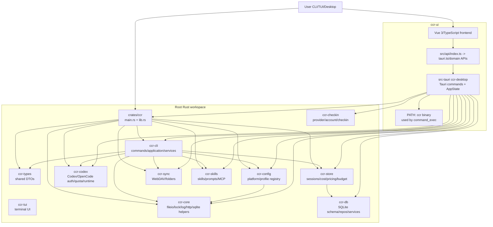

# CCR 仓库代码审计与优化建议 Canvas

审计对象：`bahayonghang/ccr`
审计时间：2026-06-03
审计范围：根 Rust workspace、`ccr-ui` Vue/Tauri 前端与桌面端、CI/Justfile、核心入口与安全敏感路径。
说明：本报告基于 GitHub 仓库可见文件逐项取证；未执行完整本地构建、测试、覆盖率或漏洞扫描，因此涉及运行时指标的项标注为“需测量”。

---

## 0. 执行摘要（TL;DR）

### 仓库概况

- **仓库定位**：CCR 是一个用 Rust 编写的 AI CLI 配置管理入口，覆盖 Claude/Codex runtime 状态、CLI-first workflow、TUI 与 CCR UI。
- **技术栈**：Rust 2024 workspace + Tokio/Clap/Serde/Rusqlite/Reqwest；Vue 3 + TypeScript + Bun + Vite；Tauri 2 桌面端；SQLite 数据层；WebDAV 同步；GitHub Actions + Justfile 工程脚本。
- **规模**：中大型个人/工具型代码库。根 workspace 显式包含 12 个 Rust crate；另有 `ccr-ui`、`ccr-vscode`、docs/scripts 等子系统。未离线统计 LOC，本报告以模块数、crate 数和依赖面评估规模。
- **成熟度评分**：**6.2 / 10**。
  - 加分项：workspace 分层意识明确、已有 code map、核心配置写入有原子写入/锁设计、跨平台 CI 与 Justfile 命令齐全、测试入口存在。
  - 扣分项：后端 CI 只在 tag push 运行；Tauri 命令执行对破坏性命令的确认与参数 schema 没有在后端强制；桌面端与根 workspace 依赖版本漂移；安全审计多处非阻断；文档与版本明显陈旧；桌面命令/job 内存无上限。

### 最关键风险（按影响排序）

1. **桌面端命令执行的后端授权边界不足**：`delete/import/restore` 等破坏性命令在 catalog 中标为需要确认，但后端 `execute_ccr_command`/`start_ccr_command_job` 只校验一级命令名，随后直接透传任意 args 到 PATH 中的 `ccr`。这不是 shell injection，但属于 capability/confirmation enforcement 缺失。
2. **Rust 后端 CI 只在 tag push 运行**：主干/PR 变更不会触发 Rust format、clippy、test、build、cargo audit，质量门禁被推迟到发版标签阶段。
3. **Windows 路径下“atomic write”语义不成立**：异步原子写入在 Windows 上先删除目标文件再 rename；同步 Windows retry 路径也存在删除目标再重试。遇到崩溃/断电/并发读取时可能短暂丢文件或丢原值。
4. **依赖与锁文件漂移**：根 workspace、Tauri 子 workspace、package.json、package-lock、bun.lock、README 之间的版本与工具链约束不一致，破坏可复现构建和安全审计可信度。
5. **全局命令 job registry 无 TTL/容量限制**：命令 stdout/stderr 全量累积到内存 Vec，并长期留在全局 HashMap，容易形成桌面进程内存泄漏或 DoS。

---

## 1. 问题清单

> P0：未发现可直接证明的远程代码执行、任意 shell 注入或硬编码生产密钥。以下最高定级为 P1。
> “性质”字段区分“客观缺陷”和“架构/风格债”。

| 级别 | 维度 | 性质 | 位置(file:line) | 证据 | 影响 / 二阶风险 | 根因 | 修复建议 | 工作量 | 信心 |
|---|---|---|---|---|---|---|---|---|---|
| 🟠P1 | 安全 / 桌面 capability | 客观缺陷 | `ccr-ui/src-tauri/src/commands/command_exec.rs:25-44`, `:475-561`, `:869-890`, `:1102-1160`; `ccr-ui/src-tauri/src/commands/mod.rs:318-324` | 白名单包含 `delete/import/restore`；catalog 对这些命令设置 `requires_confirmation=true`；但后端 `validate_command` 只判断 `entry.name == command && entry.executable && ALLOWED_COMMANDS.contains(&command)`，执行函数随后 `cmd.arg(&command).args(&extra_args)`。 | 如果 WebView 被 XSS、插件或前端 bug 触发 Tauri invoke，可绕过 UI 确认调用破坏性 CLI。参数 schema、路径约束、`--force` 语义都未在 Rust 后端强制。 | 把 UI 元数据当作安全策略；Tauri command 暴露的是 capability，但没有后端 policy 层。 | 引入 `CommandPolicy`：后端强制 `requires_confirmation_token`、arg schema、flag allowlist、危险命令二次 challenge；所有 destructive command 必须由专门 Tauri command 实现，不再走通用 CLI passthrough。 | 1-2d | 高 |
| 🟠P1 | 工程化 / CI | 客观缺陷 | `.github/workflows/ci.yml:5-8`; `.github/workflows/frontend-ci.yml:5-17` | Rust CI 仅 `push.tags: '*'`；前端 CI 才有 `push`/`pull_request` branches。 | Rust 代码在 PR/主干阶段不会跑 fmt/clippy/test/build/audit，缺陷可能到 tag release 才暴露。 | release workflow 和 CI workflow 混淆；Rust 门禁没有覆盖开发流。 | 将 Rust CI 触发改为 `pull_request` + `push` to `main/develop` + tag；tag 只做 release/publish。为重任务做 path filter 与缓存，而不是取消 PR 门禁。 | <0.5d | 高 |
| 🟠P1 | 健壮性 / 文件安全 | 客观缺陷 | `crates/ccr-core/src/core/atomic_writer.rs:134-191`, `:216-228`; `crates/ccr-core/src/core/fileio.rs:96-118`, `:184-205` | Windows 同步 retry 路径失败后 `remove_file(&target_path)` 再 sleep/retry；异步写在 Windows 上如果目标存在先 `remove_file`，再 `rename(temp, target)`。fileio 的 TOML/JSON write 调用这些 writer。 | 与“atomic write”承诺不一致。崩溃、断电或权限错误发生在删除与重命名之间，会导致目标文件短暂消失或原文件丢失。配置/认证文件尤其敏感。 | 用跨平台 `rename` 模拟原子替换，但 Windows 语义不支持覆盖式 atomic rename。 | Windows 使用 `ReplaceFileW`/`MoveFileExW(MOVEFILE_REPLACE_EXISTING|MOVEFILE_WRITE_THROUGH)`；所有写入前持有文件锁；增加 crash-safety tests。短期：先写 backup，再 replace，失败时恢复。 | 1-2d | 高 |
| 🟠P1 | 依赖治理 / 可复现构建 | 客观缺陷 | `Cargo.toml:21-104`; `ccr-ui/src-tauri/Cargo.toml:3-31`, `:55-61`; `ccr-ui/package.json:3`; `ccr-ui/package-lock.json:4-11`; `ccr-ui/bun.lock:3-28` | 根 workspace version `6.3.0`，Tauri crate 独立 workspace；根 `reqwest=0.13.4`，Tauri `reqwest=0.13.2`；package.json version `6.3.0`，package-lock root version `5.7.10`；Bun lock 与 npm lock 内容漂移。 | 同一仓库出现多套依赖解析和锁文件源，漏洞审计、复现构建、升级策略都容易失真。 | Tauri 子项目独立 workspace + 前端同时保留 npm 和 Bun lock；缺少 drift check。 | 确定唯一 JS 包管理器。若使用 Bun，删除/冻结 package-lock 或增加一致性检查；Tauri Rust 依赖改用 root workspace inheritance，或增加 `scripts/check-dependency-drift`。 | 1d | 高 |
| 🟠P1 | 安全审计 / 供应链 | 客观缺陷 | `justfile:206-211`; `.github/workflows/frontend-ci.yml:120-139`; `.github/workflows/ci.yml:177-190` | Justfile 的 `audit` 用 `-cargo audit || just warn`，失败不阻断；Frontend CI 的 `better-npm-audit` 设置 `continue-on-error: true`；Rust cargo audit 仅在 tag-triggered CI 中运行。 | 已知漏洞不会阻断合并；安全反馈变成可忽略日志。 | 安全审计被当作提示项而非 release gate。 | 引入 `cargo-deny` + `cargo-audit` + `bun audit`/OSV Scanner；PR 阶段阻断 critical/high，低危允许基线豁免。 | 0.5-1d | 高 |
| 🟡P2 | 性能 / 资源管理 | 客观缺陷 | `ccr-ui/src-tauri/src/commands/command_exec.rs:772-785`, `:807-813`, `:849-854`, `:928-934`, `:1142-1160`; `ccr-ui/src-tauri/src/main.rs:186-235` | `CommandJobSnapshot` 保存 stdout/stderr/system `Vec<String>`；全局 `COMMAND_JOBS` 保存 jobs 和 cancel_tokens；完成后只移除 cancel token；后台 maintenance 没有清理 command jobs。 | 长时间桌面会话、多次命令执行或大输出命令会持续占用内存；前端频繁轮询会复制 snapshot。 | 缺少 job lifecycle、TTL、输出 ring buffer、容量限制。 | 加 `JobStore`：max jobs=100、TTL=24h、每 channel max lines/bytes；输出改 ring buffer；`get_status` 返回增量 cursor；后台 tick 清理。 | 1d | 高 |
| 🟡P2 | 架构 / 桌面命令执行 | 架构债 | `ccr-ui/src-tauri/src/process/mod.rs:44-55`; `ccr-ui/src-tauri/src/commands/command_exec.rs:972-987`, `:1102-1139` | 桌面端已依赖 CCR core/CLI crates，却仍通过 `tokio_command("ccr")` 调 PATH 中的外部二进制。 | 运行的 `ccr` 可能不是当前应用内置版本；PATH hijack/版本不一致/行为不一致。性能上也引入子进程开销和输出解析。 | 命令面板复用 CLI 文本接口，而不是调用 domain service。 | 用内部 service façade 替代 CLI 子进程；命令面板只作为 UI，调用 typed Rust service；若保留 passthrough，必须使用内置 absolute path + version check。 | 2-4d | 高 |
| 🟡P2 | 架构 / 模块边界 | 架构债 | `crates/ccr/Cargo.toml:28-38`; `crates/ccr/src/lib.rs:129-182`; `crates/ccr-cli/Cargo.toml:21-28`; `ccr-ui/src-tauri/Cargo.toml:16-31`; `ccr-ui/src-tauri/src/commands/mod.rs:35-164` | `ccr` crate 重导出 `ccr_cli::{application, commands, managers, models, platforms, services, sync}`；CLI 和 Desktop 都直接依赖大量 domain/persistence crate；Tauri handler 宏集中注册海量 command。 | 边界难以 enforce；任何模块重构都可能成为破坏性 API 变更；桌面端形成 god backend。 | 缺少稳定 public prelude、domain contract 和 handler registry。 | `ccr` 只保留 stable API/prelude；内部模块移到 `ccr-cli` private；Tauri command 按 domain 注册 `CommandModule`，生成 handler 与 TS client。 | 3-8d | 中-高 |
| 🟡P2 | 文档 / 可维护性 | 客观缺陷 | `ccr-ui/README.md:9-12`, `:34-43`, `:152-186`, `:201-205`, `:211-220`; `ccr-ui/src/api/index.ts:3-10`; `ccr-ui/src-tauri/Cargo.toml:5-11`, `:42-61` | UI README badge version 2.5.0；写 Rust >=1.70、Edition 2021、Tokio 1.48、Web/HTTP dual mode；实际 package/Tauri 是 6.3.0、Edition 2024、Tokio 1.49，并且 API index 声明 HTTP/Axios dual mode 已移除。 | 新贡献者按 README 操作会踩坑；架构认知与真实代码不一致。 | 文档没有纳入 CI drift check；版本同步脚本未覆盖 README 内容。 | 增加 docs drift CI：版本、MSRV、packageManager、运行模式从 manifests 自动生成；README 保留最小入口，详细文档放 docs。 | 0.5-1d | 高 |
| 🟡P2 | 工程化 / Frontend CI | 客观缺陷 | `ccr-ui/package.json:3`; `.github/workflows/frontend-ci.yml:45-52`, `:137-139` | package script `lint` 含 `eslint . --fix` 和 stylelint `--fix`；CI 直接跑 `bun run lint`。 | CI 中自动修改文件会掩盖 lint failure 或造成工作区 dirty；审查者看不到需要手动提交的格式变更。 | 本地修复命令和 CI 检查命令混用。 | 拆分 `lint` 与 `lint:fix`、`lint:style` 与 `lint:style:fix`；CI 使用 no-fix 检查，并在结束时 `git diff --exit-code`。 | <0.5d | 高 |
| 🟡P2 | 测试质量 / 并发可靠性 | 需验证 | `justfile:147-160`; `.github/workflows/ci.yml:125-126`; `crates/ccr-core/src/core/lock.rs:47-78` | 测试统一 `--test-threads=1`，Justfile 注释称避免并发冲突；核心锁文档也强调全局 `CONFIG_LOCK`。 | 串行测试降低速度，并可能掩盖真实并发竞态；用户场景是多 CLI/桌面并发写配置。 | 测试夹具可能共享 HOME/config/env，全局状态隔离不足。 | 建 `TestHome`/`TestEnv` fixture，所有路径注入；并发相关测试单独保留串行，其他测试恢复默认并发；增加 loom/proptest/跨进程锁测试。 | 2-5d | 中 |
| 🟢P3 | 代码质量 / 可读性 | 风格债 | `ccr-ui/package.json:3`; `ccr-ui/src/api/tauri.ts:3-27`, `:237-280` | package.json 压缩为单行；`tauri.ts` 作为兼容 facade 聚合大量 domain API。 | Review diff 难读；API 迁移期容易继续堆积。 | 缺少格式化约束与 typed client 生成。 | 格式化 package.json；冻结 `tauri.ts` 为 compatibility-only，新增 API 只能落 domain files；生成 `@/api/generated/tauriClient.ts`。 | <0.5d-2d | 高 |

---

## 2. 架构评估

### 2.1 现状架构图（基于真实依赖/入口）

### 2.2 主要架构反模式 vs 目标架构

| 现状反模式 | 证据 | 这其实合理的反驳 | 结论 | 目标架构 |
|---|---|---|---|---|
| Desktop god backend | `src-tauri` 直接依赖几乎所有 CCR crate；`commands/mod.rs` 一个 macro 注册大量命令。 | 桌面应用天然要聚合全部功能；单一 invoke_handler 是 Tauri 常见写法。 | 聚合可以接受，但安全策略、schema、生命周期不应散落在 UI 元数据和通用 passthrough。 | 按 domain 拆分 `CommandModule`，每个模块暴露 typed commands + policy + TS binding。 |
| CLI 子进程复用 core 能力 | Desktop 已 link CCR crates，却仍通过 PATH 调 `ccr`。 | 复用 CLI 可快速得到一致输出和兼容旧命令。 | 作为临时兼容可以，但不适合作为安全边界和核心桌面能力路径。 | Desktop 调 service façade；CLI 和 Tauri 共享同一 use-case 层。 |
| Public API 暴露内部层 | `ccr/src/lib.rs` 重导出 CLI `commands/managers/services`。 | 作为工具库给脚本用户使用方便。 | 方便性换来了重构成本和 semver 风险。 | `ccr::prelude` + 稳定 DTO；内部模块 crate-private 或 behind `unstable` feature。 |
| 多 workspace / 多 lockfile 漂移 | root workspace、Tauri 独立 workspace、package-lock 与 bun.lock 同时存在且版本不同。 | Tauri 独立 workspace 可缩短构建和规避依赖冲突。 | 可以独立，但必须有 drift check 和统一升级策略。 | 明确单一包管理器；Rust 依赖通过 root workspace 或 manifest drift CI 约束。 |
| 文档与代码不同步 | UI README 版本/运行模式/MSRV/Edition/Tokio 与 manifest/代码冲突。 | README 可能是旧版历史文档。 | 对新贡献者和安全审计是实质风险。 | 文档从 manifest 自动生成版本段；架构说明来自 code map / ADR。 |

---

## 3. 优化 Plan

### 阶段一：Quick Wins（每项 <1d）

| 优先级 | 动作 | 量化预期收益 | 风险 | 回滚策略 | 验收标准 |
|---|---|---|---|---|---|
| P0 | Rust CI 加 `pull_request` 与 `push` main/develop 触发 | PR 质量门禁覆盖率从 tag-only → 每 PR | CI 时间增加 | 先 path-filter，只对 Rust 路径触发 | 任一 Rust PR 自动跑 fmt/clippy/test/build/audit |
| P0 | Frontend lint 拆分 no-fix / fix | CI 不再隐式修改文件 | 本地脚本习惯变化 | 保留 `lint:fix` 别名 | CI 用 no-fix，且 `git diff --exit-code` 通过 |
| P0 | 安全审计阻断 high/critical | 供应链风险从 warning-only → gate | 可能暴露历史漏洞导致暂时红灯 | 建 baseline/allowlist，逐项到期 | high/critical 无豁免不能合并 |
| P0 | 修正 UI README 与 package/manifest 版本 | 新贡献者启动失败率降低 | 文档调整影响小 | 回滚 README | README 中版本、MSRV、运行模式与 manifest 一致 |
| P1 | 删除或冻结 stale `package-lock.json` | JS 依赖源唯一化 | npm 用户受影响 | 若保留则加同步校验 | `bun install --frozen-lockfile` 与 lockfile 策略一致 |
| P1 | command job 加 max lines / TTL | 内存泄漏风险显著下降 | 老 job 可能不可查 | TTL 可配置，默认 24h | 超过容量自动裁剪；测试覆盖 |

### 阶段二：中期重构（模块级）

| 优先级 | 动作 | 前置依赖 | 量化预期收益 | 回归风险 | 回滚策略 | 验收标准 |
|---|---|---|---|---|---|---|
| P0 | Tauri command policy 层 | catalog 梳理 | 破坏性命令后端确认覆盖 100% | 前端调用需要适配 | 双轨保留旧 command behind feature | 所有 destructive command 单测覆盖 unauthorized / missing confirmation / invalid arg |
| P0 | Desktop 不再 PATH 调 `ccr` | use-case service façade | 消除 PATH hijack/版本不一致 | CLI 输出与 service 返回格式差异 | 临时保留 passthrough debug 命令 | 命令面板 80% 常用命令走 internal service；外部 `ccr` 只用于诊断 |
| P1 | Windows atomic write 替换实现 | 文件锁回归测试 | 配置写 crash-safety 提升 | Windows API 封装需验证 | 保留旧 writer behind feature | Windows 上 replace 失败不丢原文件；断点测试通过 |
| P1 | Root/Tauri 依赖 drift check | 明确 workspace 策略 | 漂移项从多个 → 0 | Tauri 构建依赖冲突 | 允许短期例外清单 | CI 输出 dependency drift report，非豁免漂移阻断 |
| P2 | Tauri handler registry 化 | command policy | 降低 macro merge conflict | 拆分多文件改动较大 | 保留 generate_handler_common 兼容层 | 每个 domain 独立注册、独立测试，新增 command 不改巨型 macro |
| P2 | TestHome/TestEnv 隔离 | 测试工具层 | 大部分测试恢复并发执行 | 隐藏依赖 HOME 的测试会失败 | 个别测试保留 serial 标记 | 默认 test threads 恢复；并发测试稳定 |

### 阶段三：长期架构演进

| 方向 | 动作 | 量化预期收益 | 风险 | 回滚策略 | 验收标准 |
|---|---|---|---|---|---|
| Stable public API | `ccr` crate 只导出 prelude/DTO/use-cases；内部 manager/service 不直接 re-export | semver 破坏面下降 | 现有外部用户导入路径变更 | v6 保留 deprecation re-export，v7 移除 | public API snapshot 测试通过；breaking list 明确 |
| Use-case layer | 抽出 `ccr-application` 或在 `ccr-cli` 内形成 CLI/Tauri 共用 use-case | CLI/Tauri 行为一致 | 抽象过度 | 先迁移 3 个高频命令 | CLI 与 Tauri 调同一 use-case，返回 typed result |
| Typed command bindings | 从 Rust command schema 生成 TS client 和 Zod schema | 前后端参数 drift 降低 | 生成链路复杂 | 保留手写 client fallback | CI 比较 generated files；所有 invoke typed |
| Observability baseline | command/job/DB/sync 增加 structured metrics | 线上问题定位时间下降 | 日志量增加 | sampling/level 控制 | 关键命令有 duration/status/error_kind，不泄露 secret |
| Supply chain hardening | `cargo-deny`, `osv-scanner`, `gitleaks`, CodeQL, zizmor | 已知漏洞和 workflow 风险提前发现 | 初期噪声 | baseline 文件管理 | high/critical 阻断；workflow lint 清零 |

---

## 4. 量化指标（Before → Target）

| 指标 | Before | Target | 获取方式 |
|---|---:|---:|---|
| Rust CI 触发覆盖 | tag-only | PR + main/develop push + tag | GitHub Actions trigger 检查 |
| JS package manager 源 | Bun + stale npm lock 并存 | 单一源，0 drift | lockfile drift script |
| 后端破坏性命令 policy 覆盖 | 仅 UI catalog 元数据 | 100% 后端 enforced | Rust unit/integration tests |
| command job 内存上限 | 无上限 | max 100 jobs，max 5MB/job，TTL 24h | 单测 + runtime metrics |
| Windows atomic write crash-safety | 删除再 rename，有丢原值窗口 | replace 失败不丢原文件 | Windows CI/integration test |
| 安全审计阻断 | 前端 continue-on-error；本地 audit ignore | high/critical 阻断 | cargo-deny / OSV / bun audit |
| 测试覆盖率 | 未测量 | Rust ≥70%，core/config/db ≥80%；Frontend ≥70% | cargo llvm-cov + vitest coverage |
| 平均圈复杂度 | 未测量 | 单函数 CC ≤15，超限需 waiver | rust-code-analysis / eslint complexity |
| 重复率 | 未测量 | Rust/TS duplication <5% | jscpd / cargo-based reports |
| 构建时长 | 未测量但 Justfile 已记录 timing | 90th percentile 降低 20% | cargo timings + CI step summary |

---

## 5. 附录

### 5.1 未能验证项与所需补充信息

1. **完整 LOC、复杂度、重复率、覆盖率**：需要本地 clone 后运行 `tokei/scc`、`cargo llvm-cov`、`vitest --coverage`、`jscpd`。
2. **CVE 真实数量**：需要执行 `cargo audit`、`cargo deny check advisories`、`bun audit` 或 OSV Scanner。本报告只指出审计门禁问题，没有声称具体 CVE 数量。
3. **所有 Tauri command 的输入校验质量**：已确认通用 command_exec 存在 policy 缺口；其他 command 需要按 domain 逐个审。
4. **数据库 schema migration 兼容性**：需要拉取 `ccr-db/src/database/schema.rs`、`migrations.rs` 与历史版本数据库 fixture 做迁移测试。
5. **真实并发冲突位置**：串行测试说明存在并发冲突风险，但具体共享状态需结合失败测试或 stress test 定位。

### 5.2 推荐工具链

#### Rust

- `cargo fmt --all -- --check`
- `cargo clippy --workspace --all-targets --all-features -- -D warnings`
- `cargo llvm-cov --workspace --all-features --lcov --output-path lcov.info`
- `cargo nextest run --workspace --all-features`
- `cargo deny check`：advisories、licenses、bans、sources
- `cargo audit`：RustSec advisories
- `cargo machete`：未使用依赖
- `cargo msrv`：MSRV drift 检查
- `cargo metadata` + graph 脚本：crate 依赖方向检查

#### TypeScript / Vue / Tauri

- `vue-tsc --noEmit`
- `eslint` no-fix CI 模式 + `eslint --fix` 本地模式
- `stylelint` no-fix CI 模式
- `vitest run --coverage`
- `playwright` smoke/e2e
- `knip` 或 `ts-prune`：未使用 exports
- `bun install --frozen-lockfile`
- Tauri command typed binding generation + Zod schema

#### 安全与供应链

- `gitleaks detect`
- OSV Scanner
- CodeQL Rust/JS workflow
- `zizmor` 检查 GitHub Actions hardening
- Dependabot/Renovate，配合 dependency group 和 auto-merge policy
- SBOM：`cargo auditable`、CycloneDX

---

## 6. 建议落地顺序

1. **先修门禁**：CI trigger、安全审计阻断、lint no-fix、lockfile/README drift。成本低，能马上防止劣化。
2. **再修安全边界**：Tauri command policy、command_exec 后端确认、PATH 子进程替换策略。
3. **随后处理 crash-safety 和内存生命周期**：Windows atomic writer、command job TTL/容量。
4. **最后做架构清债**：public API 收敛、handler registry、typed command binding、use-case layer。
